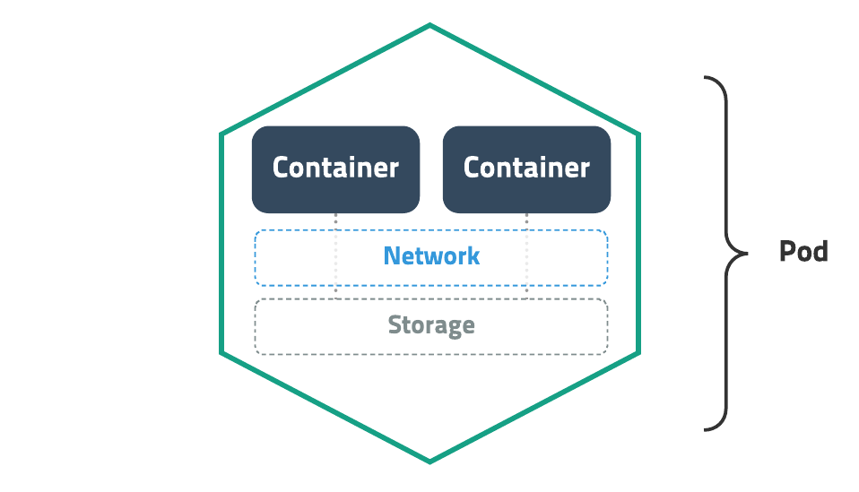
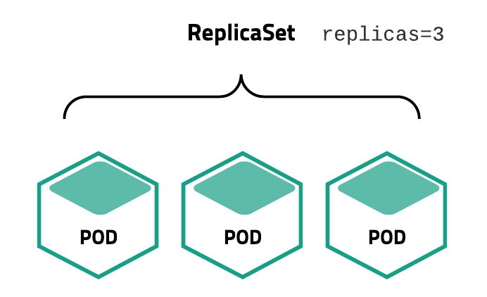

# Kubernetes

## 1. 개념
- 컨테이너화된 프로세스를 관리(ex. 라이프사이클)하기 위한 컨테이너 오케스트레이션 플랫폼
- 구글이 만들고 리눅스 재단 산하의 CNCF가 관리함
- current state를 모니터링하며 desired state를 유지하는 활동을 함
    * desired state? 관리자가 바라는 환경. 얼마나 많은 웹서버를 띄우나, 몇 번 포트로 서비스하나 등.


## 2. 장점
- 서비스 배포와 운영에 필요한 기능 지원
    * 서비스 디스커버리와 로드 밸런싱
    * 롤아웃/롤백/bin 패킹/복구 자동화
- 성능, 안정성, 확장성(커스텀, 다른 도구들과의 연동)
    * 고가용성? 프로덕션 환경에서는 컨트롤 플레인이 여러 컴퓨터에서 실행 & 클러스터가 여러 노드를 실행되기 때문
    * 벤더/플랫폼에 종속되지 않음 & 대부분의 퍼블릭 클라우드(구글,AWS,Azure)등에 사용 가능 & 베어메탈에도 배포 가능


## 3. 아키텍처 & 컴포넌트


- 쿠버네티스를 배포하면 `클러스터`를 얻는다
- 클러스터는 하나 이상의 `노드`라는 worker를 가진다

### 노드 (=worker)
* 역할
  + 애플리케이션의 구성요소인 `파드pod`(클러스터에서 실행 중인 컨테이너 집합)를 호스트 (컨테이너화된 애플리케이션을 실행)
  + 마스터로부터 명령을 전달 받아 서비스
  + 동작 중인 파드를 유지 & 쿠버네티스 런타임 환경을 제공

* 컴포넌트
  + `kubelet`
     - 마스터의 명령에 따라 컨테이너의 라이프 사이클을 관리하는 노드 관리자
     - 파드에서 컨테이너가 확실하게 동작하도록 관리하기 위해 클러스터의 각 노드에서 실행되는 에이전트
  + `kube-proxy`: 클러스터의 각 노드에서 실행되는 네트워크 프록시
     - 쿠버네티스 네트워킹 서비스를 용이하게 하기 위한 네트워크 프록시
     - OS의 패킷 필터링 계층에 의존하거나 트래픽 자체를 전달하여 클러스터 내부 또는 외부의 네트워크 통신을 처리
  + `컨테이너 런타임`: 컨테이너 실행을 담당하는 소프트웨어. (ex. Docker)


### 컨트롤 플레인 (=master)
* 역할
  + 워커 노드와 클러스터 내 파드 관리
  + 클러스터 전반적인 결정 & 클러스터 이벤트 감지 및 반응

* 컴포넌트
  + `kube-apiserver`: 프론트 엔드. 쿠버네티스 API를 노출.
     - REST 호출이나 kubectl 커맨드라인 인터페이스 또는 kubeadm과 같은 기타 CLI를 통해 접근 
  + `etcd`
     - 모든 클러스터 (메타)데이터를 담는 쿠버네티스 뒷단의 key-value 저장소
     - 데이터 동기화를 담당하는 분산 코디네이터
  + `kube-scheduler`: 노드가 배정되지 않은 새로 생성된 파드를 감지하고, 실행할 노드를 선택.
  + `kube-controller-manager`
     - 현재 상태를 원하는 상태로 만드는 컨트롤 프로세스를 실행 및 모니터링
     - 특정 이벤트에 따라 특정 동작을 수행
     - 여러 컨트롤러 기능이 하나로 통합
     - 스케줄러를 참고하여 요청한 갯수의 파드를 실행
  + `cloud-controller-manager`: 클라우드별 컨트롤 로직.

* 기타
  + `kubectl`: 마스터노드의 CLI로 클러스터 제어 (사용자가 제어, 큐브 컨트롤)


### 4. 쿠버네티스 오브젝트
> 시스템은 오브젝트의 생성을 보장하고, 사용자가 지정한 desired state를 유지하기 위해 지속적으로 작동
- 쿠버네티스는 쿠버네티스 시스템의 영구 엔티티인 `오브젝트`들을 사용하여 클러스터의 상태를 나타낸다.
- 쿠버네티스는 현재 상태를 사용자가 생각하는 최종 배포 상태(`Desired State`)로 변경한다.
- 쿠버네티스 오브젝트롤 동작(생성/수정/삭제)시키려면, 쿠버네티스 API를 이용해야 한다.

1. 개념
    - 하나의 **의도를 담은 레코드**
    - 기본 오브젝트와 컨트롤러로 구성
    - **클러스터 상태**를 나타내기 위해 사용
        - 어떤 컨테이너화된 애플리케이션(`파드`)이 동작 중인지 (그리고 어느 노드에서 동작 중인지)
        - 그 애플리케이션이 이용할 수 있는 리소스
        - 그 애플리케이션이 어떻게 재구동 정책, 업그레이드, 그리고 내고장성과 같은 것에 동작해야 하는지에 대한 정책

2. 기본 오브젝트
    - 파드
        * 
        * **컨테이너화된 애플리케이션**
        * 쿠버네티스에서 배포할 수 있는 `가장 작은 단위` (컨테이너가 하나여도 파드로 감싸야 함)
        * 한 개 이상의 컨테이너(종류가 다른 컨테이너도 가능)와 스토리지, 네트워크 속성을 가짐
        * 파드 안의 컨테이너끼리는 스토리지(볼륨), 네트워크를 공유하며, 서로 localhost로 접근할 수 있음
            + cf. 애플리케이션들은 실행할때 Reverse proxy, 로그 수집기와 같이 묶어 배포된다. 로그 수집기의 경우에는 애플리케이션 로그 파일을 읽어서 수집한다. 
        * 파드별로 IP 주소가 부여됨
        * 생성 과정
            + 
    - 서비스
        * 네트워크와 관련된 오브젝트
        * 파드를 외부 네트워크와 연결 (포트 할당. 서버를 외부에서 접근 가능하도록 외부 IP에 노출하는 역할.)
        * **로드밸런서**: 여러개의 파드를 바라보게끔 내부 로드밸런싱
            + 특정 라벨로 파드들을 하나의 서비스로 묶어서 서비스에 속하는 파드 간에만 로드밸런싱 가능
        * 서비스 디스커버리: 내부 DNS에 서비스 이름을 도메인으로 등록
    - 볼륨
        * 저장소와 관련된 오브젝트
        * 일종의 **디스크** 개념
        * 호스트 디렉토리를 그대로 사용 or EBS 같은 스토리지를 동적으로 생성하여 사용
    - 네임스페이스
        * 일종의 **패키지명** 개념
        * 쿠버네티스 클러스터 내의 논리적인 분리 단위
        * 네임스페이스 레벨 리소스와 클러스터 레벨 리소스로 구분
        * 네임스페이스별 리소스 할당량을 지정하고, 사용자별로 접근 권한을 다르게 주기 위함

3. 컨트롤러 (control-loop를 돌며 특정 리소스를 지속적으로 모니터링 -> 사용자가 생성한 리소스의 이벤트에 따라 사전에 정의된 작업을 수행)
    - 레플리카 셋
        * 
        * Pod을 여러 개(한 개 이상) 복제하여 관리하는 오브젝트
        * Pod을 생성하고 개수를 유지하려면 반드시 ReplicaSet을 사용해야 함
        * 복제할 개수, 개수를 체크할 라벨 선택자, 생성할 Pod의 설정값(템플릿)등을 가짐
        * 직접적으로 ReplicaSet을 사용하기보다는 Deployment등 다른 오브젝트에 의해서 사용되는 경우가 많음
    - 디플로이먼트
        * 각자 역할을 위임하는 간접 구조 (사용자가 디플로이먼트를 생성 -> 디플로이먼트가 레플리카셋에게 팟을 띄우라고 명령 -> 레플리카셋이 팟을 생성하고 관리)
    - 스테이트풀 셋
    - 데몬 셋
    - 잡


### 5. 선언형 커맨드
- 쿠버네티스는 애플리케이션을 배포하기 위해 **원하는 상태(desired state)를 다양한 오브젝트(object)에 라벨(label)을 붙여 정의(yaml)하고 API 서버에 전달하는 방식**을 사용한다.
- 사용자가 직접 시스템의 상태를 바꾸지 않고, 바라는 상태를 **선언적으로 기술**하여 명령을 내리는 방법
    * ex. 80 포트를 오픈한 nginx 컨테이너를 1개 유지해줘 
- 선언형 커맨드의 반대 개념은 명령형(Imperative) 커맨드로, SQL 쿼리도 명령형 커맨드의 한 종류
    * ex. nginx 컨테이너를 실행해줘. 그리고 80 포트로 오픈해줘
- 쿠버네티스는 `YAML` 형식을 이용하여 object **spec**을 기술
- ```yaml
  apiVersion: v1              # 쿠버네티스 API 버전
  kind: Pod                   # 리소스 종류 정의. (Pod, ReplicaSet, Deployment, Service, ...)
  metadata:                   # 이 리소스의 각종 메타 데이터. 라벨/리소스 이름
  name: mypod
    spec:                     # 상세 스펙
      containers:
      - name: nginx           # 컨테이너 이름
        image: nginx:latest   # 이미지 이름
  ```


### cf.
- Helm 패키지 매니저
    * Chart: Helm 패키지, app을 실행하기 위한 모든 리소스를 포함
    * Repository: 저장소, 도커허브 같이 쿠버네티스 서비스(Chart) 검색, 다운로드 지원
    * Release: 차트 인스턴스들은 고유의 릴리즈 번호를 가짐
- docker swarm과의 비교
    * swarm은 소규모(50대 미만)의 서버 운용을 하거나 설정이 간결할 때 유용
    * kubernetes는 대규모(500대의 서버에 50,000 컨테이너를 서비스 가능)의 서버 운용을 하거나 설정이 복잡할 때 유용