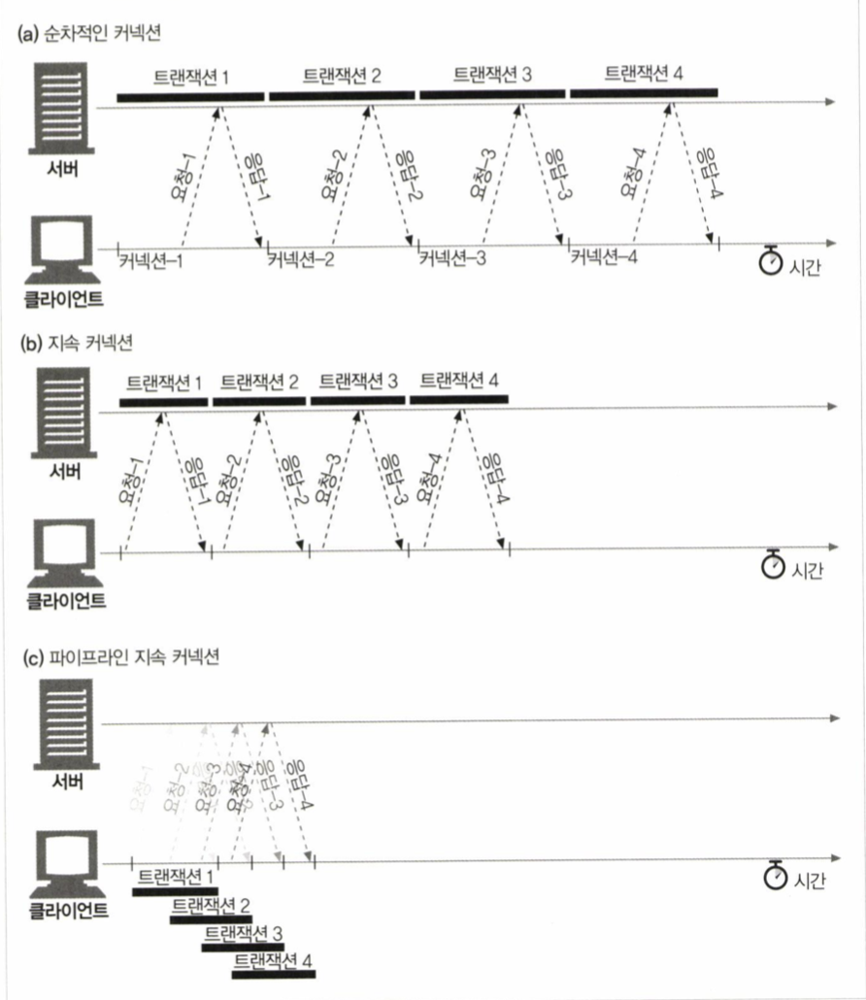
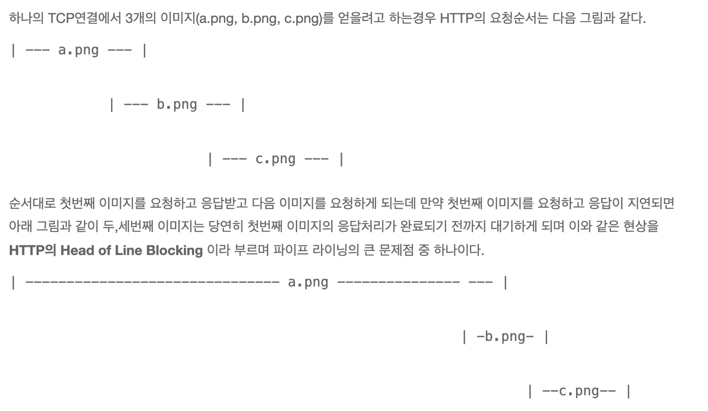
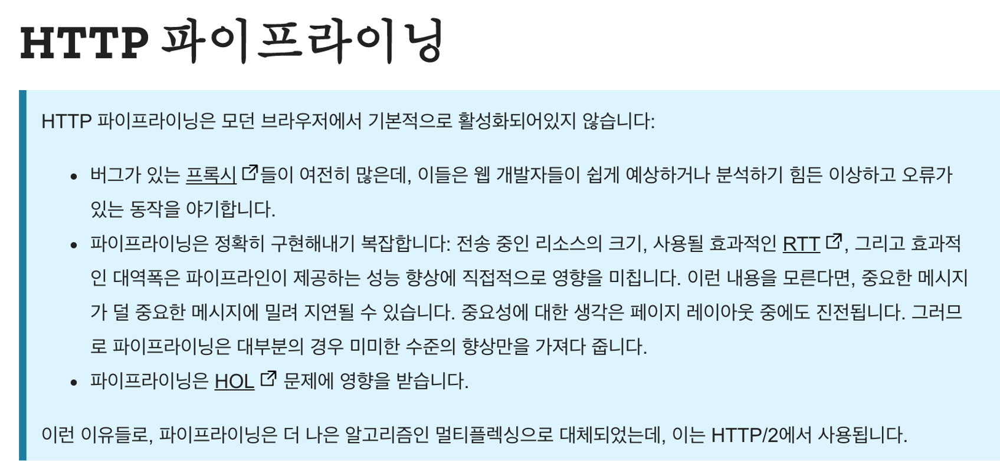

# Connection Management

- HTTP는 어떻게 TCP 커넥션을 사용하는가
- TCP 커넥션의 지연, 병목, 막힘
- 병렬 커넥션, keep-alive 커넥션, 커넥션 파이프라인을 활용한 HTTP 최적화
- 커넥션 관리를 위해 따라야 할 규칙들

## 인터넷 네트워크
- 인터넷 통신은 복잡한 망을 거친다.
- IP(인터넷 프로토콜)은 메시지의 송/수신을 위해 사용한다. 패킷(package+bucket)으로 관련 정보를 다룬다.
- IP만으로는 한계가 있다.
    1. 비연결성: 받을 대상이 없거나 서비스 불능이어도 패킷을 보낸다
    2. 비신뢰성: 중간에 소실되거나 순서가 다르게 올 수 있다
    3. 프로그램 구분: 같은 IP를 사용하는 서버에서 통신하는 앱이 2개 이상일 경우 구분하기 어렵다
- IP의 한계점을 TCP가 보완한다. (=> `신뢰할 수 있는 프로토콜`, 대다수가 TCP 사용)
    ```
    인터넷 프로토콜 스택의 4계층 (각 계층마다 추가 정보가 붙음)
    1. 애플리케이션 계층 (HTTP, FTP)
    2. 전송 계층 (TCP, UDP)
    3. 인터넷 계층 (IP)
    4. 네트워크 인터페이스 계층
    ```
    * 연결 지향 (3 way handshake): 개념적 연결
    * 데이터 전달 & 순서 보장
    * 포트 정보 (같은 IP에서 프로세스를 구분) cf. 1~1023까지는 잘 알려진 포트라 이것 외의 것을 사용하는 게 좋다
- cf. UDP
    * IP에서 port, 체크섬 정보 정도만 추가된 단순한 프로토콜
    * TCP보다 가볍기 때문에 사용자 임의로 커스텀하기 좋고, HTTP 3에서 관심을 받고 있다.
- cf. DNS
    * 도메인 이름으로 IP를 찾을 수 있도록 도와주는 시스템


## TCP 커넥션
- 모든 http 통신은 tcp/ip를 통해 이루어짐
- TCP는 신뢰할 수 있음. 브라우저가 주소를 찾아 커넥션을 생성하고, 커넥션이 맺어지면 tcp의 특성상 메시지가 손실/손상되지 않고 순서가 바뀌지 않음
- TCP는 세그먼트라는 단위로 데이터 스트림을 나누고, 세그먼트를 IP 패킷에 담아 전달함 by TCP/IP 소프트웨어
    * IP 패킷 구성 요소
        1. IP 패킷 헤더 (발신지, 목적지 IP 주소, 크기, 기타 플래그)
        2. TCP 세그먼트 헤더 (TCP 포트 번호, TCP 제어 플래그, 데이터 순서, 무결성 검사용 숫자 값)
        3. TCP 데이터 조각
- TCP 커넥션은 발신지 IP 주소, 발신지 포트, 수신지 IP 주소, 수신지 포트 의 값으로 식별 가능한 유일한 커넥션을 만든다.
- OS 단에서 TCP 커넥션 생성을 위한 기능을 제공함. 소켓 API는 TCP/IP의 세부 구현을 숨긴다.
    * 소켓 API의 역할: 데이터 구조 연결, 데이터 스트림 읽고 쓰기 
        1. bind: 소켓에 로컬 포트와 인터페이스 할당
        2. listen: 소켓 커넥션을 허가함
        3. accept: 커넥션을 맺기를 기다림
    * TCP API의 역할: 핸드셰이킹, ip 패킷 분할 및 재조립 등
    * 소켓이란 네트워크 환경과 연결할 수 있도록 만들어진 연결 부분을 말함
    * 웹소켓과는 다르다!!
        1. 웹 소켓은 HTTP 커넥션으로 핸드셰이킹하고, utf-8 포맷의 데이터를 주고받는다.
        2. TCP 소켓은 TCP 커넥션으로 핸드셰이킹하고, 바이트 스트림을 사용한다.

### (+a) 웹소켓이란?
- 무엇인가? 서버-클라이언트 사이에 연결이 계속 유지될 수 있도록 소켓 연결을 할 수 있게 하여 full-duplex를 지원하는 통신 규약
- 왜?
    * connectionless한 HTTP의 특징 때문에 실시간 상호작용성이 떨어지는 것을 보완하기 위해
    * ActiveX를 쓰지 않기 위해... (ActiveX는 서버에 요청을 보내고도 페이지를 이동하지 않을 수 있게 하기 위한 일종의 꼼수)
    * 실시간 게임, 인스턴트 소셜 네트워크 알림, 주식, 또는 날씨 정보의 최신 디스플레이 등 안전하고 빠른 데이터 전송이 필요한 앱에 사용하는 데 적합
- 특징?
    * 클라이언트와의 연결이 유지되므로 클라이언트의 상태를 알 수 있다
    * http 요청을 사용하므로 기존 포트(80, 443)를 접속하여 방화벽 처리 불필요 + CORS, 인증 등 과정에서 추가 설정 불필요
    * 기본 자바스크립트 웹소켓 API는 간단한 기능만 제공하여 socket.io와 같은 오픈소스를 사용하는 경우가 많음
    * HTML5에 정식으로 포함되었음
- 기존에는?
    1. polling: 클라이언트가 http request를 서버로 계속 날려 이벤트 내용을 전달받음
          * 가장 쉬운 방법
          * 서버의 부담이 많아짐
          * 실시간이라고 할 만큼의 빠른 응답을 기대하기 어려움 
    2. long polling: 클라이언트가 전달한 http request를 응답이 생길 때만 서버가 응답함
          * 서버는 일단 요청하고 응답을 지연하고, 클라이언트는 응답을 받으면 곧바로 다시 요청함
          * 이 주기가 짧으면 일반적인 polling과 차이가 없어짐
    3. streaming: 클라이언트가 http request를 보내면 서버는 응답을 끊임없이 흘려보냄
          * long polling처럼 응답을 끊는 게 아니라 하나의 연결에서 계속 보내는 것
          * 하나의 tcp 포트로 읽기와 쓰기를 동시에 할 수 없기 때문에 메시지 입력은 tcp 외의 포트에서 받아야 함
    + 2번과 3번 방법은 http comet이라고도 불림
    + 웹소켓이 기존의 방법과 다른 것은...
          1. full-duplex를 지원
          2. tcp 소켓을 쓰는 게 아님
          3. stateful (같은 연결을 계속 쓰니까 연결을 위해 사용하는 불필요한 데이터 전송을 막을 수 있음)
- 어떻게?
    1. http 프로토콜의 handshake 과정으로 웹소켓을 사용할 수 있는지 확인
    2. 성공할 경우 http를 웹소켓 프로토콜로 바꿈
    3. 만들어진 새로운 소켓으로 통신함 (ws-일반 웹소켓/wss-ssl적용된 웹소켓)
- 이슈
    * stateful한 만큼 서버와 클라이언트 연결을 계속 유지해야하고, 비정상적 연결이 끊어졌을 때를 대응해야함.
    * 서버와 클라이언트간의 socket 연결을 하는 것 자체가 비용이 많이 든다 (트래픽이 많은 서버 같은 경우 CPU부담이 될 수 있다)
- [참고](https://medium.com/@icehongssii/%EA%B9%9C%EC%B0%8D%ED%95%9C-%ED%94%84%EB%A1%9C%EA%B7%B8%EB%9E%98%EB%A8%B8%EB%93%A4%EC%9D%84-%EC%9C%84%ED%95%9C-%EA%B0%84%EB%8B%A8%ED%95%9C-%ED%94%84%EB%A1%9C%EA%B7%B8%EB%9E%98%EB%B0%8D-%EC%83%81%EC%8B%9D-2-2-http%EB%A5%BC-%EB%84%98%EC%96%B4%EC%84%9C-%EC%8B%A4%EC%8B%9C%EA%B0%84-%EB%84%A4%ED%8A%B8%EC%9B%8C%ED%82%B9websocket-c49125e1b5a0)와 [참고2](https://medium.com/@chullino/http%EC%97%90%EC%84%9C%EB%B6%80%ED%84%B0-websocket%EA%B9%8C%EC%A7%80-94df91988788)

## TCP의 성능
- HTTP의 성능은 TCP의 성능에 영향을 받는다. 너무 많은 데이터를 받아오려고 하거나, 복잡하고 동적인 리소스를 실행하지 않는 한.
    * DNS에서 호스트 이름을 IP 주소로 바꾸는 데 걸리는 시간 -> 현재는 이런 경우가 적고, 대부분 DNS 캐시를 사용
    * 새로운 커넥션을 맺는 데 걸리는 시간 -> 마찬가지로 현재는 이런 경우가 적음
    * 클라이언트에서 서버까지 메시지가 전달되고 처리되는 데 걸리는 시간
    * 서버가 클라이언트에게 응답을 보내는 데 걸리는 시간
    * 그 외 TCP 네트워크 지연 원인 후보: 하드웨어 성능, 네트워크/서버 전송 속도, 메시지 크기, 클라이언트와 서버의 거리
- 성능 관련 중요 요소
    1. TCP 커넥션의 핸드셰이크 설정
        * 문제: 크기가 작은 HTTP 트랜잭션은 50% 이상의 시간을 TCP 구성에 사용함
        * 해결: (이후 챕터에서 다룸) 이미 존재하는 커넥션 재활용
    2. 인터넷 혼잡 제어를 위한 TCP의 slow start
        * 문제: TCP 커넥션은 처음에는 최대 속도에 제한이 있고, 전송이 성공할수록 속도가 빨라진다. (급작스러운 부하, 혼잡을 막기 위함)
        * 해결: 어느 정도 데이터를 주고받은 튜닝된 커넥션을 재활용
    3. 데이터를 한데 모아 한번에 전송하고자 하는 네이글 알고리즘
        * 문제: 효율적(헤더 양>>데이터 양 방지)인 데이터 전송을 위해 많은 데이터를 합쳐 전송하는 네이글 알고리즘. 버퍼에서 대기하며 지연 발생함. 특히 확인응답 지연과 함께 쓰이면 양쪽에서 지연되니까 형편없어짐.
            + Silly Window Syndrome 전송자: 1바이트 크기 패킷을 대량 전송하는 것. 다른 인터넷 통신에 방해가 됨. 
        * 해결: HTTP 애플리케이션에서 HTTP 스택에 TCP_NODELAY 파라미터 값 설정하여 네이글 알고리즘 비활성화 가능. 하지만 작은 패킷이 너무 많이 생기지 않도록 주의해야 함.
    4. TCP의 편승(piggyback) 확인 응답(ack)을 위한 확인응답 지연 알고리즘
        * 문제: ack와 송출 데이터를 묶어 보내기 위해 잠시 ack를 지연시킴
        * 해결: 지연의 원인이 되는 관련 기능을 수정/비활성화 가능. 하지만 수정할 때에는 그 수정이 tcp 내부 알고리즘이 피하려는 문제를 발생시키지 않을 것임을 확신할 수 있어야 함. 
    5. TIME_WAIT 누적으로 인한 지연과 포트 고갈
        * 문제: 실제 상황에서는 큰 문제가 아닌데 문제 상황으로 오해할 수 있음
            + TIME_WAIT은 TCP 상태의 가장 마지막 단계. 
                + 이전 커넥션과 새로운 커넥션이 충돌하는 것을 방지하기 위함
                + 먼저 close()를 요청한 곳에 최종적으로 남음
                + 같은 주소+포트번호의 TCP 커넥션을 일정 시간(2MSL) 동안 생성하지 못하게 함
            + 성능 테스트 환경에서는 열린 서버도 별로 없는데 테스트하는 클라이언트도 별로 없으니 유일할 수 있는 조합(클라주소, 서버주소, 목적지포트=80, 발신지포트=`changeable`)이 적은데 TIME_WAIT 때문에 재활용도 어려움. 그러면 사용 가능한 발신지 포트가 약 6만 개고, 2MSL을 120초로 가정할 경우 초당 500개로 커넥션이 제한됨. 서버가 초당 500개 이상의 트랜잭션을 처리할 만큼 성능이 좋으면 TIME_WAIT 포트 고갈이 발생할 수 있는 것.
            + 현재는 라우터가 빨라져서 커넥션이 닫혔는데 중복되는 패킷이 생기는 경우는 거의 없어졌음. 그럼에도 2MSL을 수정하는 것은 조심해야 함.
        * 해결: 부하를 생성하는 클라이언트 역할의 장비를 더 많이 사용하거나, 더 많은 커넥션을 맺을 수 있도록 여러 개의 가상 IP 주소를 사용
            + 포트 고갈 문제를 겪지 않더라도, OS에 따라 성능 문제를 겪을 수 있으므로 커넥션을 너무 많이 맺거나 대기 상태의 control block을 너무 많아지지 않도록 주의
        * [참고: TIME_WAIT 상태란 무엇인가](http://docs.likejazz.com/time-wait/)

## HTTP 커넥션 관리
- Connection 헤더
    * 연결 관리 > 현재 트랜잭션이 끝난후에 네트워크 연결을 열린 상태로 둘지 여부를 제어 
    * 역할? 중개 서버 외에 인접한 HTTP 앱이 현재 맺고 있는 연결에 대해서만 적용될 옵션을 지정
    * 특징
        1. 커넥션 토큰을 쉼표로 구분하여 갖고 있고, 다른 커넥션에 전달되지 않음
        2. Connection, Keep-Alive와 같은 연결 관리 헤더는 `HTTP/2.에서 금지`되어 사파리에서는 지원 중단
        3. `Connection: {여기}`와 같이 사용하며, `여기`에는 HTTP 헤더 필드명, 임시 토큰, close가 들어갈 수 있음. 셋이 한번에 쓰기도 가능.
    * 가능한 토큰 종류
        1. HTTP 헤더 필드명
            + 현재 커넥션에만 해당되는 헤더
            + 다음 커넥션에 해당 헤더 정보를 전달하면 안 되므로, 중개 서버는 이를 삭제해야 함 + 캐시 금지
            + 홉별(hop by hop) 헤더명을 기술함 => 헤더 보호하기
                - 홉: 각 서버
                - 홉별: 현재 연결된 두 서버 간에만 영향 미치고, 다른 서버 간에는 영향 없음
            + 여기에 명시되어 있지 않아도 홉별 헤더인 것
                - Proxy-Authenticate: 프록시 서버 뒤에 있는 리소스에 액세스하는 데 사용해야 하는 인증 방법을 정의
                - Proxy-Connection: 비표준. Connection 헤더를 모르는 프록시에게 Connection 대신 전달.
                - Transfer-Encoding: 사용자에게 entity를 안전하게 전송하기 위해 사용하는 인코딩 형식을 지정
                - Upgrade: 이미 설정된 클라이언트/서버 연결을 다른 프로토콜로 변경
        2. 임시 토큰
            + 커넥션에 대한 비표준 옵션 
        3. close
            + 커넥션이 작업이 완료될 때 종료되어야 함 
- 순차적인 트랜잭션 처리에 의한 지연
    * 리소스의 순차적 다운로드는 매번 새로운 커넥션을 맺고, 만약 그 작업이 느려지면, 느린 시작으로 인해 사용자에게 불쾌함을 준다...
    * 커넥션 성능 향상을 위한 방법
        1. 병렬 커넥션: 여러 개의 TCP 커넥션을 통한 동시 HTTP 요청
        2. 지속 커넥션: 커넥션을 맺고 끊는 데서 발생하는 지연을 제거하기 위해 TCP 커넥션 재활용
        3. 파이프라인 커넥션: 공유 TCP 커넥션을 통한 병렬 HTTP 요청
        4. 다중 커넥션: 요청과 응답들에 대한 중재 (실험 기능)

## 병렬 커넥션
- 순차 커넥션 vs 병렬 커넥션
    * 순차: 1. html 2. 리소스 3. 리소스
    * 병렬: 1. html 2. 리소스 2. 리소스
- 병렬 커넥션은 페이지를 더 빠르게 내려받는다
    * 각 커넥션의 지연 시간을 겹침 -> 총 지연 시간 줄임
        + latency: 자극과 반응 사이의 시간, 어떤 원인과 그 결과 간의 지연 시간, 즉 어떤 `상호작용의 완료까지 걸리는 시간` 
    * 대역폭을 하나의 커넥션에서 다 쓰는 게 아니라 나머지 리소스를 받는 데 사용 -> 남은 대역폭 활용 가능
- 병렬 커넥션이 항상 더 빠른 것은 아니다
    * 대역폭이 좁은 경우: 대부분 시간을 데이터 전송에 사용 & 여러 커넥션 생성에 따르는 부하 때문에 순차적 방법보다 더 느릴 수도
    * 메모리 많이 소모
    * 한 사용자가 많은 커넥션을 가지면 서버의 성능 저하 우려
    * 브라우저는 최신 기준 6-8개까지의 병렬 커넥션 지원 & 서버는 임의로 끊어버리기 가능
- 병렬 커넥션은 더 빠르게 `느껴질 수` 있다
    * 실제로는 순차 방식보다 느려도, 사용자는 진행 과정이 보이면 더 빠르다고 느낄 여지가 있음

## 지속 커넥션
- 지속 커넥션? 처리 완료된 이후에도 계속 연결 상태로 있는 TCP 커넥션
- 왜? 
    * `사이트 지역성` -> 같은 서버에 리소스를 계속 요청할 확률이 높으므로 TCP 커넥션을 유지하여 이후의 HTTP 요청에 재사용하는 것이 이득
    * 연결 시간 없음, 느린 시작 지연 회피 등
- 단점? 지속 커넥션을 잘못 관리하면 계속 연결된 많은 커넥션이 쌓이게 됨
- 지속 커넥션 vs 병렬 커넥션
    * 병렬 커넥션은 매번 새로운 커넥션을 맺고 끊으므로 시간과 대역폭이 소요 <-> 지속 커넥션은 사전 작업과 지연을 줄여주고 튜닝된 커넥션 유지, 커넥션 수를 줄임
    * 함께 사용하는 것이 효과적 (HTTP1.0: keep-alive, HTTP1.1: 지속 커넥션)

### HTTP/1.0+ 의 Keep-Alive 커넥션
- 특징
    * keep-alive는 사용하지 않기로 결정되어 1.1 명세에서 빠졌지만, 아직도 keep-alive 핸드셰이크를 사용하고 있으므로, 처리 가능하게 애플리케이션을 개발해야 함
- Keep-Alive 동작
    * 커넥션을 유지하려면 클라이언트가 요청에 `Connection:Keep-Alive` 헤더 포함시킴
    * 서버는 다음 요청도 이 커넥션으로 받으려면 같은 헤더를 포함시켜 응답. 이게 없을 경우 클라이언트는 미지원 서버로 판단.
- Keep-Alive 옵션
    * keep-alive가 담긴 요청이 왔다고 해서 무조건 따라야 하는 것은 아님 (언제든지 끊거나 수 제한 가능)
    * `Connection:Keep-Alive` 헤더가 있을 때에만 사용 가능
    * 디버깅을 위한 임의의 필드 포함 가능
    * Keep-Alive 헤더의 쉼표로 구분된 옵션으로 제어 가능. 응답 헤더에 포함되며, 의미한 대로 동작을 보장하는 것은 아님.
        + `Keep-Alive: max=5, timeout=20`
        + max: 커넥션이 몇 개의 트랜잭션을 처리할 때까지 유지될 것인지 의미함. 
        + timeout: 커넥션이 얼마나 유지될 것인지 의미함. 단위는 sec
- Keep-Alive 커넥션 제한과 규칙
    * HTTP/1.0의 기본 연결은 지속 커넥션이 아님
    * 이미 지속 커넥션이었더라도, 상기 헤더가 없을 때에는 이제 지속되지 않을 것이라고 판단함
    * 커넥션을 유지하려면 Content-Length 값이 정확해야 함. 기존 메시지의 끝과 새로운 메시지의 시작을 정확히 판별하기 위함.
    * 프록시와 게이트웨이는 Connection 헤더의 규칙을 철저히 지켜야 함
        + Connection 헤더는 홉별 헤더 (a-b-c가 있으면 a-b 까지만, b-c에서는 탈락해야)
        + 프록시와 게이트웨이는 메시지를 전달하거나 캐시에 넣기 전에 Connection 헤더와 관련된 모든 헤더 필드를 `제거해야 함`
        + HTTP/1.0을 따르는 기기로부터 받는 모든 Connection 헤더 필드는 무시해야 함 (`실수로` 전달될 수 있음)
        + Connection 헤더를 인식할 수 없는 프록시 서버와 keep-alive 커넥션은 연결되면 안 되지만, 그것이 쉬운 일은 아님
    * 클라이언트가 응답을 모두 받기 전에 커넥션이 끊어졌다면 별 문제가 없는 이상 요청을 다시 보낼 수 있게 준비되어야 함
- Keep-Alive와 멍청한(dumb) 프록시
    * [문제] Connection 헤더의 무조건 전달
        1. 프록시가 Connection을 이해하지 못하고 그냥 확장 헤더로 인식해서 그냥 다음 프록시에 전달
        2. 클라이언트와 서버는 지속 커넥션이 잘 연결되었다고 여김 (실제로는 클라-프록시, 프록시-서버 간에 지속 커넥션이 만들어진 것)
        3. 서버는 프록시가 지속 커넥션을 요청했다고 여기고 그에 ok 했으므로 커넥션을 끊지 않음 -> 프록시는 그걸 모르는 상태로 끊어지기를 대기
        4. 클라이언트는 새로운 요청을 보내는데, 같은 커넥션에서 다른 요청이 올 거라는 것을 예상하지 못하므로 해당 요청을 무시함
        5. 클라이언트는 응답을 받지 못하고 자신이나 서버가 타임아웃이 나서 커넥션이 끊길 때를 기다리게 됨
    * [해결] 프록시와 홉별 헤더
        + 프록시는 Connection 관련 헤더를 전달하면 안 됨
        + 여타 홉별 헤더도 마찬가지 
- Proxy-Connection
    * 개발자들이 무조건 전달 문제를 해결하기 위해 제안한 `Proxy-Connection`이라는 헤더를 사용하는 차선책
    * 멍청한 프록시는 여전히 무조건 전달하겠지만, 영리한 프록시는 `Proxy-Connection`을 이해 가능한 `Connection`로 변경하여 전달
    * 모든 상황에서 동작하지는 않지만, 프록시를 별도로 설정할 수 있는 많은 현대 브라우저와 프록시들이 인식함
    * `클라-영프-서버`일 경우에서만 잘 동작하고, `클라-멍프-영프-서버`와 같이 멍청한 프록시를 끼고 지나가면 같은 문제 발생
    * 문제가 되는 프록시는 네트워크 상에서 보이지 않는 경우가 많음 ex. 방화벽, 캐시서버, 리버스 프록시 등

### HTTP/1.1의 지속 커넥션
- 특징
    * 1.1에서는 keep-alive를 지원하지 않지만, 설계가 개선된 `지속 커넥션`을 지원
    * 1.1의 지속 커넥션은 기본으로 활성화 (별도 설정이 없다면 모든 커넥션이 지속 커넥션)
    * 지속 커넥션을 종료하려면 `Connection:close` 헤더를 포함하면 되고, 이게 없다고 영원한 커넥션이 되지는 않음
- 지속 커넥션의 제한과 규칙
    * `Connection:close`가 포함된 요청을 받을 경우, 해당 커넥션을 사용한 요청을 추가로 보낼 순 없다
    * 커넥션을 유지하려면 Content-Length 값이 정확해야 함
    * HTTP/1.1 프록시는 클라이언트와 서버 각각에 대해 별도의 지속 커넥션을 맺고 관리해야 함
    * HTTP/1.1 프록시는 멍청한 프록시 문제를 막기 위해 클라이언트가 얼마나 지원 가능한지를 모른다면 지속 커넥션을 맺으면 안 되지만, 현실적으로 쉽지 않고, 많이 무시됨
    * HTTP/1.1 기기는 Connection 헤더의 값과 무관하게 언제든지 커넥션을 끊을 수 있음
    * HTTP/1.1 애플리케이션은 중간에 커넥션이 끊어지면 복구할 수 있어야 함. 다시 보내도 문제가 없다면 클라이언트는 다시 요청을 보내야 함.
    * 1 클라이언트는 서버 과부하를 방지하기 위해 2 지속 커넥션을 유지해야 함

## 파이프라인 커넥션
- 순차 vs 지속 vs 파이프라인
     
- 특징
    * HTTP/1.1에서 지속 커넥션을 사용하여 요청 파이프라이닝
    * 여러 개의 요청은 응답이 도착하기 전까지는 큐에 쌓임 -> 네트워크상 왕복에 드는 시간을 줄임
- 파이프라인 커넥션의 제약과 규칙
    * HTTP 클라이언트는 지속 커넥션인지 확인 전까지 파이프라인을 이어서는 안 됨
    * 응답 순서는 요청 순서와 같아야 함
    * 커넥션이 끊어지더라도 완료되지 않은 요청이 파이프라인에 있으면 다시 보낼 수 있어야 함
        + 단, POST와 같이 반복해서 보내면 문제가 생기는 것(비멱등)은 파이프라인으로 보내면 안 됨
        + 에러가 발생하면 무슨 요청이 처리되었는지 클라이언트는 모르기 때문

## 커넥션 끊기에 대한 미스터리 - 특별한 기준이 없는 커넥션 관리
> 언제 어떻게 커넥션을 끊는가?
- `마음대로` 커넥션 끊기
    * 클라이언트, 서버, 프록시는 언제든지 TCP 전송 커넥션을 끊을 수 있음
        + [일반적] 메시지를 다 보낸 다음 끊음 
        + [문제상황] 헤더의 중간이나 다른 엉뚱한 곳에서 끊김
        + [임의중단] 지속 커넥션인데 일정 시간 요청이 없다 -> 서버는 커넥션 끊을 수 있으나, 요청이 오는 중이 아니라는 확신 불가
- Content-Length와 Truncation
    * 제약사항에 명시되어 있었던 `커넥션을 유지하려면 Content-Length 값이 정확해야 함`
    * 일부 오래된 서버는 Content-Length 헤더를 생략하거나 잘못된 정보로 응답할 수 있음
    * 만약 커넥션 종료 응답을 받았는데 전달받은 엔터티 길이와 Content-Length의 값이 다르거나 Content-Length가 없으면 데이터의 정확한 길이를 서버에 물어봐야 함
    * 캐시 프록시는 Content-Length를 정정하거나 캐시하지 않고 그대로 전달
- 커넥션 끊기의 허용, 재시도, 멱등성
    * 에러가 없어도 커넥션은 끊을 수 있고, 그에 대한 대응이 준비되어 있어야 함
    * 파이프라인 커넥션에서의 이슈
        + 커넥션이 끊겼을 때 다시 연결해서 요청을 보내는 것은 클라이언트는 큐에 요청을 두면 되니까 괜찮은데, 서버는 요청을 처리중이었을 수 있음
        + 서버가 무슨 요청을 얼마나 처리했는가는 클라이언트에서 모르는 문제이기 때문에, 비멱등 요청은 파이프라인을 통해서는 안 됨
    * 비멱등 요청을 반복해야 하는 경우
        + 이전 요청에 대한 응답을 받을 때까지 기다리기
        + 자동으로 재시도 X -> 요청을 다시 보내기를 원하는지 묻는 대화상자 노출 
- 우아한 커넥션 끊기
    * TCP 커넥션의 특징: 양방향, 양쪽 끝에는 입력 큐 & 출력 큐 있음, 출력 큐 -> 입력 큐
    * 전체 끊기와 절반 끊기
        + 애플리케이션은 TCP 입력 채널과 출력 채널 중 하나만 끊거나 둘 다 끊을 수 있음
        + `close()`: 둘 다 끊기 a.k.a 전체 끊기
        + `shutdown()`: 둘 중 하나 끊기 a.k.a 절반 끊기
    * TCP 끊기와 리셋 에러
        + 단순한 HTTP 앱은 전체 끊기만 가능
        + 앱이 각기 다른 클라이언트, 서버, 프록시와 통신하고, 파이프라인 지속 커넥션을 사용할 때 예상치 못한 쓰기 에러를 방지하기 위해 절반 끊기 사용해야 함
        + 안전한 방법: 서버 측에서 커넥션의 출력 채널 끊기
            - 클라이언트가 모든 데이터를 버퍼에서 읽은 이후 커넥션이 끊겼다는 것을 알게 됨
        + 위험한 방법: 서버 측에서 커넥션의 입력 채널 끊기
            - 클라이언트가 이미 끊긴 입력 채널에 데이터를 보내면 서버가 `connection reset by peers` 메시지를 응답
            - 위의 메시지는 대부분의 OS가 심각한 에러로 취급하며, 버퍼에 있는 읽히지 않은 모든 데이터를 삭제함
            - 파이프라인에서는 이 상황이 더 심각해짐
    * 우아한 방법: 자신의 출력 채널을 끊고 다른 쪽의 출력 채널이 끊기는 것을 대기 (리셋 위험 없음)
        + 상대방이 절반 끊기를 지원하는지 보장하거나 검사되었다는 것을 보장하지 않음
        + 실제로 우아하게 끊고자 하는 앱은 출력 채널을 끊고 입력 채널에 대해 상태 검사를 해줌. 만약 타임아웃 내에 안 끊어지면 강제로 끊음

## HTTP2와 3에서의 커넥션 관리
- HTTP/2.
    * HTTP/1.1의 Head Of Line Blocking 문제: 특정 응답에 대한 지연
        
    * HTTP/2 부터 파이프라이닝 미지원
         
    * HTTP/1.1의 요청/응답 단위 `메시지`
        + 요청/응답 시 요청을 여러 개 보내더라도 서버에서 이전에 온 요청을 처리하고 있는 중이면 이후의 요청에 대해서 blocking 이 발생
    * HTTP/2 부터, 메시지를 자른 단위인 `프레임`과 여러 프레임을 주고받는 흐름의 단위인 `스트림` 도입
        + 여러 개의 요청과 응답을 한 커넥션에서 주고받을 수 있음
        + 요청과 응답이 한 쌍으로 작용하지 않아 blocking 이 발생하지 않고 요청과 응답이 서로 다른 메시지를 가질 수 있어 여러 메시지가 병렬적으로 오갈 수 있음
    * 그 외: 바이너리 데이터 전송, 헤더 압축 등
- HTTP/3
    * HTTP에서 해결한 HOLB는 HTTP의 것. TCP 단에서는 여전히 같은 문제 발생 가능
    * 스트림이 특정 메시지의 지연이 다른 메시지의 지연에 영향을 미치지 않게 해준 것처럼 tcp에도 오가는 패킷에 순서를 없애서 영향을 미치지 않도록 수정하고자 함
    * 그러나 TCP의 특징이 순서가 있다는 것이기 때문에 http3는 UDP를 사용하고, 신뢰성에 대해서는 여러 튜닝을 함