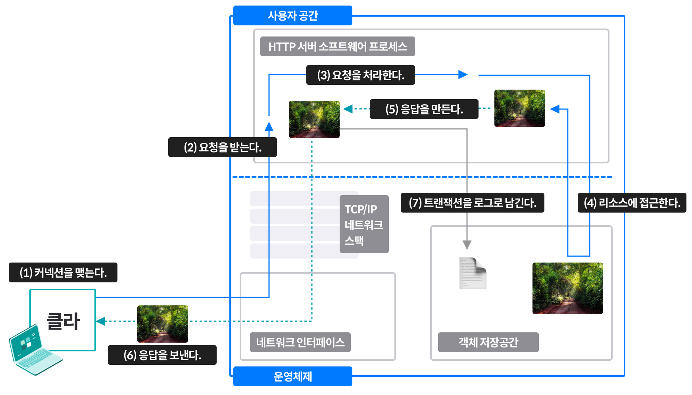

# 웹 서버
- 역할: HTTP 요청 처리, 응답 제공
- 웹 서버 소프트웨어, 웹페이지 제공에 특화된 장비

## 구현
- HTTP 및 그와 관련한 TCP 처리를 구현
- 기능: 프로토콜 구현, 리소스 관리, 관리 기능
    * OS와 함께 TCP 커넥션 관리
    * OS: 하드웨어 관리, 네트워크 지원, 파일 시스템 제공, 프로세스 관리
- 종류
    1. 다목적 소프트웨어 웹서버 (nginx, apache, etc.)
    2. 임베디드 웹서버
- HTTP/1.1 기능
    * 풍부한 리소스 지원
    * 가상 호스팅
    * 접근 제어
    * 로깅
    * 설정
    * 모니터링

## 웹 서버가 하는 일

1. 커넥션을 맺는다
    * 새 커넥션 다루기
        1. 이미 열려 있는 지속적 커넥션을 갖고 있지 않다면, 클라이언트에서 새로운 커넥션을 열고자 한다.
        2. 서버는 TCP커넥션에서 IP주소를 추출하여 어떤 클라이언트인지 확인한다.
        3. 클라이언트의 접속을 받거나, 원치 않는 클라이언트라면 닫는다.
    * 역방향 DNS를 사용해서 IP주소로 클라이언트 호스트 명으로 변환한다. 이렇게 얻은 호스트 명을 구체적 접근 제어와 로깅을 위해 사용한다. 이 과정에 시간이 걸릴 수 있어서 대용량 웹서버는 이 기능을 꺼두거나 특정 콘텐츠에 대해서만 켜 둔다.
    * ident 프로토콜로 HTTP 커넥션을 초기화한 사용자 이름을 파악할 수 있다. 보통 이 정보가 없어서 '-'로 채워진다.
    * 호스트 명? 보통 사람이 읽고 이해할 수 있는 이름으로 지어지며, 흔히 IP 주소나 MAC 주소와 같은 기계적인 이름 대신 쓸 수 있음. ex. `sooah-macbook-pro.local`
2. 요청을 받는다
    * HTTP 요청 메시지를 네트워크로부터 읽어들이고, 파싱하여 요청 메시지를 구성한다.
        - 요청 메서드, URI, 버전 번호, 메시지 헤더(CRLF), 본문(Content-Length) 등을 파싱
        - 이해 가능한 만큼의 분량이 확보될 때까지 메시지 일부를 메모리에 임시 저장
    * 몇몇 웹 서버는 요청 메시지를 내부 자료구조에 저장해서 신속하게 접근 가능하게 함
    * 커넥션 입출력 처리 아키텍처
        - 서버는 항상 새 요청을 주시함
        - 단일 스레드 웹 서버: 한 번에 하나씩 요청 처리, 처리 중 다른 커넥션 무시됨, 성능 문제
        - 멀티프로세스와 멀티스레드 웹 서버: 필요할 때마다 만들거나, 미리 만들어질 수 있음, 스레드/프로세스 총 개수 제한 있음
        - 다중 I/O 서버: 대량 커넥션을 지원하기 위해 많은 웹서버가 채택한 방식. 커넥션 활동을 감시당하다가 상태 변화가 생기면 소량의 처리 이후 열린 커넥션으로 돌아감
        - 다중 멀티스레드 웹 서버: CPU 여러 개의 이점을 살리기 위해 멀티스레딩과 멀티플렉싱을 결합, 커넥션을 감시하고 각 커넥션에서 조금씩 작업 수행
        - 아파치: 멀티프로세스, 멀티스레드 & nginx: 멀티프로세스, 단일스레드
3. 요청을 처리한다
    * 요청 메시지를 해석하고 메서드, 리소스, 헤더, 본문 등을 얻어 행동을 취한다.
4. 리소스에 접근한다
    * 메시지에서 지정한 리소스에 접근한다.
    * docroot: 웹 콘텐츠를 위해 예약해둔 웹서버 파일 시스템의 특별한 폴더. URI에서 docroot 외의 경로가 노출되지 않도록 유의.
    * 가상 호스팅된 docroot: 한 웹 서버에서 여러 개의 웹 사이트를 호스팅하는 방법, URI나 host헤더에서 얻은 IP주소나 호스트 명을 이용, 올바른 문서 루트를 식별
    * 사용자 홈 디렉터리 docroots: 한 대의 웹 서버에서 각자의 개인 웹 사이트를 만들 수 있도록 함
    * 경로가 파일이 아닌 디렉토리를 가리킬 경우 에러/인덱스 페이지를 리턴할 수 있다
    * 요청에 맞게 콘텐츠를 생성하는 프로그램에 URI를 매핑할 수 있음 (동적 리소스) ex. CGI(서버사이드 앱을 실행하기 위한 인터페이스)->>서블릿 등으로 발전
    * 서버사이드 인클루드: 웹페이지 내에서 다른 파일 내용을 읽어서 삽입할 수 있게 함
        - HTML 페이지에 사용하는 지시어로 서버가 HTML 페이지에 동적으로 내용을 추가하여 서비스하는 것
        - CGI 와 같이 페이지 전체를 만들지 않고 HTML 페이지에 생성된 내용을 추가하는 방식
        - 예시
          ```html
          <!--#config timefmt="%D" -->
          This file last modified <!--#echo var="LAST_MODIFIED" -->
          ``` 
        - LAST_MODIFIED 라는 환경변수의 값을 불러와 설정한 format 에 맞게 해당 HTML 파일에 삽입한 후 서빙
        - SSI 가 올바로 작동하지 않아 해당 태그를 값으로 변환하지 못했더라도 브라우저는 주석으로 처리한다
    * 클라이언트의 IP 주소에 근거하여 접근을 제어하거나, 리소스에 접근하기 위한 비밀번호를 물어볼 수 있다.
5. 응답을 만든다
    * 상태 코드, 헤더, 본문 등을 포함한 HTTP 응답 메시지를 생성한다.
    * 본문이 있다면 주로 Content-Type 헤더(MIME 타입을 서술), Content-Length 헤더(본문 길이), 본문 내용 등이 포함됨.
    * MIME 타입과 리소스를 연결하는 여러가지 방법
        1. mime.types: 웹 서버는 MIME 타입을 나타내기 위해 파일 이름의 확장자를 사용할 수 있다.
        2. 매직 타이핑(magic typing): 파일의 내용을 검사해 알려진 패턴에 대한 테이블에 해당하는 패턴이 있는지 찾아본다. 느리지만 파일이 표준 확장자 없이 이름 지어진 경우 편리하다.
        3. 유형 명시(explicit typing): 특정 파일이나 디렉터리 안의 파일들에 대한 유형을 명시한다.
        4. 유형 협상(type negotiation): 한 리소스가 여러 종류의 문서 형식에 속하도록 설정한다. 이때 웹 서버가 사용자와의 협상 과정을 통해 사용하기 가장 좋은 형식을 판별할 것인지 설정한다. 특정 파일이 특정 MIME 타입을 갖게끔 설정한다. 
    * 성공 메시지 대신 3XX 상태 코드로 지칭되는 리다이렉션 응답이 유용한 경우
        1. 영구히 리소스가 옮겨진 경우: 리소스에 새 URL이 부여되어 새로운 위치로 옮겨졌거나 이름이 바뀐 경우. `301 moved permanently`
        2. 임시로 리소스가 옮겨진 경우: 서버는 클라이언트가 나중에 원래 URL로 찾아오고 북마크를 갱신하지 않기를 원함 `303 See Other, 307 Temprary Redirect`
        3. URL 증강: 문맥 정보를 포함하기 위해 재 작성된 URL로 리다이렉트. 상태 정보를 내포한 완전한, FAT URL로 요청. 트랜잭션 간 상태를 유지하기 용이. `303 See Other, 307 Temprary Redirect`
        4. 부하 균형: 과부하된 서버가 요청을 받으면, 덜 부하가 걸린 서버로 리다이렉트 `303 See Other, 307 Temprary Redirect`
        5. 친밀한 다른 서버가 있을 때: 클라이언트에 대한 정보를 갖고 있는 다른 서버로 리다이렉트 `303 See Other, 307 Temprary Redirect`
        6. 디렉터리 이름 정규화: 클라이언트가 디렉터리 이름에 대한 URI요청할 때, 끝에 /를 빠뜨리면 정상 디렉터리로 리다이렉트
6. 응답을 보낸다
    * 응답을 클라이언트에게 돌려준다.
    * 요청을 받을 때와 마찬가지로 커넥션 이슈가 있다. 따라서 서버는 커넥션 상태를 추적해야 한다.
    * 비지속적인 커넥션일 경우 모든 메시지를 보내고 자신 쪽의 커넥션을 닫는다.
    * 지속적인 커넥션이면, Content-Length 헤더를 바르게 계산하기 위해, 클라이언트 응답이 언제 끝날지 알 수 없는 경우 열린 상태를 유지한다.
7. 트랜잭션을 로그로 남긴다
    * 로그파일에 트랜잭션이 어떻게 수행되었는지 등 완료에 대한 기록을 남긴다.