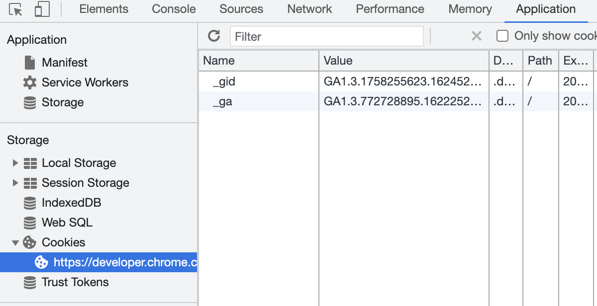

# 클라이언트 식별과 쿠키

## 개별 접촉
- HTTP는 익명, stateless, 요청-응답 기반 통신 프로토콜
- 현대 웹사이트: 개인화된 서비스 제공 니즈 O
    * 사용자 특화 환영 메시지
    * 사용자 맞춤 추천
    * 저장된 사용자 정보 (ex. 주소, 카드 번호 등)
    * 세션 추적 (ex. 장바구니)
- HTTP가 사용자를 식별하는 기술
    * 사용자 식별 정보를 전달하는 HTTP 헤더
    * 클라이언트 IP 주소 추적
    * 사용자 로그인 인증
    * URL에 식별자를 포함시킴
    * 식별 정보를 지속해서 유지하는 강력하고 효율적인 쿠키

## HTTP 헤더
1. `From` (요청): 사용자 이메일 주소
    * 악의적인 서버가 메일을 수집해서 스팸 메일을 발송할 우려가 있어서 많이 쓰이지 않음
    * 로봇, 스파이더는 웹마스터가 항의 메일을 보낼 수 있도록 메일 주소를 기재
2. `User-Agent` (요청): 사용자 브라우저
    * 브라우저 이름, 버전, 운영체제 정보 등
    * 콘텐츠를 최적화하는 데 유용
3. `Referer` (요청): 사용자가 링크를 타고 온 페이지
    * 이것만으로 식별하기는 어려움
    * 사용자의 취향, 사용 행태 파악 용이
4. `Authorization` (요청): 사용자 이름과 비밀번호
5. `Client-ip` (확장-요청): 클라이언트의 IP 주소
6. `X-Forwarded-For` (확장-요청): 클라이언트의 IP 주소
7. `Cookie` (확장-요청): 서버가 생성한 ID 라벨

## 클라이언트 IP 주소
- 보통 HTTP 헤더에 IP 주소가 들어가지는 않음 -> 웹 서버 HTTP 요청을 보내 반대쪽 TCP 커넥션의 IP 주소를 알아낼 수 있음
- 단점
    * IP 주소는 사용자가 아니라 컴퓨터를 가리킨다. 여러 사용자가 같은 컴퓨터를 사용할 수 있다.
    * ISP는 동적으로 IP 주소를 할당한다.
    * 많은 사용자가 NAT 방화벽을 통해 인터넷을 사용한다. NAT 장비들은 클라이언트들의 실제 IP 주소를 하나의 방화벽 IP 주소로 변환한다.
    * 서버가 프록시나 게이트웨이와 연결되어 있는 경우, 서버는 클라이언트의 IP 주소 대신 프록시의 IP 주소를 본다. (프록시 확장 헤더(`Client-ip`, `X-Forwarded-For`)를 사용할 수도 있지만 모든 프록시가 그렇게 하지는 않는다.)

## 사용자 로그인
- 웹 사이트 로그인이 쉽도록 HTTP는 `WWW-Authenticate`, `Authorization` 헤더를 사용해 웹 사이트에 사용자 이름을 전달하는 체계를 가짐
- 한번 로그인하면 이후 요청에는 모두 로그인 정보를 함께 보냄
- 과정
    1. 클라이언트가 요청
    2. 서버는 `401 Login Required` 응답과 `WWW-Authenticate` 헤더를 반환해 로그인 요청
    3. 사용자가 입력한 로그인 정보 토큰 `Authorization` 헤더에 담아 보냄 (ex. `Authorization: Basic am910jRmdW4=`)
    4. 추후 요청에 대해서는 서버가 요청하지 않아도 사용자 이름과 비밀번호를 포함해 전달해 세션이 진행되는 내내 사용자에 대한 식별을 유지함
- 단점
    * 귀찮음
    * 각기 다른 사용자 이름과 비밀번호

## 뚱뚱한 URL
- 웹 서버가 URL 뒤에 상태 정보를 추가한 하이퍼링크를 동적으로 생성
- 과정
    1. 사용자가 처음 방문하면 유일한 ID가 생성됨
    2. URL 처음이나 끝에 ID를 추가함 ex. `http://amazon.com/.../002-1145265-801683`
    3. 서버가 ID를 포함한 요청을 받으면 사용자와 관련된 추가적인 정보(ex. 장바구니, 프로필)를 찾고, 응답을 뚱뚱한 URL로 만듦
- 단점
    * 못생긴 URL: 사용자 혼란
    * 공유할 수 없는 URL: 타인과 공유할 수 없음 & 공유한다면 의도치 않은 개인 정보 누출
    * 캐시 불가: URL이 계속 달라지기 때문
    * 서버 부하 가중: 서버가 뚱뚱한 URL에 해당하는 페이지를 다시 그려야 함
    * 이탈: 사용자가 의도치 않게 뚱뚱한 URL 세션에서 이탈할 수 있음. 그럴 경우 사용자 정보 초기화.
    * 세션 간 지속성 부재: 만들어진 뚱뚱한 URL을 유지하기 위해 따로 조치를 취하지 않으면, 결국 이탈하게 되어 정보 초기화.

## 쿠키
> 브라우저가 서버 정보를 저장하고, 사용자가 해당 서버 접근 시 정보를 함께 전송
- 사용자 식별, 세션 유지 방법 중 가장 애용됨
- 넷스케이프 개발, 모든 브라우저 지원
- 캐시와 충돌할 수 있어서 캐시/브라우저에서는 쿠키 내용을 캐싱하지 않음

### 쿠키의 타입
* 파기되는 시점의 차이
1. 세션 쿠키
    - 사용자가 사이트를 탐색할 때, 관련 설정과 선호 사항 저장하는 임시 쿠키
    - 브라우저를 닫으면 삭제
    - Discard 파라미터 설정 (RFC 2965에 정의됨, 현재는 RFC 6265에 의해 대체됨, 사용되지 않음)
2. 지속 쿠키
    - 사용자가 주기적으로 방문하는 사이트 설정 정보, 로그인 이름 유지
    - 브라우저를 닫아도 지속 가능 (디스크에 저장)
    - Expires, Max-Age 파라미터 포함

### 쿠키의 동작
1. 사용자가 웹 서버를 방문한다. 서버는 사용자에 대해 아무 것도 모른다.
2. 서버는 사용자를 식별하기 위한 값을 쿠키에 할당한다.
   - 쿠키는 이름=값 형태의 리스트이다.
   - 서버는 이 리스트를 Set-Cookie 헤더에 담아 클라이언트에 전달한다.
   - `Cookie: name="Sooah Kim"; phone="1234-5678"`
3. 브라우저는 서버에서 온 Set-Cookie 헤더에 있는 쿠키를 데이터베이스에 저장한다.
4. 사용자가 나중에 같은 사이트를 방문하면 브라우저는 Cookie 헤더에 쿠키를 담아 전송한다.
* 확장 헤더 Set-Cookie2는 현재 폐기됨

### 쿠키 상자
- HTTP 상태 관리 체계: 브라우저는 쿠키 정보를 저장할 책임이 있음 (=클라이언트 측 상태)
- 브라우저마다 다른 방식으로 쿠키를 저장함
- 구글 크롬
    * Cookies 라는 SQLite 파일에 저장
    * 
    * [공식 문서 - Fields](https://developer.chrome.com/docs/devtools/storage/cookies/#fields)
- 인터넷 익스플로러
    * 캐시 디렉토리에 개별 파일로 저장

### 사이트마다 다른 쿠키들
- 브라우저는 각 사이트에 모든 쿠키를 보내지 않음
    * 모두 전달하면 성능 저하
    * 쿠키는 특정 서버에 특화된 값이라 다른 사이트에는 무의미
    * 개인정보 보호
- 보통 브라우저는 쿠키를 생성한 서버에게만 해당 쿠키를 전달함
- 서버는 쿠키를 생성할 때 Set-Cookie 응답 헤더에 여러 속성을 넣어 쿠키를 제어함
    * Domain: 어떤 사이트가 그 쿠키를 읽을 수 있는지 제어
        + `Set-cookie: user="sooah"; domain="somewhere.com"`
        + something.somewhere.com 같이 해당 도메인에 방문할 때 쿠키를 전달
    * Path: 해당 경로에 속하는 페이지에만 쿠키를 전달
        + `Set-cookie: type="dorothy"; domain="somewhere.com"; path="/rainbow/"`
        + somewhere.com/rainbow/에서만 type을 원할 경우
        + 즉, 도메인/경로별 관리 가능한 일종의 상태 정보

### 쿠키와 세션 추적
- 세션 **쿠키**를 사용해 사용자의 연속적인 트랜잭션을 추적
- 세션의 동작 방식
    1. 클라이언트가 서버에 접속 시 세션 ID를 발급 받음
    2. 클라이언트는 세션 ID에 대해 쿠키를 사용해서 저장하고 가지고 있음
    3. 클라이언트는 서버에 요청할 때, 이 쿠키의 세션 ID를 서버에 전달
    4. 서버는 세션 ID를 전달 받아서 별다른 작업없이 세션 ID로 세션에 있는 클라언트 정보를 가져옴
    5. 클라이언트 정보를 가지고 서버 요청을 처리, 클라이언트에게 응답
- 세션의 특징
    * 각 클라이언트에게 고유 ID를 부여
    * 세션 ID로 클라이언트를 구분해서 클라이언트의 요구에 맞는 서비스를 제공
    * 보안 면에서 쿠키보다 우수
    * 사용자가 많아질수록 서버 메모리를 많이 차지하게 됨

### 쿠키와 캐싱
- **주의** 쿠키와 관련된 문서를 캐싱하면 사용자의 쿠키가 다른 사용자에게 할당되거나, 개인 정보가 노출될 수 있음
1. 캐시하면 안 될 문서에는 표시할 것
    * 캐시하면 안 되는 문서라면 명시적으로 `Cache-Control: no-cache="Set-Cookie"`를 표시
    * 캐시해도 되는 문서에 `Cache-Control: public`을 사용하면 웹 대역폭 절약
2. 쿠키 헤더 처리
    * Set-Cookie 헤더가 있는 응답 본문은 캐시 가능, but Set-Cookie 헤더 자체를 캐시하는 것은 주의 (같은 헤더를 여러 사용자에게 보내 사용자 추적 실패 가능)
    * 서버 - 캐시 (Set-Cookie 헤더 캐싱 주의)
        + 어떤 캐시는 응답을 저장하기 전에 Set-Cookie 헤더를 제거 -> 클라이언트가 헤더 정보를 잃게 될 수 있음
        + 헤더 제거 위험을 피하기 위해 캐시가 모든 요청마다 원 서버에 재검사하도록 만들려면 `Cache-Control: must-revalidate, max-age=0`을 추가
        + 아주 보수적인 캐시는 Set-Cookie를 가지고 있는 응답은 아예 캐싱하지 않거나, 이미지만 캐싱하고 텍스트는 캐싱하지 않는다.
    * 캐시 - 클라이언트 (Cookie 헤더를 가지고 있는 요청을 주의)
        + 요청이 쿠키 헤더와 함께 오면, 보수적인 캐시는 해당 요청의 응답을 캐시하지 않을 수 있다.
        + 위와 유사하게 이미지만 캐싱할 수도 있음
        + 효율적인 방식은 매번 재검사를 강제하는 것

### 쿠키, 보안, 개인정보
- 쿠키가 그 자체로 보안상 위험한 것은 아님
- 잘못된 의도로 사용되는 것을 주의하고 개인정보 정책을 잘 따르면 괜찮음