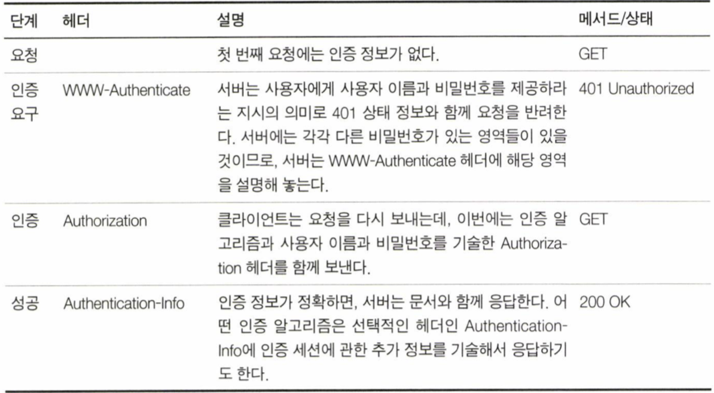
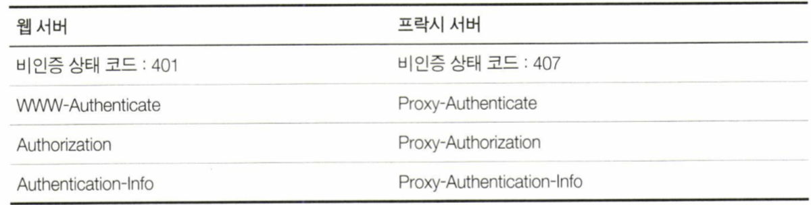

# 기본 인증
- 인증의 필요?
    * 데이터에 특정하게 허가된 사람만 접근 가능해야 함
    * 서버가 사용자를 식별 가능해야 함
- 기본 HTTP 인증 & 강력한 다이제스트 인증

## 인증
- 인증: 내가 누구인지 증명하는 것
- HTTP 인증 요구-응답 프레임워크
    1. 클라이언트가 서버에 정보 요청
    2. 서버가 클라이언트에 인증 요청
    3. 클라이언트가 인증 정보와 함께 서버에 정보 요청
    4. 서버가 클라이언트에 응답 보냄
- 인증 프로토콜과 헤더
    * HTTP는 customize 가 가능한 제어 헤더를 통해 여러 인증 프로토콜에 맞게 확장할 수 있는 프레임워크를 제공한다.
    * HTTP: 기본 인증, 다이제스트 인증의 2개 프로토콜 제공
    * 네 가지 인증 단계
        + 
        1. 요청
        2. 인증 요구
            + Basic : 기본 인증 스킴으로 ID/PW 를 base64 encoding 하여 전달
                + `Authorization: <type> <credentials>` 등에 기술되는 type 중 하나. Basic, Bearer, Digest, ...
            + realm : 인증을 요구하는 공간이나 범위에 대한 설명
        3. 인증
            + WWW-Authenticate 헤더에 정의된 스킴에 맞춰 Authorization 헤더에 ID/PW 쌍을 기술하여 전송
        4. Authentication-info
            + 추가적인 인증 알고리즘에 대한 정보를 기술
- OAuth
    * 다른 서비스의 회원 정보를 안전하게 사용하기 위한 방법
    * HTTP의 인증 요구-응답 프로토콜 사용하는 인증 프로토콜
    * 모바일 기기 등 다양한 애플리케이션에서 API 인증을 위해 액세스 토큰 등을 사용
    * ex. 네이버로 로그인하기, 페이스북으로 로그인하기 등
- 보안 영역
    * HTTP가 각 리소스마다 다른 접근 조건을 다루는 방법
    * realm (보안 영역. `WWW-Authenticate` 헤더 안에 기술.)
        + 서버는 접근이 제한된 문서들을 realm 그룹으로 나눔
        + realm 그룹은 각각 다른 사용자 권한을 요구
        + realm의 내용은 사용자가 권한 범위를 이해할 수 있도록 해설 형식으로 되어 있음
        + `WWW-Authenticate: Basic realm="Corporate Financials"`

## 기본 인증
- 거의 모든 주요 클라이언트, 서버에 구현되어 있음
- 인증 과정
    1. 서버는 클라이언트의 요청을 거부하고 401 상태 코드와 함께 클라이언트가 요청한 보안 영역을 `WWW-Authenticate`에 기술해서 응답하면서 인증을 요구함
    2. 사용자는 계정과 비밀번호를 입력
    3. 클라이언트는 이를 암호화하여 서버에 전송 (`Authorization` 헤더)
    4. 서버는 사용자의 권한을 검사함
- base64 인코딩
    * HTTP기본 인증은 사용자 이름과 비밀번호를 콜론으로 이어서 합치고 base-64 인코딩
    * why? 쉽게 국제문자를 포함할 수 있게 함 & 네트워크 트래픽에 민감 정보가 노출되지 않게 함
- 프록시 인증
    * 중개 프록시 서버로 인증 ex. 회사의 LAN/무선 네트워크에 접근하기 전에 프록시를 거치게 함
    * 접근 정책을 중앙 관리할 수 있음 -> 리소스 전체에 대해 통합 접근 제어 가능
    * 웹 서버 인증과 헤더, 상태 코드만 다르고 절차는 같음
        + 

## 기본 인증의 보안 결함
- 기본 인증은 단순하고 편리하지만, 안심할 수는 없음
    * 일반적인 환경에서 개인화와 접근 제어에 편리함
    * 사용자가 악의적이지 않을 경우, 설사 노출되어도 상관 없는 정보를 통신할 때 유용함
    * 암호화된 데이터 전송과 함께 연계해서 사용 가능
- 보안 결함 예시
    1. 인증 정보를 인코딩하기는 하지만, 누구나 쉽게 디코딩할 수 있음
        + 모든 HTTP 트랜잭션을 SSL 암호화 채널로 보내기
        + 보안이 더 강화된 다이제스트 인증 프로토콜을 사용하기 
    2. 제 3자가 디코딩하지 않더라도 중간에서 인코딩 정보를 탈취하여 원 서버에 인증을 성공할 수 있음 (재전송 방지 X)
    3. 제 3자가 같은 계정과 비밀번호를 사용하는 다른 사이트에 접근할 수 있음
    4. 인증 헤더를 그대로 두고 다른 부분을 수정하는 중개자가 개입할 수 있음
    5. 인증 정보를 요청하는 가짜로 위장한 서버에 대한 대책이 없음