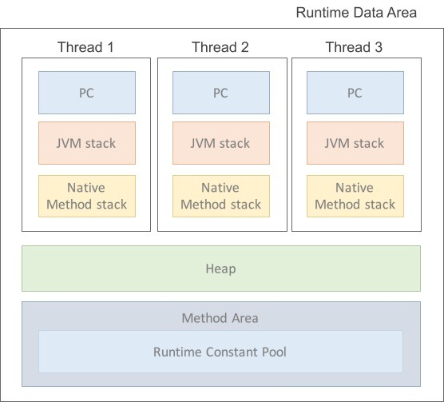

# JDK (Java Development Kit)

- JDK?
    * Java 환경에서 돌아가는 프로그램을 개발하는 데 필요한 툴들을 모아놓은 소프트웨어 패키지
    * 개발을 위한 클래스, 컴파일러, 실행 및 배포도구를 포함 등 개발을 위한 전반적인 환경 제공
    * Java SE(Standard Edition. 자바 기본 에디션, JVM + 개발에 필수적인 도구 +  API(표준 클래스 라이브러리) 제공) 구현체
- 구성
    * JRE(Java Runtime Environment) = JVM + 표준 클래스 라이브러리
    * Java 바이트코드 컴파일러
    * Java 디버거 등
- 주요 실행 파일
    * `javac.exe`: 자바 컴파일러. 자바 소스코드를 바이트코드로 컴파일함.
    * `java.exe`: 자바 인터프리터. 컴파일러가 생성한 바이트코드를 해석 및 실행함.
    * `javap.exe`: 역어셈블러. 컴파일된 클래스 파일을 원래의 소스로 변환함.

# JVM (Java Virtual Machine)

- JVM? 자바를 실행하기 위한 가상 머신 (VM; 소프트웨어로 구현된 하드웨어)
- 구성
    * Class Loader(클래스 로더)
        + 클래스를 처음 참조할 때, JVM내의 런타임 데이터 영역에 클래스(.class파일, 바이트 코드)를 `로드`하고, `링크`를 통해 배치하는 작업을 수행하는 모듈
        + jar파일 내 저장된 클래스들을 JVM위에 탑재하고 사용하지 않는 클래스들은 메모리에서 삭제함. (컴파일러 역할) 
    * Execution Engine(실행 엔진)
        + 클래스를 자바 바이트 코드를 명령어 단위로 읽어서 실행시키는 엔진 (인터프리터 언어의 단점)
        + 바이트코드를 실제로 JVM내부에서 기계가 실행할 수 있는 형태로 변경
    * JIT(Just - In - Time)
        + 인터프리터 방식의 단점을 보완하기 위해 도입된 컴파일러
        + 인터프리터 방식으로 실행하다가 적절한 시점에 바이트코드 전체를 컴파일하여 네이티브 코드로 변경하고, 이후에는 해당 더 이상 인터프리팅 하지 않고 네이티브 코드로 직접 실행하는 방식. 네이티브 코드는 캐시에 보관하기 때문에 한 번 컴파일된 코드는 빠르게 수행하게 된다. 물론 JIT컴파일러가 컴파일하는 과정은 바이트코드를 인터프리팅하는 것보다 훨씬 오래 걸리므로 한 번만 실행되는 코드라면 컴파일하지 않고 인터프리팅하는 것이 유리하다. 따라서 JIT 컴파일러를 사용하는 JVM들은 내부적으로 해당 메서드가 얼마나 자주 수행되는지 체크하고, 일정 정도를 넘을 때에만 컴파일을 수행한다.
    * Garbage collector: GC를 수행하는 모듈 (쓰레드)이 있다.
- 특징
    * 일반 애플리케이션 코드가 OS 하나만 거치는 데 비해 자바 코드의 경우 JVM-OS를 거치며, 하드웨어에 맞게 완전히 컴파일된 상태가 아니라 실행 시에 해석(interpret)되기 때문에 속도가 느리다. (cf. JIT 컴파일러는 바이트코드를 기계어로 완전 변환함)
    * 자바 애플리케이션은 OS와 하드웨어에 독립적이지만, JVM은 OS에 종속적이다.
    * 메모리 관리(Garbage Collection) 수행
    * 스택 기반 VM (<-> ARM 아키텍처: 레지스터 기반)
- 자바 프로그램 실행 단계: 자바 소스 파일 -(`javac`)-> 바이트 코드 -(`java`)-> 바이너리 코드 -> 실행
    1. 프로그램이 실행되면 JVM은 OS로부터 이 프로그램이 필요로 하는 메모리를 할당받는다.
       JVM은 이 메모리를 용도에 따라 여러 영역으로 나누어 관리한다.
    2. 자바 컴파일러(javac)가 자바 소스코드(.java)를 읽어들여 자바 바이트코드(.class)로 변환시킨다.
    3. Class Loader를 통해 class파일들을 JVM으로 로딩한다.
    4. 로딩된 class파일들은 Execution engine을 통해 해석된다.
    5. 해석된 바이트코드는 Runtime Data Areas 에 배치되어 실질적인 수행이 이루어지게 된다.
        이러한 실행과정 속에서 JVM은 필요에 따라 Thread Synchronization과 GC같은 관리작업을 수행한다.

# 런타임 데이터 영역

- Runtime Data Area? 프로그램을 수행하기 위해 OS에서 할당받은 메모리 공간
- java.exe로 JVM이 시작되면 JVM은 운영체제에서 할당받은 Runtime Data Area를 다음과 같이 세부 영역으로 구분하여 사용하게 됨

1. PC Register
- Thread가 시작될 때 생성됨 & 생성될 때마다 생성되는 영역 -> `Thread`마다 하나씩 존재
- Thread가 어떤 부분을 어떤 명령으로 실행해야할 지에 대한 기록을 하는 부분
- 현재 수행 중인 JVM 명령의 주소를 가진다.

2. JVM 스택 영역
- 프로그램 실행과정에서 `임시로 할당`되었다가 메서드를 빠져나가면 바로 소멸되는 특성의 데이터를 저장하기 위한 영역 
    * ex. 원시 타입, 메서드 안에서 사용되는 값들(local variable), 호출된 메서드의 매개변수, 지역변수, 리턴 값 및 연산 시 일어나는 값들을 임시로 저장
- 메서드 호출 시마다 각각의 스택 프레임(그 메서드만을 위한 공간)이 생성됨
    * 각 Thread 는 자신만의 stack 을 가진다.
- 메서드 수행이 끝나면 프레임 별로 삭제

3. Native method stack
- 자바 프로그램이 컴파일되어 생성되는 바이트 코드가 아닌, 실제 실행할 수 있는 `기계어`로 작성된 프로그램을 실행시키는 영역
- JAVA Native Interface를 통해 바이트 코드로 전환하여 저장
- 커널이 스택을 잡아 독자적으로 프로그램을 실행시키는 영역 (자바 외 일반 프로그램 등과 같음) 

4. Method Area (= Class area = Static area)
- `클래스` 정보를 처음 메모리 공간에 올릴 때 초기화되는 대상을 저장하기 위한 메모리 영역
- JVM이 시작할 때 생성되고, JVM의 모든 스레드가 공유하는 영역
- 자바는 main 메서드의 호출에서부터 계속된 메서드의 호출로 흐름을 이어가기 때문에 흐름을 구성하는, 거의 모든 바이트 코드가 여기에 올라간다고 보면 됨
- 코드에서 사용되는 클래스(~.class)들을 클래스 로더로 읽어 클래스별로 데이터 종류를 분류하여 저장함
    * ex. Class 정보, Method 정보, 멤버변수, static 변수 저장 영역
- 올라가는 정보의 종류
    * Field Information: 멤버변수의 이름, 데이터 타입, 접근 제어자에 대한 정보
    * Method Information: 메서드의 이름, 리턴타입, 매개변수, 접근제어자에 대한 정보
    * Type Information: class인지 interface인지의 여부 저장 /Type의 속성, 전체 이름, super class의 전체 이름(interface 이거나 object인 경우 제외)

5. Heap Area

- `객체`를 저장하는 가상 메모리 공간 (소멸 방법과 소멸 시점이 지역 변수와는 다르기 때문)
- GC의 관리 대상
- new 연산자로 생성된 객체와 배열을 저장. 물론 class area영역에 올라온 클래스들만 객체로 생성할 수 있음.
    * ex. 모든 Object 타입(Integer, String, ArrayList, ...)
- 메모리 중 스택에 있는 데이터 제외한 모든 부분으로 볼 수 있음. JVM 스택 영역의 변수나 다른 객체의 필드에서 참조.
    * Heap 영역에 있는 오브젝트들을 가리키는 레퍼런스 변수가 stack 에 올라가게 된다.
    * 힙의 객체를 참조하는 것들
        + 힙 내의 다른 객체에 의한 참조
        + Java 스택, 즉 Java 메서드 실행 시에 사용하는 지역 변수와 파라미터들에 의한 참조
        + 네이티브 스택, 즉 JNI(Java Native Interface)에 의해 생성된 객체에 대한 참조
        + 메서드 영역의 정적 변수에 의한 참조
- 몇개의 스레드가 존재하든 상관없이 단 하나의 heap 영역만 존재함
- 참조하는 변수나 field가 없으면 Garbage Collector를 실행시켜 쓰레기 객체를 힙 영역에서 자동으로 제거
- 구성
    * Permanent Generation, `Permanent`
        + 생성된 객체들의 정보의 주소값이 저장된 공간
        + Class loader에 의해 load되는 Class, Method 등에 대한 Meta 정보가 저장됨
        + JVM에 의해, Reflection으로 동적으로 클래스가 로딩되는 경우에 사용됨. (내부적으로 Reflection 기능을 자주 사용하는 Spring Framework를 이용할 경우 이 영역에 대한 고려가 필요)
        + Permanent 영역은 Java 8 이후로 삭제됨. Java 8 이후로는 Metaspace에서 Meta 정보를 관리한다.
    * Young(New) Generation, `Eden`, `Survivor0`, `Survivor1`
        + Eden : 객체들이 최초로 생성되는 공간
        + Survivor 0 / 1 : Eden에서 참조되는 객체들이 저장되는 공간
    * Tenured Generation, `Old`
        + Young에서 일정 시간 참조되고 있는, 살아남은 객체들이 저장되는 공간
        + Eden에 객체가 가득차게 되면 첫번째 GC(minor GC) 발생 -> Survivor 1 영역에 복사 & 나머지 객체 삭제

### 어떤 데이터가 어떤 메모리에 올라갈까?
- **전역변수&스태틱변수** → 메모리의 `스태틱` 영역 (종료까지 안 사라짐)
- **기본자료형&로컬변수** → 메모리의 `스택` 영역 (호출시 할당, 작업 끝나면 해제)
- **참조형&배열** 등 → 메모리의 `힙` 영역 (값은 여기에 할당, 참조값을 스택에서 갖고 있음, 사용 안 하면 JVM의 GC 기능으로 해제됨)

### 런타임 데이터 영역의 참조 관계

# 참고 자료
- 자바의 정석, 남궁성 저
- [JDK, JVM 용어 정리 및 프로그램 실행 단계](https://you9010.tistory.com/150)
- [#자바가상머신, JVM(Java Virtual Machine)이란 무엇인가?](https://asfirstalways.tistory.com/158)
- [Java Garbage Collector(자바 가비지 수집기)](https://blog.naver.com/pcmola/222060198638)