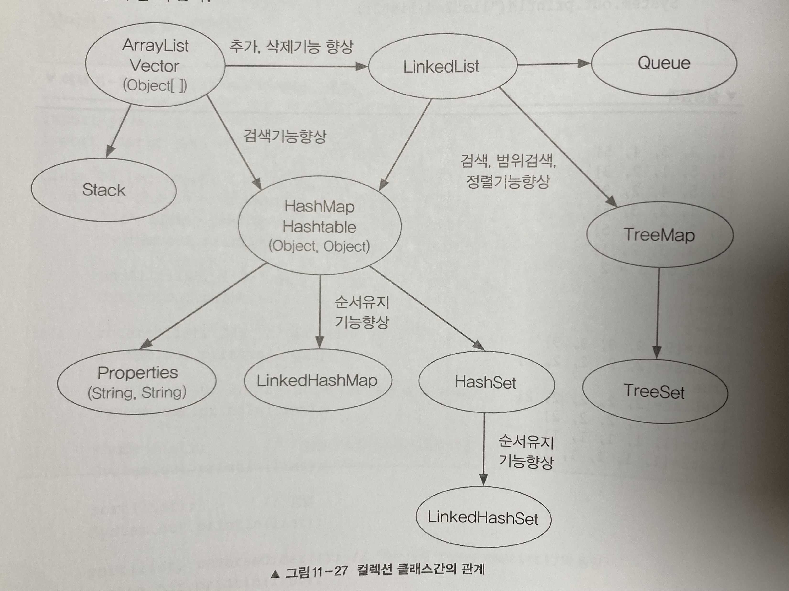

# 컬렉션 프레임워크

## 관계 

- ArrayList = 배열 기반, 임의의 요소 접근성 높음
- LinkedList = 연결 기반, 데이터의 추가/삭제 잦을 경우 유리
- HashMap = 배열 + 연결, 검색 최고 성능
- TreeMap = 연결 기반, 정렬과 범위 검색에 적합
- Stack = Vector 상속 후 구현
- Queue = LinkedList가 구현
- Properties = HashTable을 상속받아 구현
- HashSet = HashMap을 이용해서 구현
- TreeMap = TreeMap을 이용해서 구현
- LinkedHashMap, LinkedHashSet = 해시맵과 해시셋에 저장순서유지기능 추가

## ArrayList와 LinkedList
- 공통점
    * List 인터페이스를 구현
- 차이점
    * 인덱스 접근: ArrayList (빠름, O(1)) LinkedList (느림, O(n), 앞부터 순차적 접근)
    * 삽입 및 삭제: ArrayList (느림, O(n), 요소 이동 필요, 단 순차적으로 이뤄질 경우엔 더 빠름) LinkedList (빠름, O(1), 노드 참조만 변경하면 됨)
    * 메모리 효율성: ArrayList (좋음, 요소 저장에 필요한 추가적인 메모리가 거의 없음) LinkedList (나쁨, 노드마다 이전/이후 참조 저장 필요)

## Comparable, Comparator
- Comparable: 기본 정렬기준을 구현하는 데 사용
- Comparator: 기본 정렬기준 외에 다른 기준으로 정렬하고자 할 때 사용

## Set 구현체
- HashSet: 중복 불가, 순서 없음
- TreeSet: 중복 불가, 순서 없음, 정렬된 저장
- HashSet, TreeSet은 내부적으로 HashMap, TreeMap을 사용하여 구현하여 유사한 특징을 가짐 (key만 사용하고 value는 고정값 사용)

## Collections
- Collection 패키지 안에는 인터페이스가, Collections 패키지 안에는 클래스가 있다
- synchronized: 동기화 클래스의 prefix
- unmodifiable: 변경불가 클래스의 prefix
- singleton: 싱글톤 클래스의 prefix
- checked: 한 종류의 객체만 저장하는 클래스의 prefix