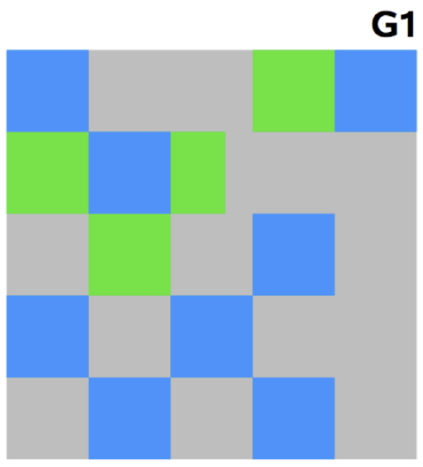

# Garbage Collection
- GC?
    * 자바는 개발자가 프로그램 코드로 메모리를 명시적으로 해제하지 않음 (`System.gc()`라는 게 있지만, 성능에 문제 발생)
    * 자체적으로 가비지 콜렉터가 더 이상 필요 없는 (쓰레기) 객체를 찾아 지워서 힙의 메모리를 회수하는 작업을 수행
- stop-the-world?
    * GC을 실행하기 위해 JVM이 애플리케이션 실행을 멈추는 것
    * stop-the-world가 발생 -> GC를 실행하는 쓰레드를 제외한 나머지 쓰레드는 모두 작업을 멈춤 -> GC 작업을 완료한 이후 중단했던 작업을 다시 시작
    * 어떤 GC 알고리즘을 사용하더라도 stop-the-world는 발생함. 
        + GC 튜닝이란 이 stop-the-world 시간을 줄이는 것.
        + 설정은 모든 상황에 대한 일반적인 방법이 존재하는 것이 아니므로, 지속적인 모니터링으로 적절한 튜닝 필요
- GC의 전제 조건 (weak generational hypothesis)
    * 대부분의 객체는 금방 접근 불가능 상태(unreachable)가 된다.
    * 오래된 객체에서 젊은 객체로의 참조는 아주 적게 존재한다.

## 어떻게 객체가 가비지인지 판단할까? reachability!
- 유효한 참조가 있으면 `reachable`로, 없으면 `unreachable`로 구별하고, unreachable 객체를 가비지로 간주해 GC를 수행
- 한 객체는 여러 다른 객체를 참조하고, 참조된 다른 객체들도 마찬가지로 또 다른 객체들을 참조할 수 있으므로 객체들은 `참조 사슬`을 이룬다. 이런 상황에서 유효한 참조 여부를 파악하려면 항상 `유효한 최초의 참조`가 있어야 하는데 이를 객체 참조의 `root set`이라고 한다. 자바 힙 내에서 힙 내의 다른 객체를 참조하는 것 외의 모든 힙에 대한 참조는 `root set`이다. Java GC는 root set으로부터 시작해서 객체에 대한 모든 경로를 탐색하고 그 경로에 있는 reference object들을 조사하여 그 객체에 대한 `reachability`를 결정한다.
- reachability
    * strongly reachable: root set으로부터 시작해서 어떤 reference object도 중간에 끼지 않은 상태로 참조 가능한 객체, 다시 말해, 객체까지 도달하는 여러 참조 사슬 중 reference object가 없는 사슬이 하나라도 있는 객체
    * softly reachable: strongly reachable 객체가 아닌 객체 중에서 weak reference, phantom reference 없이 soft reference만 통과하는 참조 사슬이 하나라도 있는 객체
    * weakly reachable: strongly reachable 객체도 softly reachable 객체도 아닌 객체 중에서, phantom reference 없이 weak reference만 통과하는 참조 사슬이 하나라도 있는 객체
    * phantomly reachable: strongly reachable 객체, softly reachable 객체, weakly reachable 객체 모두 해당되지 않는 객체. 이 객체는 파이널라이즈(finalize)되었지만 아직 메모리가 회수되지 않은 상태이다.
    * `unreachable`: root set으로부터 시작되는 참조 사슬로 참조되지 않는 객체

# Garbage Collectotion 종류
## 1. MinorGC
- Young Generation 에서 발생하는 GC
- 순서
    1. 새로 생성한 대부분의 객체는 Eden 영역에 위치한다.
    2. Eden 영역에서 GC가 한 번 발생한 후 살아남은 객체는 Survivor 영역 중 하나로 이동된다.
    3. Eden 영역에서 GC가 발생하면 이미 살아남은 객체가 존재하는 Survivor 영역으로 객체가 계속 쌓인다.
    4. 하나의 Survivor 영역이 가득 차게 되면 그 중에서 살아남은 객체를 다른 Survivor 영역으로 이동한다. 그리고 가득 찬 Survivor 영역은 아무 데이터도 없는 상태로 된다. (따라서 데이터가 서바이버 영역 모두에 있거나, 모두에 없다면 뭔가 문제가 있는 것이다)
    5. 이 과정을 반복하다가 계속해서 살아남아 있는 객체는 Old 영역으로 이동하게 된다.

## 2. MajorGC
- Old Generation (Tenured Space) 에서 발생하는 GC
- 방식
    * Serial GC (운영 서버에서 절대 사용하면 안 되는 성능이 나쁜 방식, CPU 코어가 하나일 때를 위함)
    * Parallel GC
    * Parallel Old GC(Parallel Compacting GC)
    * Concurrent Mark & Sweep GC(이하 CMS)
    * G1(Garbage First) GC

## 3. FullGC
- Heap 전체를 clear 하는 작업

# Garbage Collector 종류
## 1. Serial GC (-XX:+UseSerialGC)
- 알고리즘: mark-sweep-compact (새로운 메모리 할당을 빠르게 하기 위해 기존 메모리에 있던 오브젝트들을 힙의 시작 위치로 옮겨 놓는 방법)
- 순서
    1. `Mark`: Old 영역에 살아 있는 객체를 식별
    2. `Sweep`: 힙(heap)의 앞 부분부터 확인하여 살아 있는 것만 남긴다
    3. `Compaction`: 각 객체들이 연속되게 쌓이도록 힙의 가장 앞 부분부터 채워서 객체가 존재하는 부분과 객체가 없는 부분으로 나눈다
- 특징
    * 적은 메모리와 CPU 코어 개수가 적을 때 적합
    * Java SE 5, 6 에서 사용되는 디폴트 가비지 컬렉터
    * MinorGC, MajorGC 모두 순차적으로 시행된다.

## 2. Parallel GC (-XX:+UseParallelGC)
- a.k.a. Throughput GC
- 알고리즘: mark-sweep-compact, 시리얼과 다른 점은 처리 쓰레드가 여러개라는 것
- 특징
    * 이 옵션이 적용되었더라도 호스트 머신이 싱글 CPU 라면 디폴트 가비지 컬렉터(Serial GC)가 사용
    * 가비지 컬렉터 쓰레드 개수는 디폴트로 CPU 개수만큼 할당되는데 `-XX:ParallelGCThread=<N>` 옵션으로 조절 가능
    * Parallel Old GC도 있는데, 이는 Parallel GC와 비교하여 Old 영역의 GC 알고리즘이 다름.
        + JDK 5 update 6부터 제공
        + Mark-Summary-Compaction 단계를 거친다. Summary 단계는 앞서 GC를 수행한 영역에 대해서 별도로 살아 있는 객체를 식별한다는 점에서 Mark-Sweep-Compaction 알고리즘의 Sweep 단계와 다르며, 약간 더 복잡한 단계를 거친다.
        + `-XX:+UseParallelOldGC` 옵션을 사용한다면, old generation 의 가비지 컬렉션에서도 멀티스레딩을 활용할 수 있다.

## 3. Concurrent Mark Sweep (CMS) Collector (-XX:+UseConcMarkSweepGC)
- a.k.a. Low Latency GC
- 알고리즘: Serial GC보다 조금 더 복잡한 방법 사용

- 순서
    1. `Initial Mark`: 클래스 로더에서 가장 가까운 객체 중 살아 있는 객체만 찾는 것으로 끝낸다. 따라서, 멈추는 시간은 매우 짧다. 
    2. `Concurrent Mark`: 방금 살아있다고 확인한 객체에서 참조하고 있는 객체들을 따라가면서 확인한다. 이 단계의 특징은 다른 쓰레드가 실행 중인 상태에서 동시에 진행된다는 것이다.
    3. `Remark`: Concurrent Mark 단계에서 새로 추가되거나 참조가 끊긴 객체를 확인한다.
    4. `Concurrent Sweep`: 쓰레기를 정리하는 작업을 실행한다. 이 작업도 다른 쓰레드가 실행되고 있는 상황에서 진행한다.
- 특징
    * 가비지 컬렉션 작업을 애플리케이션 쓰레드와 동시에 수행함으로써 가비지 컬렉션으로 인한 stop-the-world 시간을 최소화 (응답 속도가 중요할 때 사용)
    * 살아있는 오브젝트들에 대한 compact 작업을 수행하지 않음 -> 메모리의 파편화(Fragmentation) 가 문제가 된다면 더 큰 힙사이즈를 할당해야 함
    * young generation 에 대한 가비지 컬렉션시 Parallel GC 와 같은 알고리즘을 사용 (`-XX:ParallelCMSThreads=<N>` 옵션으로 쓰레드 개수를 설정)
    * 다른 GC 방식보다 메모리와 CPU를 더 많이 사용하고, Compaction 단계가 기본적으로 제공되지 않으므로, 적용시 신중한 검토 필요.

## 4. G1 Garbage Collector (-XX:+UseG1GC)
- 알고리즘: 이전 콜렉터들과 다르게, young-old 영역 개념을 아예 사용하지 않음. 바둑판 할당식.
- 순서
    
    1. G1 GC는 바둑판의 각 영역에 객체를 할당하고 GC를 실행한다. 
    2. 해당 영역이 꽉 차면 다른 영역에서 객체를 할당하고 GC를 실행한다.
- 특징
    * Java 7 부터 사용 가능
    * Young의 세가지 영역에서 데이터가 Old 영역으로 이동하는 단계가 사라진 방식
    * 장기적으로 CMS 컬렉터를 대체하기 위해 만들어짐
    * 위의 어떤 가비지 콜렉터보다 빠른 좋은 성능

# 참고 자료
- [Java Garbage Collection](https://d2.naver.com/helloworld/1329)
- [Java Reference와 GC](https://d2.naver.com/helloworld/329631)
- [[Oracle] Java Garbage Collection Basics](https://www.oracle.com/webfolder/technetwork/tutorials/obe/java/gc01/index.html)
- [자바 메모리 관리 - 가비지 컬렉션](https://yaboong.github.io/java/2018/06/09/java-garbage-collection/)