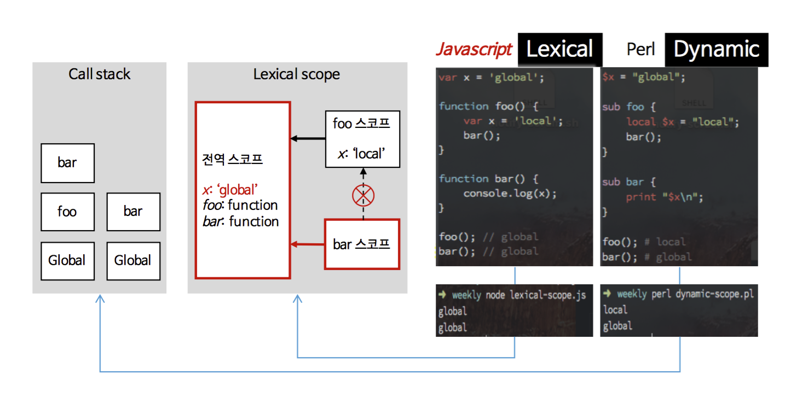

# 호이스팅 (hoisting)
- 호이스팅? 선언부를 코드의 최상단으로 `끌어올리는` 것
    * 변수를 아직 선언(var, let 등 키워드)하지 않아도 초기화(값을 할당)했다면 사용할 수 있다
    * 함수를 아직 선언(function 키워드로 작성)하지 않아도 함수를 호출할 수 있다
      * function 키워드 = function declaration(함수 선언식)
      * const 키워드 = function expression (함수 표현식)
- 웬만하면 호이스팅을 이용하지 말고, 선언하기 전에 사용하지 않는 방식으로 코딩할 것!

# 클로저 (closure)
- 클로저? 함수와 함수가 선언된 lexcal environment
    * ECMAScript 명세에 클로저에 대한 것은 없음. 자바스크립트가 스코프, 1급 객체 함수를 클로저로 구현하는 것
    * 함수가 생성될 때 그 함수의 렉시컬 환경을 `포섭`하여 실행될 때 이용
      * 함수를 만들고 그 함수 내부의 코드가 탐색하는 스코프를 함수 생성 당시의 렉시컬 스코프로 고정하면 바로 클로저가 되는 것
      * 개념적으로 자바스크립트의 모든 함수는 클로저이지만, 모든 함수를 클로저라고 하지는 않는다. 함수 내부에 함수를 작성했을 때 그 내부 함수를 클로저로 볼 수 있긴 하지만, 역시 일반적으로 부르는 클로저와는 약간 거리가 있다. 함수가 어떤 함수 내부에서 정의되고 실행되고, 그 밖으로 나왔을 때 클로저라고 부른다. 실행 과정 중에 현재 실행 스택과 무관하게 스코프를 탐색할 때.
- 목적
    * 사이드 이펙트 제어 (원할 때 클로저 호출)
    * private 변수 생성 (함수 내부 변수를 외부에서 접근해야 할 일이 생길 때 사용)

## 스코프
- 스코프(Scope)? 이름 대 값의 조합을 충돌 없이 사용하기 위해 만든 언어 명세. 자바스크립트는 함수 레벨과 블록 레벨(ES6~)의 lexical scope 규칙을 따름.

1. 전역 스코프 (Global Scope)
- 변수가 함수 바깥이나 중괄호 ({}) 바깥에 선언됨 (cf. 웹브라우저의 자바스크립트 한정, Node.js에서의 정의와 다름)
- 코드 모든 곳에서 변수 사용 가능. 함수 안에서도 가능.
- 변수 이름이 충돌할 수 있고, 그럴 때마다 에러가 발생하기 때문에 `언제나 지역 변수로 선언하는 것이 좋다`. var로 선언했다면 덮어쓰기가 되기 때문에 더더욱.

2. 지역 스코프 (Local Scope)
이 두 스코프의 차이가 자바스크립트 코딩에서 var 사용을 지양하는 이유. 코딩할 때 스코프에 혼란을 가져오기 때문임.
- 함수 스코프
    * 자바스크립트에서 var 키워드로 선언된 변수나, 함수 선언식으로 만들어진 함수는 함수 레벨 스코프를 갖는다. (함수 내부에서 유효한 식별자)
    * 함수는 서로의 스코프에 접근할 수 없음
    * 함수가 다른 함수의 내부에 정의되었다면 내부 함수는 외부 함수에 접근할 수 있음 (=lexical scoping) 반대는 불가능
- 블록 스코프
    * ES6의 let, const키워드는 블록 레벨 스코프 변수를 만들어 준다. (블록 내부에서 유효한 식별자)
    * arrow function으로 implicit한 리턴을 하는 게 아니라면, 이는 함수 스코프의 subset

3. 기타 참고

- 렉시컬 스코프(Lexical scope)
    * a.k.a. 정적 스코프(Static scope) 또는 수사적 스코프(Rhetorical scope)
    * 현대 프로그래밍에서 대부분의 언어들이 따르는 규칙. 자바스크립트도 마찬가지.
    * 소스코드가 작성된 문맥에서 name resolution.
    * this를 제외하고 호출 스택과 관계없이 대응표를 소스코드 기준으로 정의, 런타임에 그 대응표를 변경시키지 않음
    * 함수의 상위 스코프를 결정하는 방식으로, 함수를 선언할 때 결정됨
- 동적 스코프(Dynamic scope)
    * 프로그램의 런타임 도중의 실행 컨텍스트나 호출 컨텍스트에 의해 name resolution

# this
- this? 현재 실행 문맥. 누가 나를 불렀는가(선언이 아닌 호출 기반)에 따른 '이것'
- 특징
    * 자바스크립트의 함수는 호출될 때, 매개변수로 전달되는 인자값 이외에, arguments 객체와 this를 암묵적으로 전달 받음
      + apply, call, bind 메소드에서는 this를 명시적으로 바인딩할 수 있음
    * 자바에서는 인스턴스 자신(self)을 가리키는 참조변수이지만, 자바스크립트에서는 호출 방식에 따라 바인딩되는 객체가 달라짐
      + 크게 종류를 나누자면, new 바인딩, 명시적 바인딩, 암시적 바인딩, 기본 바인딩으로 나눌 수 있음.
      + 만들어지는 곳에 따라 this가 가리키는 것
          1. 단독으로 사용하는 this -> `전역 객체`
          2. 일반 함수에서 this -> `전역 객체` (단, strict mode에서는 undefined)
          3. 중첩 함수에서 this -> `전역 객체`
          4. 중첩 함수 안 화살표 함수에서 this -> `바깥 함수나 클래스의 this` (새로 정의하지 않음)
          5. 이벤트에서 this -> `이벤트 객체` (이벤트를 받는 HTML 요소)
          6. 메소드에서 this -> `메소드 객체`
          7. 메소드 내부 함수에서 this -> `전역 객체`
          8. 콜백 함수에서 this -> `전역 객체`
          9. 생성자 함수에서 this -> `생성될 객체를 담을 빈 객체`
          10. apply, call, bind에서 this -> `바인딩할 객체. 인자.`
      + 전역 객체? 모든 객체의 유일한 최상위 객체. Browser-side에서는 window, Server-side(Node.js)에서는 global 객체

# References
- [MDN Web Docs - Hoisting](https://developer.mozilla.org/ko/docs/Glossary/Hoisting)
- [MDN Web Docs - Closure](https://developer.mozilla.org/ko/docs/Web/JavaScript/Guide/Closures)
- [자바스크립트의 스코프와 클로저](https://meetup.toast.com/posts/86)
- [[번역] 자바스크립트 스코프와 클로저(JavaScript Scope and Closures)](https://medium.com/@khwsc1/%EB%B2%88%EC%97%AD-%EC%9E%90%EB%B0%94%EC%8A%A4%ED%81%AC%EB%A6%BD%ED%8A%B8-%EC%8A%A4%EC%BD%94%ED%94%84%EC%99%80-%ED%81%B4%EB%A1%9C%EC%A0%80-javascript-scope-and-closures-8d402c976d19)
- [[자바스크립트] this 객체의 정체](https://beomy.tistory.com/6)
- [함수 호출 방식에 의해 결정되는 this](https://poiemaweb.com/js-this)
- [자바스크립트에서의 this](https://nykim.work/71)