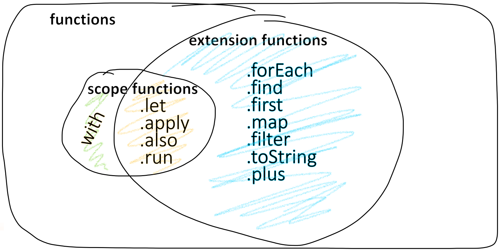

# and other Idioms
자주 사용되는 관용구 모음, 추가하고 싶을 경우 [Kotlin Repo](https://github.com/JetBrains/kotlin)에 PR 남기기

## DTO 만들기
```kotlin
data class Customer(val name: String, val email: String)
```
- data class? 특별히 별도의 함수가 필요하지 않고 데이터만 갖고 있는 클래스
- 컴파일러가 자동으로 각종 기본 메서드 생성
    * equals()
    * hashCode()
    * toString()
    * copy()
    * 모든 프로퍼티에 대한 getters (setters의 경우 var)


## Singleton 만들기
```kotlin
object Resource {
    val name = "Name"
}
```
- Singleton?
    * 클래스에 하나의 인스턴스만 생성되고 해당 클래스에 대한 단일 글로벌 액세스 지점이 제공(스레드 안정성 보장)되도록 보장하는 소프트웨어 디자인 패턴
    * use case? 로깅/헬퍼 등을 여러 인스턴스로 만드는 낭비를 막기 위해 사용
- 특징
    * 생성자 메서드 작성 불가 (초기화가 필요할 경우, `init` 블록 작성)
    * 인스턴스는 처음 사용할 때 생성됨 (lazy instantiation)
- 자바와의 비교
    * 자바의 경우, private, static, synchronized 등을 조합해서 만들어야 함
    * 코틀린의 경우, `object` 키워드로 간단하게 thread-safe(여러 쓰레드가 싱글톤 클래스를 만들 때에도 하나의 인스턴스 생성)를 보장하는 싱글톤 객체 생성 지원


## expression을 변수에 할당할 수 있다
### 1. if-else
```kotlin
fun foo(param: Int) {
    val result = if (param == 1) {
        "one"
    } else if (param == 2) {
        "two"
    } else {
        "three"
    }
    // result로 뭔가 하는 곳
}
```

### 2. try-catch
```kotlin
fun test() {
    val result = try {
        count()
    } catch (e: ArithmeticException) {
        throw IllegalStateException(e)
    }
    // result로 뭔가 하는 곳
}
```


## Scope Functions

- 확장 함수(extension functions)? 이미 존재하는 객체에 함수/프로퍼티를 임의로 확장하는 것 (switch context)
- 범위 함수(scope functions)? 객체의 임시 scope를 만들어 그 안에서 전달한 람다식을 실행하는 함수 (add context)
- 같은 일을 하는 코드라도 범위 함수 사용 여부에 따라 object reference, return value 등에 따라 체이닝을 하는 등으로 활용할 수 있음
- TODO: 자세한 작동 원리, 사용예

1. with
2. let
3. run
4. apply
```kotlin
// builder style method 작성 지원
fun arrayOfMinusOnes(size: Int): IntArray {
    return IntArray(size).apply { fill(-1) }
}
val a = arrayOfMinusOnes(5)
println(a.asList()) // [-1, -1, -1, -1, -1]

// 자바 스타일로 작성한다면, 이렇게 작성할 수 있으나, 아래 코드는 Unit을 리턴하므로 컴파일 에러 발생
return IntArray(size).fill(-1)

// 컴파일 에러를 피하기 위해 작성 가능한 코드
val ret = IntArray(size)
ret.fill(-1)
return ret

/* 
    위와 같은 코드를 apply를 응용하여 
    .이렇게(작업을이어나가는) 방식(builder-style)으로 코드를 쓸 수 있음
    apply의 리턴 타입이 IntArray 또는 일반적인 T 타입이기 때문
*/
IntArray(size).apply { fill(-1) }
```
5. also
```kotlin
// 변수 스와핑
var a = 1
var b = 2
a = b.also { b = a }
```


## Generic함수에서 타입 정보 읽기
```kotlin
inline fun <reified T> function(argument: T)
```
- `inline`? 함수 안에서 함수를 호출할 때, 호출된 함수 내부의 코드를 호출한 함수 안으로 넣어주는 것
- `reified`? inline 함수에서 런타임에 타입 정보를 알고 싶을 때 활용하는 키워드


## 초기화 지연
- 언제 사용하나요? 실제로 필요하기 전까지 비용이 많이 드는 객체 생성을 지연하고자 할 때 (성능 최적화 용도)
- deferred assignment과의 차이점? d.a.는 체크카드고, l.i.는 신용카드 같은 것.
- lazy evaluation과의 차이점? l.e.는 효율적인 연산에 대한 개념, l.i.도 일종의 l.e.이지만, 인스턴스화에 초점이 맞춰져 있음.

### 1. Late initialization
- 필요할 때 초기화하고 사용할 수 있음. 초기화하지 않고 쓰면 Exception 발생
```kotlin
class Rectangle {
    lateinit var area: Area             // var 앞에 lateinit을 붙이면 초기값을 나중에 설정할 수 있음
    fun initArea(param: Area): Unit {
        this.area = param
    }
}

class Area(val value: Int)

fun main() {
    val rectangle = Rectangle()
    rectangle.initArea(Area(10))        // 늦은 초기화
    println(rectangle.area.value)       // 이후 객체에 접근 (이 라인을 먼저 쓰면 UninitializedPropertyAccessException이 발생)
}
```
- 특징
    * var 프로퍼티만 사용 가능
    * primitive type(Int, Boolean)은 사용할 수 없음
    * Custom getter/setter를 만들 수 없음
    * Non-null 프로퍼티만 사용 가능
    * 직접 프로퍼티를 갖고 있는 구조

### 2. Lazy initialization
- 변수를 선언할 때 초기화 코드도 함께 정의. 변수가 사용될 때 초기화 코드 동작하여 변수가 초기화됨
```kotlin
val balance : Int by lazy {     // 이 블록은 변수가 처음 사용될 때 "한번" 호출되며 마지막의 값이 초기값으로 할당됨. 이 예시에서는 100
    println("이 문장은 처음 한 번 프린트됩니다.")
    100
}
```
- 특징
    * val 프로퍼티만 사용할 수 있음
    * primitive type(Int, Boolean 등)도 사용 가능
    * Non-null, Nullable 모두 사용 가능
    * lazy라는 객체 안에 필드를 갖고 있는 구조 (lazy의 프로퍼티 직접 변경 불가)


## TODO로 미완성 코드 표현하기
```kotlin
fun calcTaxes(): BigDecimal = TODO("개발중: 회계팀에게 피드백 대기")
```
- 위 함수는 언제나 `NotImplementedError`를 던진다.
- 리턴 타입은 `Nothing` (함수의 리턴값으로 정의된 타입이 무엇이든 `TODO()` 사용 가능)
- 예제와 같이 이유를 설명한 문자열을 허용하는 오버로딩이 있음
- 인텔리제이에서 TODO toolwindow에 이 부분을 자동으로 추가함


## Reference
- [Singleton class in Kotlin](https://medium.com/swlh/singleton-class-in-kotlin-c3398e7fd76b)
- [Objects in Kotlin: Create safe singletons in one line of code](https://antonioleiva.com/objects-kotlin/)
- [The “Builder-style usage of methods that return Unit” on Kotlin website confuse me](https://stackoverflow.com/questions/47955058/the-builder-style-usage-of-methods-that-return-unit-on-kotlin-website-confuse)
- [What is lazy initialization and why is it useful?](https://stackoverflow.com/questions/978759/what-is-lazy-initialization-and-why-is-it-useful)
- [lateinit과 lazy로 초기화를 지연하는 방법](https://codechacha.com/ko/kotlin-late-init/)
- [Kotlin - Property initialization using “by lazy” vs. “lateinit”](https://stackoverflow.com/questions/36623177/kotlin-property-initialization-using-by-lazy-vs-lateinit)
- [Kotlin의 Extension은 어떻게 동작하는가 part 1](https://medium.com/til-kotlin-ko/kotlin%EC%9D%98-extension%EC%9D%80-%EC%96%B4%EB%96%BB%EA%B2%8C-%EB%8F%99%EC%9E%91%ED%95%98%EB%8A%94%EA%B0%80-part-1-7badafa7524a)
- [Kotlin scope and extension functions. How to not harm your code.](https://proandroiddev.com/kotlin-scope-and-extension-functions-b35925ec96b7)
- [[Kotlin] 코틀린 let, with, run, apply, also 차이 비교 정리](https://blog.yena.io/studynote/2020/04/15/Kotlin-Scope-Functions.html)
- [Kotlin의 유용한 함수들 (scope functions) -> 맨 아래 표](https://tourspace.tistory.com/56)
- [자바의 lazy initialization](https://en.wikipedia.org/wiki/Lazy_initialization#Java)
- [자바의 lazy evaluation](https://en.wikipedia.org/wiki/Lazy_evaluation#Java)