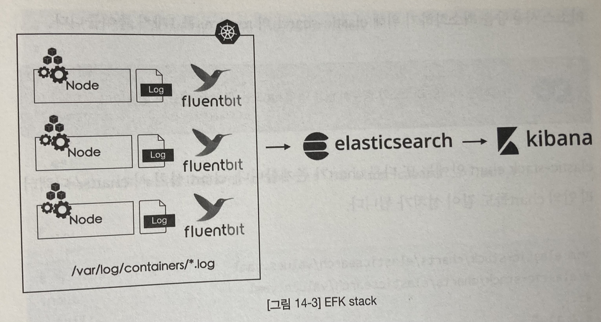
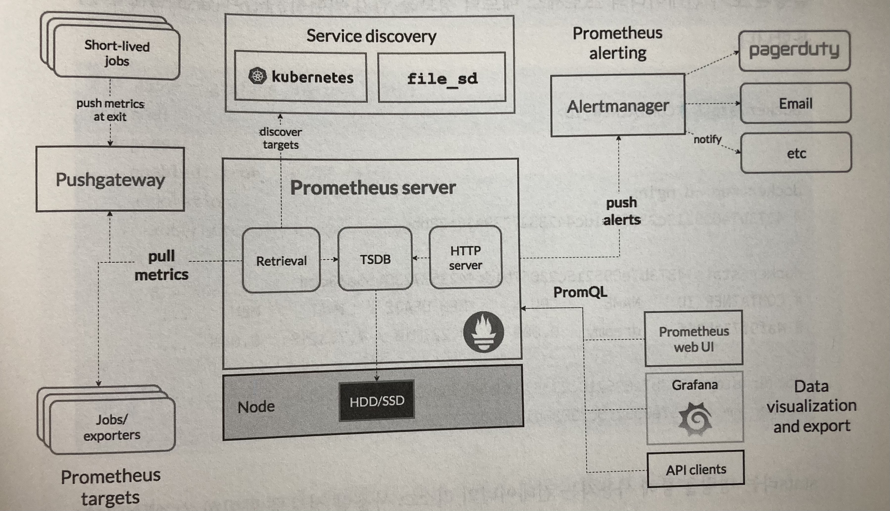

# 로깅과 모니터링
- 기본적으로 내장하는 로깅/모니터링 시스템은 없음
- 자주 쓰이는 스택: EFK, ELK etc...
    * ElasticSearch, fluentd, Kibana
    * ElasticSearch, logstash, Kibana
- 키바나와 그라파나 같은 시각화 도구를 사용하려면 공인 IP를 부여해야 함
- 명확한 사용량에 근거한 의사결정을 내릴 수 있음

## 로깅

- 클러스터 레벨 로깅
    * kubectl logs 커맨드로 확인하는 로그는 파드가 죽으면 사라지는 1회성이나, 클러스터 레벨 로깅은 파드의 생명주기와 무관하게 로그 확인 가능
    * 컨테이너 안에서 발생하는 로그 뿐 아니라 시스템 컴포넌트 로그 systemd 들도 확인 가능
    * 통일된 화면으로 모든 개발자가 로그 조회 가능
- 원리
    * 로그는 대개 호스트의 특정 디렉터리에 저장됨
    * 로그 수집기가 저장된 로그를 수집
    * 중앙 로그 저장소로 보냄
- ElasticSearch
    * 텍스트 검색에 최적화된 오픈소스 검색 엔진
    * JSON 형식으로 데이터를 인덱싱하여 저장: 비정형 데이터를 저장 및 빠르게 검색하는 데 유리함
    * 개념
        + index 도큐먼트의 집합, 일종의 테이블
        + shard 성능 향상을 위해 인덱스를 분할한 것, 일종의 파티션
        + document 한 개의 개별 데이터, 일종의 행
        + field 도큐먼트 안의 한 개의 데이터, 일종의 열
    * 장점
        + 유연함 (비정형 데이터)
        + 높은 확장성
        + 고가용성
        + full text 검색이 빠름
        + 계층적 데이터 쿼리 가능
        + RESTful API 지원
        + 준 실시간 쿼리
    * 단점
        + 업데이트 비용이 큼
        + 트랜잭션 기능 없음
        + 조인 기능 없음
- fluentd
    * 데이터 수집, 처리, 라우팅이 뛰어난 데이터 수집기
    * 경량 버전: fluent-bit
    * 로그를 수집 및 집계하고 (경량 버전의 경우 집계 불가) 다양한 플러그인으로 타 시스템과 쉽게 연동
    * cf. 로그스태시는 데이터 콜렉터로 beats를 사용하며, 나머지 역할은 fluentd와 유사함, 엘라스틱에서 개발하여 높은 호환성
- Kibana
    * 웹을 통해 대시보드를 제공하는 데이터 시각화 플랫폼
    * KQL 이라는 질의 언어를 사용하여 엘라스틱서치 쿼리 가능

## 모니터링

- 모니터링 방법의 변화
    * as-is 서버에 역할이 부여되고 서버마다 모니터링 툴을 설치해서 모니터링 시스템으로 연결 (모니터링 에이전트, push-based)
    * to-be 특정 서버의 역할이 모호해지고, 배치되는 노드를 특정 불가하여 모니터링 시스템이 수집 대상을 찾아 직접 수집 (pull-based)
- 프로메테우스
    * SoundCloud 사에서 만든 오픈소스 모니터링/알람 툴 (완료된graduated 프로젝트)
    * 서비스 디스커버리로부터 수집 대상을 질의하여 HTTP를 사용한 pull 방식으로 직접 메트릭을 수집함
    * key/value 형태의 타임 시리즈 데이터 구조
    * promQL 이라는 질의 언어 제공 (유연함)
    * 분산 스토리지를 사용하지 않음
    * 구조
        + prometheus server 메트릭을 수집하는 주체. 데이터 저장소 및 쿼리 엔진 등 중심이 되는 컴포넌트
        + service discovery 수집 대상을 프로메테우스에게 알려주는 컴포넌트
        + alertmanager 선언된 규칙에 따라 알람을 특정 채널에 발생시키는 컴포넌트 (이메일, 메신저 등)
        + exporter 실제 메트릭을 수집하는 수집기
        + push gateway 풀 방식의 데이터 전달이 불가능한 경우, 이 컴포넌트로 대신 전달함
        + grafana 데이터 시각화 툴
    * 원리
        + 익스포터가 docker stats 같은 명령어처럼 지정된 방법으로 메트릭을 추출
        + 프로메테우스 서버가 익스포터에게 요청하면 그 정보를 전달
        + 전달된 정보는 내부 저장소에 저장됨
        + 그라파나 등 시각화 도구로 저장된 데이터를 보여줌
