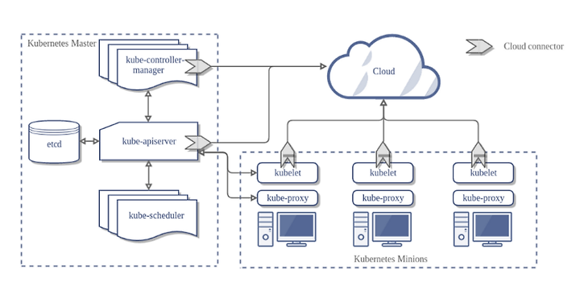

# 쿠버네티스 개념

## 용어
> 쿠버네티스는 클러스터 관리를 위한 일종의 운영체제
- 쿠버네티스: 여러 서버로 구성된 클러스터 환경에서 컨테이너화된 프로세스를 관리하기 위한 컨테이너 오케스트레이션 플랫폼
- 역사: 구글이 발표하고, CNCF에 기증된 프로젝트로, 그리스어로 키잡이helmsman 라는 의미를 가짐
- 클러스터: 여러 서버를 연결하여 하나의 시스템처럼 동작하게 하는 컴퓨터 집합
- 컨테이너 오케스트레이션: 컨테이너의 전반적인 라이프사이클 관리를 담당
- 역할: 실행, 배포, 이중화와 가용성 보장, 수평확장과 축소, 스케줄링, 네트워크 설정, health 모니터링, 설정값 관리, 자원할당 관리 등
- 유저 인터페이스: `kubectl`

## 개념
- 서버를 가축처럼 관리한다 (서버 각각이 중요한 게 아니다)
- 바라는 상태
    - 사용자가 생각하는 최종 애플리케이션 배포 상태
    - 애플리케이션이 죽어도 쉽게 자가치유 가능한 이유
- 컨트롤러
    - 현재 상태와 바라는 상태가 동일해지게 변경하는 주체
    - control-loop 를 돌며 리소스 모니터링하다가 이벤트에 따라 사전 정의된 작업을 수행함
- 리소스
    - 모든 것이 리소스로 표현됨
    - ex. Pod, ReplicaSet, Deployment 등
- 선언형 커맨드
    - 직접 시스템 상태를 바꾸는 것이 아니라 사용자가 바라는 상태를 선언적으로 기술하여 명령을 내리는 방법. 무엇을what 에 대한 명령.
    - <-> 명령형 커맨드: 일반적인 명령 방식. 어떻게how 에 대한 명령.
    - YAML형식을 이용하여 선언형 명령을 내림. 이런 형식의 리소스를 YAML description이라고 부름. 여기의 프로퍼티를 추가/수정/삭제하는 식.
- 네임스페이스
    - 클러스터를 논리적으로 분리하는 개념
    - 각 네임스페이스는 고유한 권한 설정, 네트워크 정책 등을 설정할 수 있음
    - 쿠버네티스 리소스 구분
        - 네임스페이스 레벨 리소스: 특정 네임스페이스 안에 속하여 존재하는 대부분의 리소스, 자유로운 추가/삭제 가능
        - 클러스터 레벨 리소스: Node, PersistentVolume, StorageClass 등
- 라벨 & 셀렉터
    - 특정 리소스/리소스그룹에 명령을 전달하거나 정보를 확인할 때 라벨링 시스템 이용
    - 리소스에 key-value 형식의 태그정보(라벨)를 붙임
    - 태깅할 리소스를 찾기 위해 셀렉터를 이용하여 추출
    - 쿠버네티스의 리소스 간 관계가 느슨하게 연결loosely coupled된 유연한 구조인 이유
- 서비스 탐색
    - Service Discovery는 클러스터 내에서 통신하기 위해 어디서든 접근 가능한 Service Endpoint 정보를 필요로 함
    - 쿠버네티스는 DNS 기반의 서비스 탐색을 지원하고, Service 리소스로 제공함
- 설정 관리
    - 컨테이너 실행시 설정값 및 민감정보credentials를 플랫폼 레벨에서 관리할 수 있도록 매커니즘 제공
    - 클러스터에서 제공하는 설정값 관리 기능을 활용하기 위해 ConfigMap, Secret 리소스를 이용해 설정 관리 가능

## 아키텍처

### 마스터
- 단일 서버 또는 클러스터로 구성 가능
- 핵심 컴포넌트
    - kube-apiserver
        - 마스터로 전달되는 모든 요청을 받는 REST **API 서버**
        - 컴포넌트들에서 오는 이벤트를 받아 적절히 응답함
        - 컴포넌트간 통신의 중심
        - kubectl로 명령을 보낼 수 있음
    - etcd
        - 클러스터내 모든 메타 정보를 저장하는 **저장소**
        - 분산형 key-value 저장소
        - 클러스터로 구축 가능
    - kube-scheduler 
        - 사용자 요청에 따라 적절하게 컨테이너를 워커 노드에 배치하는 **스케줄러**
        - 아직 실행 못된 컨테이너 확인, 노드 상태/요청 리소스량/제약 조건에 따라 서버를 선택하고 클러스터를 배치함
    - kube-controller-manager 
        - 현재 상태와 바라는 상태를 지속적으로 확인하며 특정 이벤트에 따라 특정 동작을 수행하는 컨트롤러
        - 전반적인 리소스 라이프사이클을 관리함
        - 리소스별로 개별적인 리소스 컨트롤러가 존재하는데, 이러한 컨트롤러를 하나의 컴포넌트로 합친 것 (**집합**)
    - cloud-controller-manager 
        - 클라우드 플랫폼에 특화된 리소스를 제어하는 클라우드 컨트롤러

### 노드 (워커)
- 핵심 컴포넌트
    - kubelet
        - 마스터의 명령에 따라 컨테이너의 라이프사이클을 관리하는 **노드 관리자**
        - 각 노드의 메인 컴포넌트
        - 상세명세spec를 전달받아 컨테이너를 실행
        - 컨테이너의 정상 동작을 지속적으로 모니터링
        - 주기적으로 api 서버와 마스터-노드 간 필요한 정보를 주고받음 (노드 상태 정보, 리소스 사용량 등)
    - kube-proxy
        - 컨테이너의 네트워킹을 책임지는 **프록시**
        - 서비스마다 개별 IP를 가질 수 있게 해줌
        - 클러스터 내/외부의 트래픽을 Pod로 전달할 수 있도록 패킷 라우팅
    - container runtime
        - 실제 컨테이너를 실행하는 **컨테이너 실행 환경**
        - 실제로 컨테이너를 실행시키는 역할
        - ex. Docker 등 CRI 규약을 따르는 각종 런타임

## 장점
- 실행 환경 고립화
    - 개별 실행 환경에 대한 고민 불필요
    - 컨테이너 런타임만 있으면 됨
- 리소스 관리
    - 여러 서버의 리소스를 자체적으로 클러스터 레벨에서 관리해줌
- 스케줄링
    - 프로세스 실행을 위해 모든 서버의 가용 여부, 리소스 가용량 등을 자체적으로 확인 후 배치함
    - 필요에 따라 사용자가 원하는 노드에 컨테이너를 할당할 수 있음
- 프로세스 관리
    - 클러스터 레벨에서 프로세스 모니터링 가능
- 통합 설정 관리
    - 개별 서버가 자기 설정값을 각자 파일로 보관하는 대신 중앙에서 통합함
    - 특정 서버와의 종속성 없이 프로세스 정상 실행 가능
- 손쉬운 장애 대응
    - 프로세스마다 리소스 사용량을 제한시킬 수 있어 특정 프로세스의 장애가 전파되지 않도록 설정 가능
    - 서버 문제로 전체 컨테이너에 이슈가 생겨도 손쉽게 서버를 교체할 수 있음 (모든 실행 정보는 마스터가 관리)
- 자동 확장
    - 기존에 프로비저닝(준비)한 리소스가 부족할 경우 자동 확장 가능
    - 평소에 최소한만 준비하고 필요하면 알아서 추가하게 할 수 있음
    - 운영 비용 절감, 안정성 확대
- 하이브리드 클라우드 운영
    - 클라우드 플랫폼 & 온프레미스 환경 모두에 구축 가능
- 자가 치유
- 데이터 스토리지 관리
    - 다양한 데이터 저장소를 자동으로 관리하여 쉽게 연결, 해제 가능
    - ex. 로컬 스토리지, 클라우드 저장소, 네트워크 스토리지 등
- 배포 자동화
    - 바라는 상태를 지정하면 자동으로 적절한 노드 선택과 배치가 이루어짐
    - 롤백하는 경우에도 자동으로 이루어짐