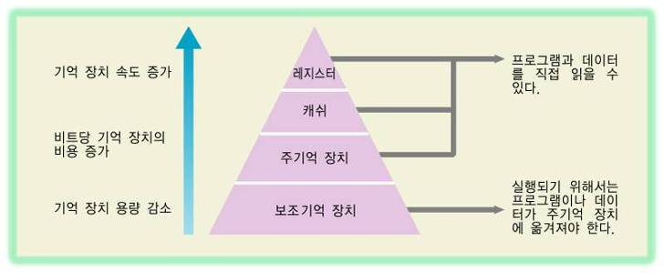

# OS Structures

## OS의 실행
- 부트스트랩 프로그램
    * 컴퓨터가 켜지자마자 실행되는 프로그램
    * 시스템 초기화 -> 부트로더 실행 -> 부트로더가 OS 실행 -> 커널이 로드 & 실행됨 -> 부팅이 완료되면 **이벤트를 대기**
- 인터럽트
    * 이벤트의 발생을 알리는 것
    * 인터럽트 by HW with `System Bus`, 트랩 by SW with `System Call`
    * CPU는 인터럽트를 받으면 하던 일을 멈추고, 인터럽트를 처리할 수 있는 **서비스 루틴**의 주소를 가진 **인터럽트 벡터**에 저장된 고정 위치로 가서 인터럽트를 처리한다.
    * 현대 OS는 대부분 인터럽트 주도. 이벤트를 계속 감시하는 폴링의 경우 자원을 낭비하기 때문.
    * 프로그램이 제어권을 운영체제에 넘기지 않는 상황을 방지하기 위해 Timer를 사용하며, 특정 시간이 지나 카운터가 0이 되면 인터럽트가 발생한다.
- Mode의 구분
    * dual-mode: `유저 모드` & `커널 모드`
    * OS는 프로그램이 마음대로 HW에 접근해 인터럽트를 보내지 않을 수 있도록 Mode를 구분한다.
- 시스템 콜
    * 유저 모드일 때 커널 모드의 기능을 사용하려면, 시스템 콜을 통한다.
    * 직접 호출하는 것은 불편하고 위험하므로, 표준 라이브러리를 사용한다.

## 스토리지 구조
- 모든 프로그램은 RAM에 할당되지만, 휘발성이고 용량이 작기 때문에 보조기억장치를 사용
- 스토리지는 계층적 구조를 가진다
  * 

## I/O 구조
- 디바이스 드라이버(OS) --> 입출력 컨트롤러 --> 입출력 디바이스
- 실행 과정
    1. 디바이스 드라이버가 디바이스 컨트롤러의 레지스터를 로드
    2. 읽어온 동작 명령을 디바이스에서 로컬 버퍼로 전송
    3. 완료되면 컨트롤러가 드라이버에게 인터럽트를 보낸다.
- 스토리지 역시 I/O 장치 중 일부
- 시스템 콜로 I/O 요청 가능

## 컴퓨터 시스템
- 폰 노이만 아키텍처
    * executor가 storage에서 commands를 가져와 kernel이 이를 memory에 할당해 실행하는 방식
- **멀티 프로세서 시스템**
    * 현대의 일반적인 컴퓨터 시스템은 2개 이상의 프로세서(a.k.a. 코어, CPU)를 가진다
    * 대부분 문제가 생기면 알아서 재할당 및 재부팅하는 symmetric multiprocessing 방식을 채용
- OS의 중요한 역할, **멀티프로그래밍**
    * 멀티프로그래밍 = CPU 효율을 높이기 위해 여러 프로그램을 로드하고 한 프로세스가 대기 상태가 되면 다른 프로세스의 작업을 수행하는 시스템
    * 멀티태스킹 = 프로세스마다 작업 시간을 정해두고 번갈아 수행하는 시스템
    * 잡 스케줄링(a.k.a. CPU 스케줄링) = 무슨 작업을 먼저 수행할 것인지 결정하는 것. 만약 메모리를 너무 많이 사용하게 되는 경우엔 *보조기억장치의 일부를 메인 메모리처럼 사용*하는, 가상 메모리를 사용할 수 있다.

## 리소스 관리
1. 프로세스 관리
    * 프로세스는 프로그램이 어디까지 실행되었는지를 기록하는 `프로그램 카운터`를 가진다. 카운터의 수는 프로세스의 쓰레드 수와 같다.
    * OS의 역할
        + CPU에게 프로세스와 쓰레드를 스케줄링
        + 프로세스를 생성/제거/일시정지/재실행
        + 동기화 및 통신
2. 메모리 관리
    * 각각 고유의 주소를 가지는, 방대한 바이트의 배열
    * 프로그램은 절대 주소에 매핑되어 메모리에 로드됨
    * OS의 역할
        + 메모리의 어떤 부분이 어디에 쓰이는지, 어느 쪽에서 쓰는지 추적
        + 어떤 프로세스와 데이터가 메모리의 안팎으로 옮겨질지 결정
        + 메모리 공간을 할당하고 해제
3. 스토리지 관리
    * 파일 = OS가 스토리지의 물리적 속성을 추상화해 논리적 저장 단위로 정의한 것
    * OS의 역할
        + 파일 시스템 관리 (파일 생성/제거/읽기/쓰기)
        + 기타 저장 장치 관리
        + 캐싱 (시간지역성/공간지역성)
4. I/O 시스템 관리
    * OS는 모든 I/O 디바이스를 파일로 취급함
    * 디바이스 드라이버만 장치의 정보를 알고 있다