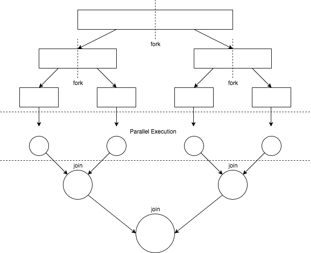

# 자바의 멀티 쓰레딩
> 자바의 멀티 쓰레드는 동시성Concurrency 또는 병렬성Parallelism으로 실행된다.
- 동시성: 하나의 코어에서 다수의 쓰레드가 실행되어 동시에 도는 것처럼 보임
- 병렬성: 쓰레드마다 코어가 할당되어 각각의 코어에서 개별 쓰레드가 동시에 실행됨
    - 쓰레드 수가 코어 수보다 많을 경우에는 쓰레드 스케줄링(어떻게 동시성을 구현할 것인지를 결정) 필요
    - 자바의 쓰레드 스케줄링은 개발자가 제어 가능한 `우선 순위`방식, 제어 불가능한 `라운드 로빈` 방식 2가지 제공
<br />
<br />
<br />

# 버전별 병렬 처리 변화
## ~자바6
### 이전까지 자바에서 지원한 병렬 처리 방식
1. 데이터를 서브 파트로 분할
2. 서브 파트를 각각의 쓰레드에 할당
3. 의도하지 않은 race condition 발생을 막기 위해 동기화
4. 부분으로 작업한 결과 합치기

### 아주 기본적으로 제공하는 Thread
- 자바는 문법적으로 Thread를 지원함
- 새로운 쓰레드를 실행시키려면, 명시적으로 task를 할당해야 함
- task를 할당하기 위해 Runnable 이라는 인터페이스를 사용 (람다식 사용/구현 등)
  ```java
  public static void main(String[] args) { //메인 쓰레드에서 직접 실행
    Runnable task = () -> { //람다식으로 할 일을 지정하는 예시
    String threadName = Thread.currentThread().getName();
    System.out.println("Hello " + threadName);
    };
    
    task.run();
    
    Thread thread = new Thread(task); //명시적으로 생성 가능
    thread.start();
    
    System.out.println("Done!"); //이게 언제 실행될지는 예측 불가능
    /*
    * 즉, Hello main -> Done! -> Hello Thread-0 순으로 찍힐지
    * Hello main -> Hello Thread-0 -> Done! 순으로 찍힐지는 모른다는 것
    * 이처럼 쓰레드를 다루는 일은 고려해야 할 것이 많은 골치 아픈 일
    */
  }
  ``` 

### java.util.concurrent
- 자바5에서 추가된 패키지
- '~자바6' 항목에 포함시켰으나, 이후 꾸준히 보강되어 자바8의 람다식 역시 지원함
- 동기화를 위한 유틸리티 클래스 제공
    * Locks: 상호 배제를 사용할 수 있는 클래스를 제공
        + synchronized 키워드를 보다 유연하고 정교하게 처리하기 위함 (starvation 방지)
        + 쓰레드들이 공유할 Lock 인스턴스를 만들고, 동기화가 필요한 실행문의 앞 뒤로 lock(), unlock()을 호출
    * Atomic : 동기화가 되어있는 변수를 제공
    * Executors : 쓰레드 풀 생성, 쓰레드 생명주기 관리, Task 등록과 실행 등을 간편하게 처리
    * Queue : thread-safe한 FIFO 큐를 제공
    * Synchronizers : 특수한 목적의 동기화를 처리하는 5개의 클래스를 제공 (Semaphroe, CountDownLatch, CyclicBarrier, Phaser, Exchanger)
- [참고: 자바 Concurrent 라이브러리 API 정리](https://hamait.tistory.com/381)

#### Executors (ExecutorService)
- 쓰레드를 직접 다루기 위해 Thread를 사용하는 대신, Executors를 사용
- 장점
    * 직접 쓰레드를 만들 필요가 없음
    * task를 비동기 실행할 수 있으며, 기본적으로 쓰레드 풀 운영
- 쓰레드 풀?
    * 
    * 목적: 병렬 처리가 늘어나면서 쓰레드 생성, 스케줄링으로 CPU 사용량이 늘어 생기는 성능 저하를 막기 위함
    * 작업처리에 사용되는 스레드를 제한된 개수만큼 정해놓고 작업큐에 들어오는 작업들을 스레드가 하나씩 맡아 처리
- 특징
    * 명시적으로 종료 필요
        ```java
        //팩토리 메서드로 원하는 종류의 ExecutorService의 인스턴스 생성 (코드: 사이즈가 1인 쓰레드 풀을 갖는 executor)
        ExecutorService executor = Executors.newSingleThreadExecutor(); 
        
        executor.submit(() -> { //실행시키려는 작업을 추가
            String threadName = Thread.currentThread().getName();
            System.out.println("Hello " + threadName);
        });

        //명시적으로 종료가 필요함
        try {
            //현재 진행중인 작업이 남아있다면 모두 끝날 때까지 기다렸다가 종료
            executor.shutdown();
            executor.awaitTermination(5, TimeUnit.SECONDS); //대기
        }
        catch (InterruptedException e) {
            System.err.println("태스크가 인터럽트됨");
        }
        finally {
            if (!executor.isTerminated()) {
                System.err.println("안 끝난 태스크를 종료합니다");
            }
            //진행중인 작업이 있든 없든 종료
            executor.shutdownNow();
            System.out.println("executor를 종료합니다");
        }
        ``` 
    * Runnable, Callable 모두 지원
        + 둘 모두 함수형 인터페이스이지만, Callable은 리턴 타입을 갖는다.
        + 함수형 인터페이스? 1개의 추상 메소드를 갖고 있는 인터페이스. 자바 람다식이 함수형 인터페이스로만 접근됨. cf. `java.util.function`
        + 쓰레드 풀의 쓰레드는 작업큐에서 Runnable 객체를 가져와 run() 메소드를 실행하거나, Callable 객체를 가져와 call()메소드를 실행한다. 
        + Callable의 리턴값을 받아오기 위해 executor는 Future라는 객체를 둔다. 
        ```java
        ExecutorService executor = Executors.newFixedThreadPool(1);
        Callable<Integer> task = () -> {
          try {
              TimeUnit.SECONDS.sleep(1);
              return 123; //Callable은 리턴값이 있다.
          }
          catch (InterruptedException e) {
              throw new IllegalStateException("task interrupted", e);
          }
        };
        Future<Integer> future = executor.submit(task);

        //isDone은 Callable이 task를 끝내고 값을 리턴했는지를 확인한다.
        System.out.println("future done? " + future.isDone());

        //get은 Callable이 값을 줄 때까지 기다린다.
        Integer result = future.get();
        // future.get(1, TimeUnit.SECONDS); 너무 오래 걸릴 것 같으면 이렇게 제한 시간을 둘 수 있다.

        System.out.println("future done? " + future.isDone());
        System.out.print("result: " + result); 
        /*
        * 결과
        * future done? false
        * future done? true
        * result: 123 
        */
        ``` 
    * 작업은 `ExecutorService.submit()` 또는 `ExecutorService.execute()`로 추가할 수 있다.
        + **execute()**
            - 작업 처리 결과를 반환하지 않는다.
            - 작업처리 도중 예외 발생시 스레드가 종료되고 해당 스레드는 스레드풀에서 제거된다.
            - 스레드풀은 다른 작업처리를 위해 새로운 스레드를 생성한다.
        + **submit()**
            - 작업 처리 **결과를 반환**한다. (작업큐에 작업을 저장하는 즉시 Future 객체를 리턴함)
            - 작업처리 도중 예외가 발생하더라도 스레드는 종료되지 않고 다음 작업을 위해 **재사용**된다.
            - 가급적 스레드의 생성 오버헤드를 줄이기 위해 submit()을 사용하는 것이 좋다. 


## 자바7: fork-join framework

- 병렬화하고자 하는 태스크를 재귀적으로 작은 태스크로 분할하여 서브 태스크 각각의 결과를 합쳐서 전체 결과를 만듦
- 절차
    1. 큰 업무를 작은 단위의 업무로 쪼갠다.
    2. 부모 쓰레드로 부터 처리로직을 복사하여 새로운 쓰레드에서  쪼개진 업무를 수행(Fork) 시킨다.
    3. 2을 반복하다가, 특정 쓰레드에서 더이상 Fork가 일어나지 않고 업무가 완료되면 그 결과를 부모 쓰레드에서 Join하여 값을 취합한다.
    4. 3을 반복하다가 최초에 ForkJoinPool을 생성한 쓰레드로 값을 리턴하여 작업을 완료한다.
- 특징
    * 대표 클래스: ForkJoinPool
    * 기본적으로는 ExecutorService의 구현체 (`java.util.concurrent.ForkJoinPool`)
    * 일반 구현 클래스들과 다른 점: work-stealing algorithm이 구현되어 있음
        + 미리 task를 적당히 분배해서 쓰레드 내부의 작업 큐에 넣었다고 해도, 어느 한쪽에서 일찍 끝나면 다른 쪽의 작업을 가져온다
        + 상황에 따라 다른 쓰레드의 큐에서 작업을 가져올지, shared inbound 큐에서 가져올지 결정한다


## 자바8: 스트림
- 스트림에 `parallel()`을 호출해서 병렬 스트림을 만들 수 있다.
- 병렬 스트림? 각각의 쓰레드에서 처리할 수 있도록 스트림 요소를 여러 청크로 분할한 스트림.
    1. 스트림 원소를 여러 서브 파트로 분리
    2. 각각의 서브 파트 처리 작업을 서로 다른 쓰레드들에 위임
    3. 모든 멀티코어 프로세서가 각각의 서브 파트 작업을 처리하도록 할당
- 예시
    ```java
    Stream.iterate(1L, i -> i + 1)
          .limit(n)
          .parallel() // 스트림을 병렬 스트림으로 변환
          .reduce(0L, Long::sum);
    ```
- 특징
    * 병렬화 과정에서 스트림을 재귀적 분할 & 서브 스트림 할당 & 값 합치는 오버헤드 발생 (성능 측정 필요)
    * 병렬 연산에서는 공유 자원의 가변 상태를 피해야 함
    * Spliterator가 스트림을 자동으로 재귀적 분할함
    * 내부적으로 유저 프로세서의 코어 수만큼 쓰레드를 가진 ForkJoinPool을 사용