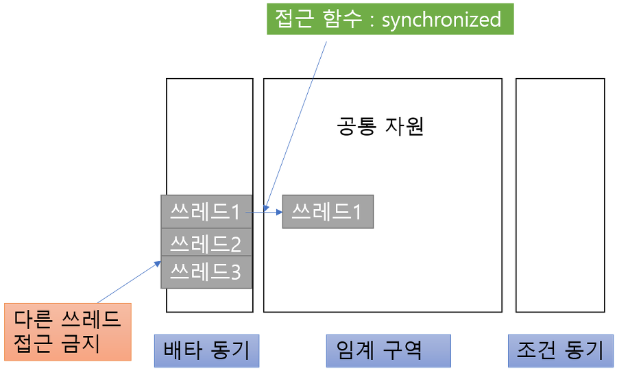

# 프로세스 동기화
- 프로세스의 구분
    1. 독립 프로세스
    2. 협력 프로세스 (다른 프로세스 간 영향 미침)
- 협력 프로세스 간에 데이터/흐름에 대한 동기화 중요
    * 언제 인터럽트로 인한 컨택스트 스위칭이 일어날지 모름
    * instruction의 실행이 언제 끊길지 모름
    * cf. 자바의 경우에는 객체 생성을 해주기 때문에 명시적으로 join을 해줘야 데이터를 공유하게 됨
- ex. `생산자-소비자 문제`
    * 두 프로세스가 공유 변수 i에 1씩 만 번을 더하는 작업을 동시에 한다고 하면, 예상처럼 2만이 찍히지 않는다.
    * 덧셈 연산은 한 줄로 표현되지만 사실 "기존의 값을 옮겨두고", "연산하고", "변경된 값을 할당하는" 과정이 함축되어 있다. 이 각 과정마다 컨택스트 스위칭이 발생할 수 있기 때문이다.


## Race Condition (경쟁 상태)
- 경쟁 상태란? 둘 이상의 프로세스가 공유 자원에 접근할 때, 접근 순서에 따라 실행 결과가 달라질 수 있는 상태
- 왜? 공유 자원을 동시에 변경하려고 하기 때문에


## Critical Section (임계 영역)
- 임계 영역이란? 코드에서 race condition이 발생할 수 있는 부분. 즉, 각 스레드가 공유하는 데이터(변수/테이블/파일 등)를 변경하는 *코드 영역*.
- 코드 영역 구성?
    * `엔트리 섹션`: 크리티컬 섹션에 진입하는 코드 영역. 여기에서 진입 허가를 얻음.
    * `크리티컬 섹션`: 한번에 실행해야 하는 섹션은 여기에 몰아둔다.
    * `엑시트 섹션`: 진입 허가를 반납함.
    * `리메인더 섹션`: 크리티컬 섹션이 아닌 영역
- 임계 영역 문제를 해결하기 위한 3조건
    1. 상호 배제 (Mutual Exclusion)
        * 프로세스가 임계 영역에서 실행 중이라면 다른 프로세스는 접근할 수 없다.
        * 이 조건은 꼭 만족해야 한다. 
    2. 진행 (Progress)
        * deadlock 발생 방지 (아무도 진입하지 못하면 안 된다)
        * 임계 영역에 접근하는 쓰레드를 결정하는 것은 유한 시간 내에 이루어져야 한다.
        * 임계 영역에서 실행 중인 프로세스가 없고, 별도의 동작이 없는 프로세스들만 임계 영역 진입 후보가 될 수 있다.
    3. 유한 대기 (Bounded Waiting)
        * starvation 발생 방지 (무한 대기하면 안 된다)
        * 임계 영역에 진입하기 위해 대기하는 모든 쓰레드는 유한 시간 내에 임계 영역에 진입할 수 있어야 한다.
        * 프로세스가 임계 영역에 진입을 신청한 뒤부터 받아들여질 때까지, 다른 프로세스들이 임계 영역에 진입하는 횟수에 제한이 있다.


### OS에서 임계 영역 다루기
> 운영체제를 구현하는 커널 코드에는 경쟁 상태가 발생하기 쉽다. 이를 다루기 위한 방법으로는 크게 선점형 커널, 비선점형 커널이 있다.
1. 선점형
    * 프로세스가 커널 모드에서 수행되는 동안 선점되는 것을 허용한다.
2. 비선점형
    * 간단하게 동기화하는 방법이다. 인터럽트를 발생시키지 않아서, 현재 시퀀스를 반드시 보장할 수 있다.
    * 어떤 커널 모드가 한번 진입하고 나면 자발적으로 놓기 전까지는 경쟁 상태가 발생할 일이 없다.
    * 싱글 코어라면 가능할 수 있으나, 멀티 코어의 경우에는 아주 성능이 떨어지게 된다.
    * 즉, 멀티 코어가 일반적인 현대에는 사용하지 않는 방법이다.


## 임계 영역의 소프트웨어 솔루션
1. 데커의 알고리즘
    ```
    //A 프로세스의 구조
    while(1){
        flag[A] = true;
        while(flag[B]){
          if(turn == B){
                flag[A] = false;
                while(turn == B);
                flag[A] = true;
            }
        }
        V++; //critical section
        flag[A] = false;
        turn = B;
    }
    ``` 
    * 두 프로세스를 위한 정확한 상호 배제 솔루션
    * 임계 영역에 진입하겠다는 표시를 위한 flag[]
    * 임계 영역의 진입 순서를 나타내는 turn
    * flag를 변경시키고 상대방 flag를 검사한 뒤, turn 값에 따라 임계 영역에 진입함 
2. 피터슨 알고리즘
    ```
    //A 프로세스의 구조
    while(1){
        flag[A] = true;
        turn = B;
        while(flag[B] && turn == B);
        V++; //critical section
        flag[i] = false;
    }
    ```
    * 데커의 알고리즘과 구성 요소는 같음
    * 차이점? 상대(B)에게 진입 기회를 양보한다는 점 (B에게 turn을 넘기고, B가 진입 의사 표시를 하지 않았다면 while에 걸리는 거 없이 바로 임계 영역 진입 가능)
    * A 프로세스를 동작시키고 싶다면 임계 영역에 들어가고 싶다는 표시로 flag [A]를 true로 만든다.
3. 아이젠버거와 맥과이어의 알고리즘
4. 베이커리 알고리즘


## 임계 영역의 하드웨어 솔루션
- 피터슨 알고리즘은 최신 컴퓨터 아키텍처에서 작동하는 것이 보장되지 않는다. 시스템 성능을 향상하기 위해 프로세서 및 컴파일러가 종속성 없는 읽기/쓰기 작업을 재정렬할 수 있다. 즉, 논리적으로 상호 배제를 의도하고 작성한 코드라도 로우 레벨에서 기계어로 바뀔 때 실행되는 라인이 뒤집힐 수 있기 때문이다.
- 메모리 장벽은 DB 락과 유사하게, 메모리의 변경 사항이 있을 때 다른 프로세서로 전파할 수 있게 메모리 사용 순서를 제한하는 것이다. 이는 쓰레드 이점을 볼 수 없고, 매우 낮은 수준의 연산이라 특수한 코드를 작성하는 커널 개발자만 사용한다.

### 메모리 장벽
- 컴퓨터 아키텍처는 메모리의 모든 변경 사항을 다른 모든 프로세서로 전파하는 명령어(=메모리 장벽/메모리 펜스)를 제공함
- 그래서 다른 프로세서에서 실행 중인 쓰레드에 메모리 변경 사항이 보이는 것이 보장됨
- 매우 낮은 수준의 연산으로, 상호 배제를 보장하는 특수 코드를 작성할 때 커널 개발자만 사용함

### 하드웨어 명령어
- 원자적인 하드웨어 명령어
    * 더 이상 쪼갤 수 없는
    * 인터럽트 되지 않는
    * 하나의 단위로서의
1. test_and_set
    * 어떤 word의 내용을 검사하고 변경함
    * 예시
        ```
        boolean TestAndSet(boolean &target)
        {
            boolean rv = traget;
            traget = true;
            return rv;
        }

        do{
            while(TestAndSet(lock));  <--- 여기
              //critical section
            lock = false;
              //remainder section
        }
        ``` 
        1. 동시에 공유 자원에 접근하는 것을 막기 위해 임계 영역에 진입하는 프로세스가 lock을 획득해야 하고, 빠져나오면 lock을 방출해야 함으로써 **상호 배제**를 만족 (처음 접근한 프로세스가 통과한 이후, `여기`에서 lock이 true가 되어 다른 프로세스의 임계 영역 접근을 막음)
        2. 임계 영역을 끝낸 프로세스는 lock을 false로 설정하여 다른 프로세스가 임계 영역에 접근할 수 있게 함으로써 **진행** 조건 만족
        3. 하지만, **유한 대기** 조건은 만족할 수 없다
2. compare_and_swap
    * 두 word의 내용을 원자적으로 교환함
    * 예시
        ```
        void Swap(boolean &a, boolean &b)
        {
            boolean temp = a;
            a = b;
            b = temp;
        }

        do{
            key = true;
            while(key == true) Swap(lock, key);  <--- 여기
              //critical section
            lock = false;
              //remainder section
        }
        ```
        1. 임계 영역이 사용 중인지를 표시하는 lock은 false, 임계 영역에 들어갈 수 있는가를 표시하는 key는 true로 초기화하고, 둘을 swap 하면서 임계 영역에 하나의 프로세스만 진입할 수 있게 되어 **상호 배제** 조건 만족 (처음 접근한 프로세스가 통과한 이후, `여기`에서 lock이 true가 되어 다른 프로세스의 임계 영역 접근을 막음)
        2. 임계 영역 실행이 끝난 프로세스는 lock을 false로 바꾸어 다른 프로세스가 임계 영역에 접근할 수 있게 함으로써 **진행** 조건 만족
        3. 하지만, **유한 대기** 조건은 만족할 수 없다
- 원자적 변수
    * 정수/부울 등 primitive type에 대한 원자적 연산 제공
    * 원자적 변수는 데이터에 경쟁 상태가 있을 수 있는 상황에서 상호 배제를 보장하는 데 사용함
    * cf. 자바에서 long, double을 제외한 변수를 읽고 쓰는 동작은 원자적이다. (메모리 비트 크기 차이 때문에) / 공유 변수를 읽어올 때 volatile 키워드를 쓰면 캐시 영역이 아니라 메모리에서 직접 읽어서 안정을 보장할 수 있다.


## 고급 레벨에서 사용하는 동기화 도구
위에 언급된 방법들은 너무 낮은 레벨이라 관리하기 어렵다.
그래서 고급 레벨에서 사용할 수 있는, 상호 배제만 확실히 보장하는 방법이 등장했다.

### 1. Mutex Lock

> 한 쓰레드, 프로세스에 의해 소유될 수 있는 Key🔑를 기반으로 한 상호배제기법
- 임계 영역에 하나 이상의 프로세스가 접근하지 않도록 함
    * 어떻게? 임계 영역에 접근하기 위해 lock을 획득하고, 나오면 반납하게 함
- 간단하게 구현시 생기는 busy waiting 문제 (=spin lock)
    * 어떤 프로세스가 임계 영역에 들어가기 위해 무한루프를 도는 현상
    * 무한루프를 돌면서 CPU 자원을 소모할 수 있음
    * 하지만 코어가 여러 개라면, 대기하는 대신 context switch가 일어나지 않아서 그 시간을 아낄 수 있다. (대기하지 않으려면 wait 큐에서 기다릴텐데, lock이 풀려서 다시 획득하려면 또 ready 큐에서 기다렸다가 얻어야 하기 때문)

### 2. Semaphore

> Signaling mechanism. 현재 공유자원에 접근할 수 있는 쓰레드/프로세스의 수를 나타내는 값을 두는 상호배제기법
- 임계 영역에 접근할 수 있는 프로세스의 수(n)를 미리 정해두고 그 이상 접근하지 않도록 함
    * 어떻게? 임계 영역의 상태를 나타낼 수 있는 정수 변수, wait(), signal() 사용
    * atomic operation `wait()`, `signal()`
        ```
        wait(S) {               // S 가 lock(=n)
            while (S <= 0)      // 0 이하인 경우에는 남들이 이미 선점한 거니까
                ; //busy wait   // 기다림. 여기서 기다리기 싫으면 스스로를 suspend (-> wait 큐 가기)
            S--;                // 임계 영역에 접근하면 S를 감소
        }

        signal(S) {             
            S++;                // 임계 영역을 다 썼으니까 S를 증가
        }
        ``` 
- 뮤텍스와의 차이점?
    * 동기화 대상의 갯수가 mutex는 한 개, semaphore는 n개 (뮤텍스는 이진 세마포어)
    * mutex는 lock을 소유한 프로세스만 lock을 해제할 수 있지만, semaphore는 세마포어 카운터를 소유하지 않은 프로세스도 증감 컨트롤 가능


### 3. Monitor

> 동기화가 필요한 객체에 모니터를 결합해서 해당 객체에 둘 이상의 프로세스가 접근할 수 없도록 하는 고수준 동기화 도구
- 세마포어는 완벽하지 않다
    * 데이터 무결성 보장 불가, 데드락 발생 가능
    * 타이밍 에러: 특정 시퀀스를 잘못 쓰면 잡기 어려운 프로그램 에러 발생
        (ex. wait, signal 뒤바뀜 / 프로그래머의 실수 / 프로세스가 누락 등)
- 자바의 모니터
    * 모니터는 상호배제를 제공해주는 추상 데이터 타입(ADT, class)
        + 모니터 안에서는 항상 하나의 프로세스만 실행 가능
        + 모니터 진입을 원하면 상호배타 큐에서 대기
        + 러닝 중인 프로세스가 I/O 인터럽트를 만나는 등 타 작업이 필요하다면, 조건동기 큐에 들어감
    * 자바는 모니터를 충실하게 구현함 & 자바의 모든 Object는 모니터가 될 수 있음 
    * | synchronized | wait      | notify      |
      |--------------|-----------|-------------|
      |     |  |  |
    * 구조: 공유 자원 + 공유 자원 접근함수 + 상호배타 큐, 조건동기 큐
        + 상호배타 큐? entry queue. 공유 자원에 하나의 프로세스만 진입하도록 하기 위한 큐
        + 조건동기 큐? condition queueu. 이미 공유 자원을 사용하고 있는 프로세스가 wait()을 호출해 들어갈 수 있는 큐 
    1. synchronized 키워드
        + 이 키워드가 붙은 메소드(this객체가 모니터락 가짐)와 코드 블록(모니터락을 갖는 객체 인스턴스 지정)에 모니터가 결합됨
        + 이 키워드를 붙인 부분에는 동기화 대상 인스턴스와 결합된 모니터 락을 획득해야 진입 가능하며, 해당 영역을 벗어날 때에는 락을 반환한다.
    2. wait(), notify()
        + 세마포어는 자원의 획득과 방출에 각각 특정 메소드를 호출해줘야 했지만, 모니터는 알아서 함
        + P와 Q의 예시
            1. 쓰레드 P가 모니터에서 실행 중
            2. 쓰레드 P가 다른 일이 생기면 wait() 호출 -> 모니터 락을 반납하고 조건동기 큐에 들어감
            3. 대기하고 있던 쓰레드 Q가 모니터에 진입
            4. 쓰레드 P가 할 일을 마침
            5. 쓰레드 Q가 notify()를 호출 -> 조건동기 큐의 쓰레드 하나를 깨움
                - 쓰레드 P가 스스로 호출할 수도 있다
                - 보통 `Q가 모니터를 떠나면 P가 실행`되는 방식(signal and wait)
                - 그 외에는 P가 먼저 실행되는 방식(signal and continue)이 있을 수 있음
                - cf. notifyAll()을 쓰면 해당 객체 조건동기 큐의 모든 쓰레드를 깨움 

### 4. Liveness
> 진행(데드락X) & 유한 대기(기아X)까지 보장하는 최근의 방법
- 모니터는 데드락, 기아 문제를 해결할 수 없음
- 데드락? 두 개 이상의 프로세스가 영원히 기다리는 상태
- 우선 순위 역전? 높은 우선 순위의 프로세스가 낮은 우선 순위의 프로세스에게 밀리는 상태


## 동기화 문제의 예시들

### Bounded Buffer 문제
- 생산자-소비자 문제 "unbounded buffer"
    * 생산자는 버퍼에 데이터를 채운다.
    * 소비자는 버퍼에서 데이터를 소비한다.
    * 버퍼의 크기는 유한하며, 버퍼는 임계 영역 안에 있어야 한다.
- 예시
    ```c++
    int n;
    semaphore mutex = 1;       // 바이너리 세마포어
    semaphore empty = n;       // n은 버퍼의 크기
    semaphore full = 0;
    ``` 
- 프로듀서 프로세스의 구조
    ```c++
    do {
        
        Producer process가 item을 생성;     

        // 임계 영역에 진입하기 위해 호출
        wait(empty);                      /* n -> n-1 (빈 공간이 하나 줄어든다)
                                          * 만약 프로듀서 프로세스만 n+1번 실행되면
                                          * 여기에서 걸려서 block 된다.
                                          */ 
        wait(mutex);                      // 상호 배제 조건 만족을 위함

        버퍼에 새로 만들어진 item을 추가;       // 만들어진 아이템은 임계 영역에서 버퍼로 들어감

        signal(mutex);                   // 임계 영역에서 벗어남을 알림
        signal(full);                    // 0 -> 1 (full++, 하나 채웠음을 알림)
            
    } while (true);
    ```
- 컨슈머 프로세스의 구조
    ```c++
    // 프로듀서와 반대로 동작한다고 이해하면 됨
    do {
		
        Producer process가 item을 생성;     

        wait(full);                     /* full--, 하나가 빠짐을 알림
                                         * 버퍼에 아이템이 하나도 없다면, full이 -1이 되어
                                         * block될 것이므로, 컨슈머 실행 전 프로듀서 실행 필수
                                        */
        wait(mutex);

        버퍼에 새로 만들어진 item을 추가;

        signal(mutex);
        signal(empty);
            
    } while (true);
    ```
- 한계: 대칭구조가 맞아야 하고, 맞지 않으면 문제가 생긴다. 쉽지 않은 조건.


### Reader-Writer 문제
- 리더와 라이터는 하나의 공유 DB를 가진다
    * 라이터는 DB를 수정한다. 라이터가 임계 영역에 있을 땐 아무도 접근할 수 없다.
    * 리더는 DB를 읽는다. 리더가 임계 영역에 있을 땐 다른 리더는 접근할 수 있다.
    * 리더가 라이터보다 많을 경우에 유용하다
    * cf. producer-consumer 문제와의 차이? p-c는 생성과 삭제의 문제라면, r-w는 쓰고 읽는 문제라서 동시접속 등이 가능
- 예시
    ```c++
    semaphore rw_mutex = 1; //binary
    semaphore mutex = 1; //binary
    int read_count = 0;
    ``` 
- 라이터
    ```c++
    do {
		
		wait(rw_mutex);         // 바이너리 세마포어로 다른 프로세스의 임계 영역 진입 차단

		writing is perfomred;

		signal(rw_mutex);

	} while (true);
    ```
- 리더
    ```c++
    // wait(mutex), signal(mutex)는 read_count에 대해 상호 배제를 보장하기 위함
    do {
		
		wait(mutex);            
		read_count++;           // 임계 영역에 있는 리더의 갯수
		if (read_count == 1)	// 한번 1이 되고 나면 = 리더가 하나 이상 접근했으면,
			wait(rw_mutex);     // 라이터는 더 이상 임계 영역에 들어올 수 없다.
		signal(mutex);

		reading is perforemed;

		wait(mutex);
		read_count--;
		if (read_count == 0)    // 임계 영역 안의 리더가 하나도 없을 때
			signal(rw_mutex);   // 라이터는 임계 영역에 다시 들어올 수 있다.
		signal(mutex);
	
	} while (true);
    ```
- 한계
    1. 라이터가 starvation 문제를 겪을 수 있다.
       * First readers and writers problem (상술)
           + 리더 프로세스에 라이터보다 우선 순위를 준다 (= 라이터가 대기 중이어도 리더 우선)
           + 라이터 프로세스가 기아 상태에 빠질 수 있다
       * Second readers and writers problem
           + 라이터 프로세스에 리더보다 우선 순위를 준다 (정확한 최신 데이터 보장)
           + 리더 프로세스가 기아 상태에 빠질 수 있다
    2. reader-writer lock은 뮤텍스/세마포어보다 더 많은 오버헤드를 요구한다.
        * 동시에 여러 리더를 접근하게 하여 동시성을 높여서 비용 상쇄 가능 


### 저녁 식사하는 철학자들 문제
- 원형 테이블에 철학자들이 앉아 있는데, 자신의 양 옆에 놓인 식기를 모두 잡아야 식사할 수 있다는 문제
- 예시
    ```c++
    semaphore fork[5]; //binary semaphore

    do {
		
        wait(fork[i]);	            // 왼쪽의 식기 집어들기
        wait(fork[(i + 1) % 5]);   // 오른쪽의 식기 집어들기

        // 둘 다 집으면 통과

        Eating;

        signal(fork[i]);	        // 왼쪽 내려놓기
        signal(fork[(i + 1) % 5]);	// 오른쪽 내려놓기

        Thinking;
        
    } while (true);
    ``` 
- 한계: 만약 모든 프로세스가 왼쪽 식기만 집어든다면 -> **데드락**
    * 최대 4명의 철학자만 앉게 한다
    * 홀수 번째 철학자는 왼쪽부터 집고 짝수 번째 철학자는 오른쪽부터 집게 한다
    * 모니터? 오른쪽 식기 집을 수 없으면 왼쪽 식기도 내려놓는다


#### 모니터를 사용하는 데드락 해결 방안
- 조건: 오른쪽 식기 집을 수 없으면 왼쪽 식기도 내려놓는다
- 예시
    ```c++
    enum { THINKING, HUNGRY, EATING } state[5];  // 철학자의 현재 상태 정의
    condition self[5];

    // sequence
    DiningPhilosophers.pickup(i);               // 식사하고 싶은 철학자는 식기를 든다
    eat
    DiningPhilosophers.putdown(i);              // 다 먹으면 내려놓는다

    // 세부 로직
    monitor DiningPhilosophers{
        enum {THINKING, HUNGRY, EATING} state[5];
        condition self[5];

        void pickup(int i) {
            state[i] = HUNGRY;                  // 일단 배고픈 상태로 만든다
            test(i);                            // 밥을 먹어도 되는가?
            if (state[i] != EATING)             /* test(i)를 빠져나온 경우 여기에 걸리지 않는다
                                                *  하지만 옆자리 철학자가 먹고 있어서 걸렸다면 */
                self[i].wait();                 // 여전히 배고픈 상태로 wait 호출
        }

        void putdown(int i) {
            state[i] = THINKING;                // 다 먹고, 다시 생각을 시작하기로 함
            test((i + 4) % 5);                  // 왼쪽과
            test((i + 1) % 5);                  // 오른쪽의 test를 호출해 줌    
        }

        void test(int i) {
            if ((state[(i + 4) % 5] != EATING) &&  // 왼쪽 사람이 먹고 있지 않음
                (state[i] == HUNGRY) &&            // 나는 배고픔
                (state[(i + 1) % 5] != EATING)) {  // 오른쪽 사람이 먹고 있지 않음
                state[i] = EATING;                 // => 그럼 내가 먹겠다
                self[i].signal();                  // 만약 wait 중이었다면, 스스로에게 signal해서 깨워 줌
            }
        }

        initialization_code() {
            for (int i = 0; i < 5; i++)
                state[i] = THINKING;
        }
        
    }

    ```
- 한계: 특정 철학자만 계속 밥을 먹게 됨 -> **기아**


#### 바이너리(mutex)와 카운팅 세마포어(next)를 이용해 모니터 발전시키기
- signal and continue 방식
- 예시
```c++
// 모니터 속 각 함수에 대해 세마포어가 추가됨
wait(mutex);

	body of Functions;

if (next_count > 0)         // next_count는 next에서 기다리고 있는 프로세스의 갯수
	signal(next);           // 살려주고 기다린 프로세스를 깨움. 1순위로 동작
else
	signal(mutex);	        // 살려주고 기다린 프로세스가 없이니 엔트리 큐에 있는 프로세스 진입하게 함
					        // 2순위로 동작


/*  
* condition x의 x.wait
* (wait을 호출했으니 count를 올리고, 자신 대신 모니터에서 활성화될 프로세스를 살림)
*/
x_count++;
if (next_count > 0)
	signal(next);	        // wait(next)한 프로세스를 우선순위 1로 살림
else
	signal(mutex);	        // 우선순위 1인 프로세스가 없으면 엔트리 큐에 있는 다른 프로세스를 살림
wait(x_sem);	            // 그 뒤 자신은 다른 프로세스가 x.signal()해줄 때까지 기다림
x_count--;


/*
* x.signal
*/
if (x_count > 0) {	        // condition x에서 기다리는 프로세스가 있으면 동작.
	next_count++;
	signal(x_sem);          // 그 프로세스를 깨우고
	wait(next);	            // x.signal을 호출한 프로세스가 next에서 대기
	next_count--;	        // 바로 위 코드 때문에 
					        // x에서 잠든 친구 깨우고 자기가 next에서 잠든 프로세스가 나중에 살아나면
					        // next_count를 다시 하나 줄여야 하니 그때 수행되는 소스 코드
}
```
- 흐름
    1. 모니터에 들어오고 싶은 프로세스는 wait(mutex)를 하며 엔트리 큐에 들어옴
    2. 모니터 안에 있는 프로세스에 event가 발생하면 x condition에 들어가는데(비효율 방지) 
    3. x_count를 ++하고, 그와 동시에 다른 프로세스를 살려 줌
    4. 다른 프로세스가 x.signal()을 호출해 컨디션 x에서 자고 있는 프로세스를 깨움
    5. 이번엔 컨디션 x에서 자고 있는 프로세스를 깨운 프로세스가 next에서 wait

- 한계: 컨디션 x에서 기다리는 프로세스의 깨우는 순서가 없어서 형평성 문제
    * FCFS, 우선순위를 사용해 모니터를 업그레이드할 수 있음