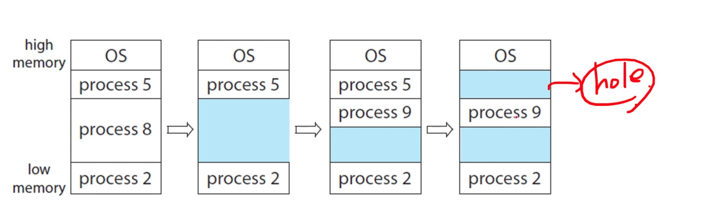
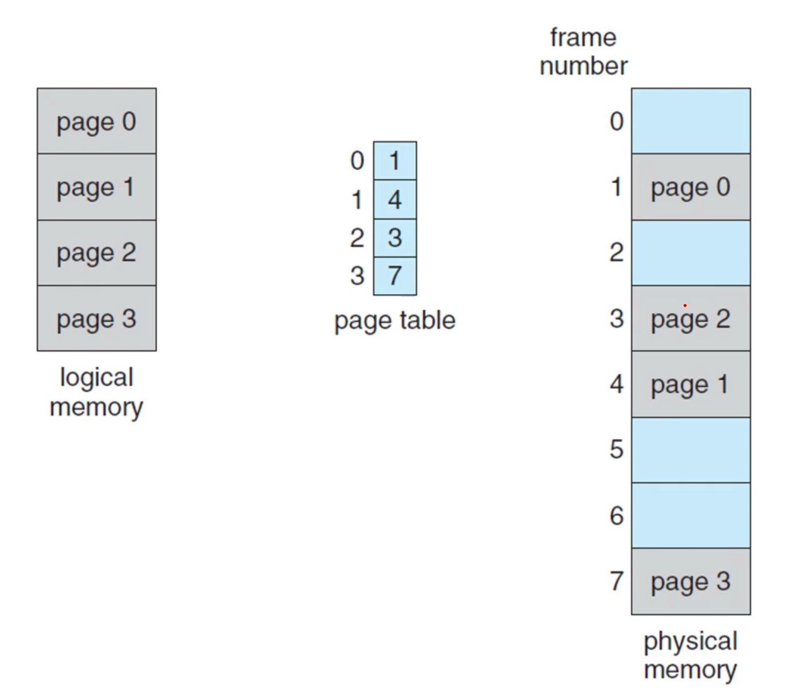
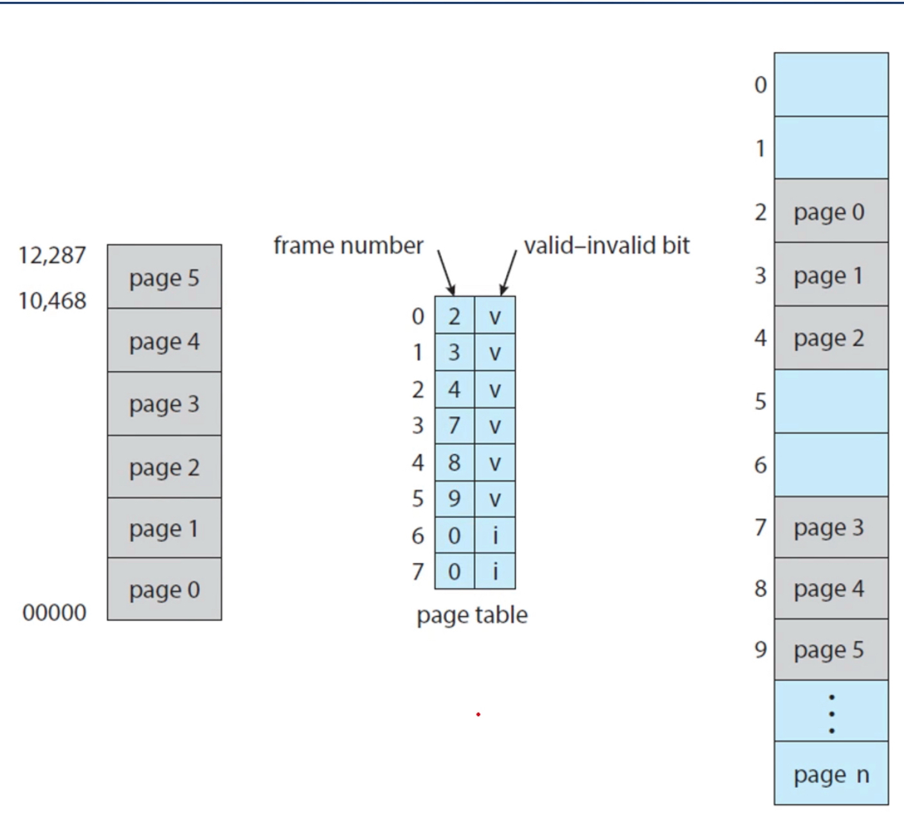
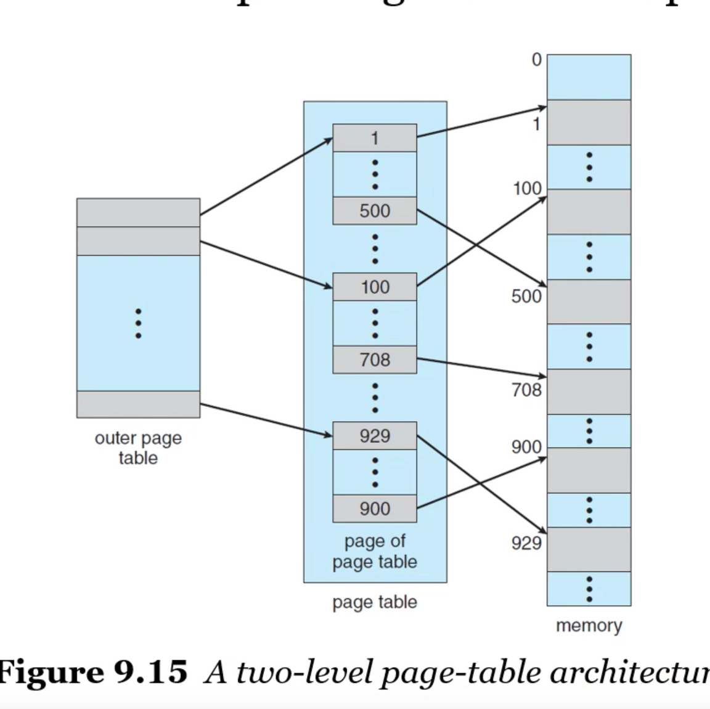
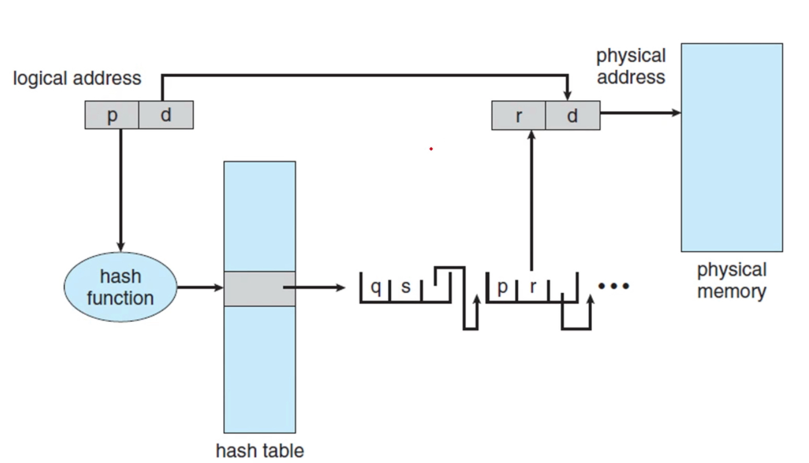

# 주메모리의 관리
> 어떻게 메모리에 프로세스를 나누어 관리할까?
- 프로그램을 실행한다는 것은 메모리에 로드되어 있다는 것을 의미한다.
- 메모리는 주소가 할당된 바이트 배열
- CPU는 메모리에서 instruction을 fetch해서 실행하면서, 데이터를 load하기도, store하기도 함


## Basic Hardware
- 각각의 프로세스가 독립된 메모리 공간을 가지도록 보장
    * 특정 프로세스만 접근할 수 있는 합법적인(legal) 메모리 주소 영역을 설정
    * 프로세스가 이러한 합법적인 영역만을 접근하도록 
- **base register**와 **limit register**, 두 개의 레지스터를 사용하여 보호
    * base register는 가장 작은 합법적인 물리 메모리 주소 값을 저장
    * limit register는 주어진 영역의 크기를 저장
    * base 주소보다 작거나, base+limit 보다 크면 넘어선다고 판단하는 방식


## 주소의 할당
```
a=1
```
1. a의 심볼릭 주소(symbolic address)
2. 메모리 주소 공간(relocatable address)
- 컴파일러는 위 둘을 바인딩함
- 링커/로더는 2를 절대 주소(absolute address)와 바인딩함

#### Logical address vs Physical Address
- logical address : CPU가 생성하는 주소
- physical address : 메모리가 취급하게 되는 주소
- logical address space(논리 주소 공간) : 프로그램에 의해 생성된 모든 논리 주소 집합
- physical address space(물리 주소 공간) : 이 논리 주소 공간과 일치하는 모든 물리 주소 집합

#### MMU
```
CPU ---(MMU)---> Physical Memory
```
- 프로그램 실행 중에는 논리 주소를 물리 주소로 변환 필요
- 변환 작업은 하드웨어 장치인 메모리 관리 장치(memory management unit, MMU)에서 수행
- MMU에서는 relocation register가 base register 역할을 함.


## Dynamic loading
> 모든 프로그램 데이터가 메모리에 올라올 필요는 없다
- 목적: 메모리 주소 공간의 효율적 사용
- 방법: 필요할 때만 필요한 루틴을 호출하자
    * 각 루틴은 실제 호출되기 전까지는 메모리에 올라오지 않음
    * 재배치 가능한 상태로 디스크에서 대기

#### Dynamic Linking & Shared Libraries
- DLL(Dynamic Linking Library 또는 shared library)
    * 사용자 프로그램 실행 중에 사용자 프로그램에 연결되는 시스템 라이브러리
    * 프로세스간 라이브러리 공유가 가능 -> 메인 메모리에 DDL 인스턴스가 하나만 존재해도 됨
- static linking
    * 시스템 라이브러리 로더가 바이너리 코드에 끼어들어감
    * like 다른 오브젝트 모듈
- dynamic linking
    * 실행 중에 필요한 부분만 DLL 파일에 접근하여 링킹함
    * like 다이나믹 로딩 (링킹을 실행시까지 연기)


## 연속 메모리 할당
- 가장 간단한 메모리 할당 방법
- 각 프로세스를 다른 프로세스의 영역과 인접한 하나의 메모리 영역에 적재하는 것
- 외부 단편화(external fragmentation)가 많이 일어남
    * 외부 단편화? 작업에 충분한 메모리 공간이 남아있지만, 작은 hole로 나뉘어 있어 실제 이용이 불가능한 상태
    * 내부 단편화? 할당된 공간이 요구된 공간보다 조금 더 커서 그 사이의 남는 공간


#### variable-partition

- 각 partition에는 하나의 프로세스만 적재될 수 있다.
- 덩치가 클수록 할당하기 어려워진다는 문제가 있다
- hole: 사용 가능한 메모리 블록
- 여러 hole이 있을 때, 어떤 hole에 할당할까?
    * first fit : 가장 첫번째 가용 공간에 할당
    * best fit : 가용 공간 중 가장 작은 곳
    * worst fit : 가용 공간 중 가장 큰 곳 


## 쪼개서 할당
> 쪼개서 할당하자!

### segmentation
- 프로세스를 세그먼트의 집합으로 여김
- 물리적인 크기의 단위가 아닌 `논리적 내용의 단위`(의미가 같은)로 자름
- 페이징 (=똑같은 크기로 쪼개기) 과 메모리 할당법은 같음


### 페이징
- 프로세스의 `물리적인 주소`를 연속적이지 않게 자름
- 장점
    * 외부 단편화 발생을 방지
    * 압축(외부 단편화를 해결하기 위해 여러개의 hole들을 모아 하나의 hole로 만드는 것)의 필요성 X
- 방법
    * 고정 사이즈로 물리적 메모리를 자른다 (`프레임`)
    * 논리 메모리도 같은 크기로 자른다 (`페이지`)
    * 물리 메모리 공간과 논리 메모리 공간의 연결은 OS가 맡음
- 특징
    - 
    * **논리 메모리**는 `페이지 넘버`(p)와 `페이지 오프셋`(d)으로 구성됨
    * 페이지 넘버: 각 프레임의 시작 주소인 프레임 테이블에 접근할 때 사용(인덱스임)
    * 페이지 오프셋: 하나의 프레임 안에서의 위치
- 페이지 사이즈
    * 2의 거듭제곱이어야 함
    * 페이지 크기가 작으면, 페이지 테이블 크기가 커지고, 메모리가 낭비됨
    * 만약 logical address space 가 2^m, page size가 2^n 바이트라면, page number 은 (m-n), page offset은 n 비트 필요
- 새로운 프로세스가 등장할 경우
    1. 프로세스가 페이지를 몇개를 필요로 하는지 조사
    2. n개의 페이지를 요구한다면 실제로 n개의 프레임이 메모리에서 사용 가능한지 확인
    3. 프레임을 프로세스에 할당
- 하드웨어 지원
    - CPU 스케쥴러가 다음 프로세스를 결정 -> context switch를 위해 page table이 리로드
    - 페이지 테이블이 크기 때문에 부담됨
    1. PTBR(page-table base register)
        * 페이지 테이블 자체를 메인 메모리에 두고, 페이지 테이블의 포인터를 저장
        * context switch 속도는 감소
        * 메모리 access 시간은 증가
        * 왜? 페이지 테이블에 접근하기 위해 PTBR에 접근한 후 실제 데이터에 접근 -> 두번씩 접근
    2. TLB(Transloation Look-aside Buffer)
        * 캐시 메모리를 써서, page table 일부를 저장
        * 하드웨어에 저장하는 것이기 때문에 아주 빠름
        * TLB에 있으면 빠르게 참조하고, 없으면 페이지 테이블 메모리 참조
    - effective memory-access time
        * TLB hit : 찾으려는 page number가 TLB에 있을 때
        * TLB miss : 찾으려는 page number가 TLB에 없을 때
        * hit ratio : 찾으려는 page number가 TLB에서 발견되는 비율
- 메모리 보호
    * contiguous: 시작주소와 끝주소를 알 수 있기에, legal한 주소인지를 간단하게 판단할 수 있었음
    * 페이징: protection bit를 사용 (valid-invalid bit 을 page table의 시작에 추가)
    * 
- shared page
    * 만약 코드가 실행 중에 변경될 일이 없는 코드(reentrant code)라면 공통의 코드를 공유 가능

#### 페이지 테이블의 구조
> 페이지 테이블이 클 때, 이를 관리하는 방법

##### 1.계층적 페이징 (Hierarchical paging)

- page table에 다시 page table을 만들어버리는 것

##### 2. 해시 페이지 테이블 (Hashed page table)


##### 3. 역 페이지 테이블 (Inverted Page Table)
- pid(프로세스의 고유번호)를 추가한다. 가장 효율적.


### 스와핑
> 실행 중에 프로세스 혹은 프로세스의 일부분을 임시로 백업 저장장치에 보냈다가 다시 가져오는 것
- 목적: 물리 메모리 공간보다 훨씬 큰 프로그램을 실행시키기 위함
- standard swapping
    * 전체 프로세스를 메모리와 disk 사이에서 스와핑
    * 메모리에 가져오는 것 : swap in
    * 백업 저장장치로 옮기는 것 : swap out
- 페이징에서의 스와핑
    * 페이지 단위로 스와핑
    * 오늘날은 그냥 paging이 페이징에서의 스와핑으로 여겨짐 -> page out, page in 이라고 부름
    * 가상 메모리에서 중요한 역할