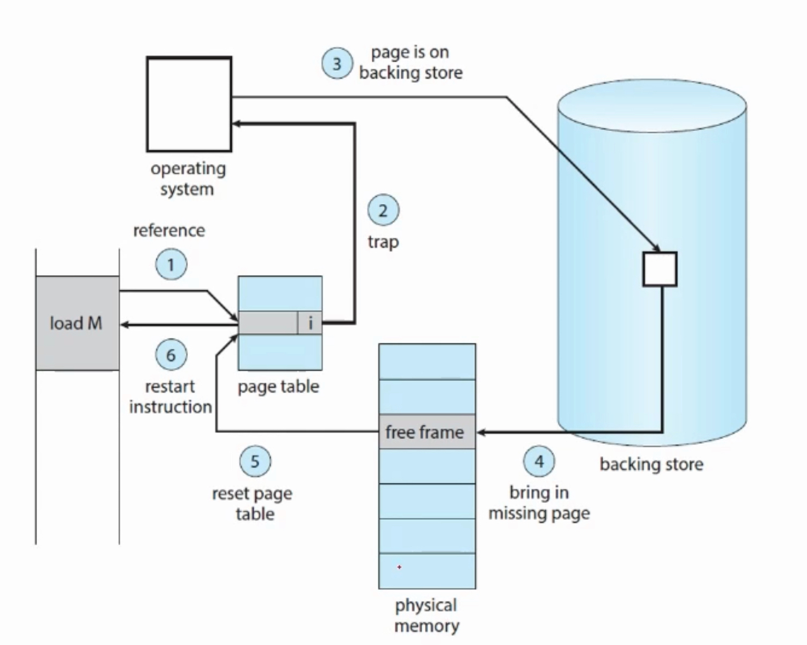
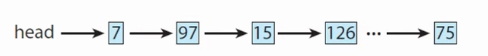

# 가상메모리
- 프로세스 전체가 메모리 내에 올라오지 않더라고 실행이 가능하도록 하는 기법
- 장점
    * 물리 메모리보다 프로그램이 커도 실행 가능
    * 효율적
    * 파일, 라이브러리를 공유하거나, 프로세스를 생성할 때 유용
- 어떻게?
    * 물리-논리 메모리 분리 -> 메인 메모리를 아주 큰 배열로 추상화
    * 전체 프로그램을 페이징을 통해 잘라서 일부만 올림 -> 언제? 페이지를 요구할 때 (demand paging)
    * 나머지는 backing store (HDD) 에 저장
- 가상 주소 공간
    * virtual address space -> 한 프로세스가 저장되는 논리적인 모습(view)
    * 0부터 시작

## Demand Paging
- valid-invalid bit이 포함된 `페이지 테이블`을 활용하여 페이지가 메모리에 있는지 파악 가능
    * invalid = 실제 참조가 무효하거나 / 보조 저장장치에 존재함 
- 페이지 테이블에서 invalid 라서 페이지 폴트(page fault) 트랩이 발생한다면?
    - 
    1. 프로세스의 internal table을 검사해서 어떤 케이스인지 구분 
       * 참조가 무효할 경우 => 프로세스를 중단
       * 유효한 참조인데 페이지가 아직 메인 메모리에 존재하지 않을 경우 => 다음으로
    2. 없는 페이지를 **page in**
       * free frame을 찾아서, 보조저장장치에서 해당 페이지를 읽어옴
       * 페이지 테이블을 valid로 갱신
       * 프로세스의 internal table 갱신
    3. 중단되었던 명령어 수행

#### 퓨어 디맨드 페이징
- 요청 안 하면 페이지 안 가져옴
- 처음에도 아예 메인 메모리에 아무것도 로드 안 시킴
- 성능 하락 => 다수의 페이지 폴트 발생 가능

#### Locality of Reference
- 프로그램은 어느 한 특정 부분만 집중적으로 참조하는 경향이 있다
- 퓨어 디맨드 페이징보다 적은 페이지 폴트를 일으키도록 할 수 있음 

#### HW 서포트
- page table (valid-invalid bit를 통해 특정 항목을 invalid로 설정가능)
- 보조저장장치 (메인 메모리에 없는 모든 페이지를 가지고 있다. 이를 스왑 장치라고 한다.)
- page-fault trap 처리 후 명령어 restart (중단된 프로세스 사태를 보관해두고, 정확히 같은 위치, 같은 상태에서 프로세스를 재시작할 수 있도록 한다.)

#### OS 서포트
- 
- Free-Frame List (linked-list를 통해 free-frame을 관리)

#### 성능
- 실질접근시간(effective access time) = (1-p) ma + p (page fault time)
- p: 페이지 폴트의 확률(0 <= p <= 1)
- ma : memory access time
- page fault time : 인터럽트의 처리 + 페이지 읽기 + 프로세스 재시작 

#### 카피 온 라이트
- process가 shared page에 **write를 할 때에만** shared page를 copy하는 것
- 부모 페이지를 fork할 때 유용하다. 전부 다 복사해오기보다 일단 공유해서 사용하게 함.

## 페이지 교체 알고리즘
> 만약 페이지 인을 하려는데 프리 프레임이 없다면? 
- 보조저장장치에 I/O를 하는 것은 비용이 크기 때문에 최적의 알고리즘을 찾아야 함.
- 목표는? 페이지 폴트의 비율을 낮추는 것
- 메모리 주소를 나열한 것을 reference string 이라고 하는데, 이를 이용하여 페이지 폴트 비율을 낮추는 법을 찾아야 함
- 페이지 프레임이 많을수록 페이지 폴트는 적다.

### 1. 어떤 프레임을 선택해서 제거할까?
#### FIFO 페이지 교체
- 간단함
- 가장 오래된 페이지를 제거함
- Belady의 모순: 프로세스에 프레임을 더 할당하였음에도 페이지 폴트가 증가하는 현상

#### 최적(optimal) 페이지 교체
- 앞으로 가장 오랫동안 사용되지 않을 페이지를 찾아 제거
- 프로세스의 참조를 예측해야하므로 실제 구현은 어렵다
- 연구에서 다른 알고리즘의 성능과 비교할 때 이용한다
  
#### LRU(least-recently-used) 페이지 교체
- 가장 오랜 기간 동안 사용되지 않은 페이지를 제거
- 페이지마다 마지막 사용 시간을 유지
- 구현
    * counter: 각 항목마다 사용 시간 필드를 추가
    * stack : 페이지가 참조될 때마다 스택 중간에서 스택 top으로 이동

#### Second-chance Algorithm
- FIFO 기반
- reference bit 을 이용(하드웨어 지원): 0 or 1로, 페이지 참조가 있을 때마다 참조 비트가 세팅된다. 어떤 페이지가 그동안 사용되었는 지 확인이 가능, LRU 근사 알고리즘의 기본이 된다.
- reference bit == 0이면 페이지를 교체하고, 1이면 한 번 더 기회를 주고 다음 FIFO 페이지를 교체한다.
- 처음 모든 참조비트는 0, 참조될때마다 1, 한번 더 기회가 주어지면 1에서 0으로 바뀐다.
- circular queue를 이용

### 2. 각 프로세스에 어떻게 프레임을 할당할까?
- Equal vs Proportional? (프로세스마다 같은 비율을 주거나 vs 프로세스의 사이즈를 고려하여 할당하거나)
- Local vs Global? (페이지 교체를 할 때 해당 프로세스에게 할당된 프레임 내에서만 교체 vs 전체 프레임들 중에서 교체)

### Thrashing
- 프로세스에게 충분한 페이지가 없다 -> 페이지 폴트 과발생 -> swapping이 많아짐
- 어떤 프로세스가 **실제 실행보다 페이징에 더 많은 시간을 소요**하고 있으면 스레싱이 발생한다
- working-set model
    * locality 기반
    * 최근 delta만큼의 페이지를 참조하였을 때, 그 안에 들어있는 서로 다른 페이지들의 집합
    * 페이지가 활발하게 사용되었으면 working-set에 포함
    * 마지막 참조 이후로 delta만큼의 시간이 지나면 working set에서 제외
    * 스레싱 완화에 도움 됨