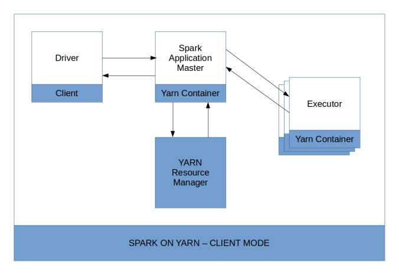
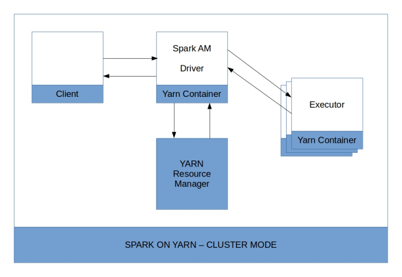

# API 관점에서 본 RDD

## spark written by 함수형 언어, scala
- 함수를 인자로 전달할 수 있음
- 스칼라는 기본 RDD 클래스에 정의되지 않은 메서드를 암묵적 변환 방식으로 처리함
- 람다식 사용 가능, 람다 미지원 언어는 인터페이스를 구현하는 식으로 지원
- 주의: 익명 함수 대신 정의한 함수를 전달하면 이를 클러스터의 워커 서버들로 전달하는 과정에서 자바의 직렬화 규칙에 따라 함수가 소속된 클래스도 전달 대상이 됨.
    * Serializble 인터페이스를 구현하면 되지만, 불필요한 정보까지 전달하게 되므로 비추천.
    * 언어별 해결 방법
        + Scala: 싱글톤 객체 object 활용
        + Java: Java8의 람다식 사용 or 스파크의 Function 인터페이스를 구현한 클래스의 인스턴스 전달
        + Python: 에러가 나지는 않지만, 되도록 클래스 내부가 아닌 모듈의 최상단에 두거나 또는 지역 함수 선언
    * 같은 맥락에서 클래스 멤버 변수를 전달할 때에도 같은 문제 발생 가능 -> 지역 변수로 변환해서 전달할 것

## 스파크 애플리케이션 프로그래밍 과정
1. SparkContext 생성
    - SparkContext: 스파크 애플리케이션과 클러스터의 연결을 관리하는 객체 
        * 모든 스파크 앱은 반드시 스파크 컨텍스트를 생성해야 함
        * 스파크 실행환경(클러스터의 백엔드 프로세스들에 대한 참조 포함)
        * 인자로 SparkConf 받아서 동작에 필요한 설정 정보 지정 가능. `클러스터 마스터` 정보, `애플리케이션 이름`은 필수값.
    - SparkConf: 애플리케이션 수행에 필요한 각종 설정 정보
2. 입력 소스로부터 RDD 생성
    - RDD: 스파크가 사용하는 기본 분산 데이터 모델 & 그 구현체
    - 1) 드라이버 프로그램의 컬렉션 객체를 이용해서 생성
    - 2) 파일과 같은 외부 데이터를 이용해서 생성
3. RDD 처리
    - 기본 연산
        * `collect`: RDD의 모든 원소를 모아서 배열로 리턴. RDD의 모든 요소가 이 연산을 호출한 서버에 모임. 메모리 주의.
        * `count`: 전체 요소 갯수 반환
    - Transformation
        * 매핑: map, flatMap(1->many), mapPartitions(파티션 단위 처리), mapPartitionsWithIndex, mapValues(페어RDD), flatMapValues
        * 그루핑: zip, zipPartitions, groupBy, groupByKey, cogroup(페어RDD, 키별로 재그룹)
        * 집합: distinct, cartesian(모든 조합), subtract, union, intersection, join(페어RDD), leftOuterJoin, rightOuterJoin, subtractByKey
        * 집계: reduceByKey(페어RDD, 같은 키 기준 병합), foldByKey(초기값 기준 병합), combineByKey(사용자 지정 집계 함수를 사용해 각 키의 요소를 결합), aggregateByKey(페어RDD, 병합을 위해 초기값을 전달하는 특수한 combineByKey)
        * pipe와 파티션: pipe(외부 프로세스), coalsce(파티션 줄이기, 성능 나음), repartition(파티션 늘이기, 줄이기), repartitionAsndSortWithinPartitions(특정 기준에 따라 파티션을 분리하고 정렬해서 새 RDD 생성), partitionBy(페어RDD, Partitioner)
        * 필터, 정렬: filter, sortByKey(페어RDD), keys, values, sample(샘플링)
    - Action
4. 결과 파일 처리
5. SparkContext 종료
--------
6. 빌드 (jar)
7. 서버에 배포
8. spark submit 등으로 실행 가능
    - spark submit: 실제 클러스터에서 항상 같은 방법으로 실행할 수 있게 기본 제공하는 스크립트
    - `--class`: 메인 함수를 가지고 있는 클래스와 그 클래스가 포함된 jar 파일 경로
    - `--master`: 클러스터 마스터 정보 (local, yarn 등)
        * local[n]에서 n에 들어가는 수는 사용할 스레드의 갯수이며, [n]을 따로 쓰지 않으면 단일 스레드, [*]는 가용한 cpu 코어 수 만큼의 스레드를 의미
    - `--deploy-mode`: 디폴트는 client(실행을 호출한 곳에서 드라이버가 생성), 필요시 cluster(클러스터 내부에서 드라이버가 생성)
        | client mode | cluster mode |
        |-------------|--------------|
        ||| 