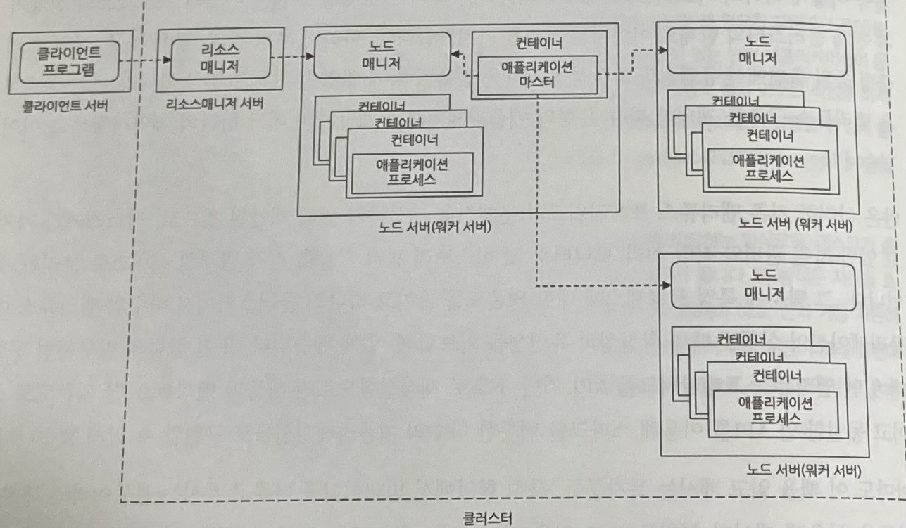

# 클러스터 환경
> 분산 처리를 위한 시스템 아키텍처, 그와 관련한 설정과 매개변수 이해

## 요약

## 1. 클러스터 환경
### 클러스터 모드와 컴포넌트
- 스파크가 한 대의 서버에서 동작하는 `로컬 모드`, 클러스터 환경에서 동작하는 `클러스터 모드`
- 클러스터 환경에서 애플리케이션을 실행할 때에도 로컬 환경 용도 애플리케이션과 사용하는 API는 동일
- `클러스터 환경` = 여러 대의 서버를 하나의 서버인 것처럼 다뤄야 함 -> 작업 분산 실행 & 취합하는 `분산 작업 관리 기능` 추가됨
- `애플리케이션` = 의도한 단위의 작업. 여러 개의 Job으로 구성됨
    * 마스터 역할 `드라이버`. 스파크 컨텍스트 생성 및 관리하는 프로그램
    * 실제 데이터 처리를 담당하는 여러 개의 `익스큐터`. 워커 노드에서 구동됨. 스레드가 아닌 프로세스.
    * 익스큐터가 자원 할당 단위가 됨. 익스큐터 하나가 쓸 자원을 정하고 -> 작업 실행 요청이 발생할 때마다 필요한 만큼의 익스큐터 할당
- `클러스터 매니저` = 클러스터 **자원을 관리**해주는 역할을 하는 컴포넌트
    * 자체적 구현 또는 외부 라이브러리 도입이 필요 (스파크는 둘 다 지원, 상황에 따라 선택) -> 선택에 따른 혼란을 방지하고자 추상화된 클러스터 모델 제공 (종류와 관계 없는 프로그램 작성법)
    * 클러스터를 관리하기 때문에 논리적 관점에서 `마스터 서버`
- `스파크 컨텍스트` = 스파크의 시작점
    * 클러스터 매니저와의 연동을 포함해서 스파크 앱이 동작하는 데 필요한 다수의 서비스(스케줄러, 처리기, 저장 등)가 준비되게 함
    * 스파크 앱이 동작하기 위한 백그라운드 서비스 환경
    * 1 앱 1 SC
    * 다른 앱의 SC 공유 불가 (스파크는 thread-safe하므로 하나의 SC를 공유하는 여러 스레드로 여러 잡을 실행 가능, 우선순위 지정 가능)
    * 클러스터 매니저와 연동해서 작업 처리 (클러스터 매니저의 종류와는 무관하게 코드 작성 가능)
- cf. 용어 정리
    * 호스트, 서버: 주로 물리 장비를 지칭
    * 노드: 작업이 수행되는 끝점을 지칭
    * 마스터(or 매니저)-슬레이브(or 워커, 작업노드): 마스터가 서버군일 수 있으며, 이 역할 분배는 물리적 분리를 의미하는 것이 아님.

### 스파크 애플리케이션 작동 과정
1. 드라이버 프로그램 생성 -> 클러스터 매니저와 연동 -> 각 클러스터 서버에 작업을 처리하기 위한 프로세스(익스큐터) 생성
2. 드라이버 프로그램이 작성된 프로그램으로 트랜스포메이션&액션 수행
3. 잡은 수행이 될 때 stage 단위로 나누어 실행
    - 나누는 기준: 데이터에 대한 셔플 필요 여부 (=각 서버 데이터를 네트워크를 타고 다른 서버에 재배치해야 하는지 여부)
4. 각 stage는 여러 task로 나누어져 분산 처리를 위해 익스큐터에 할당
    - 익스큐터의 역할 1: 할당받은 task 처리
    - 익스큐터의 역할 2: 이미 처리된 데이터를 나중에 빠르게 재사용할 수 있게 메모리에 저장

### 클러스터 모드를 위한 시스템 구성
- 스파크 앱을 실행할 때, 스파크 클러스터에서 직접 요청을 보내기보다, 별도의 애플리케이션 실행 서버(=배치/클라이언트 서버)를 통하는 경우가 많음.
- 개발 환경 기본 조건
    * 서버 간 통신이 가능한 상태, 클러스터 서버와 드라이버 프로그램 구동 서버는 네트워크상 최대한 근접하게
    * 모든 서버에 자바 설치 & JAVA_HOME 등록
    * 모든 서버에 하둡 설치 & HADOOP_HOME 등록 & PATH 등록
    * 로컬 서버, 애플리케이션 실행 서버, 클러스터 서버

### 드라이버 프로그램과 디플로이 모드
- 드라이버 프로그램: SC 생성 코드가 포함된 부분. 대부분 메인 함수도 포함.
    * 로컬 모드: 드라이버 프로그램의 메인 함수에서 실행
    * 클러스터 모드: 클러스터 매니저에게 실행 요청 (=제출)
- 클러스터 매니저별로 다르게 애플리케이션 실행. 즉 `실행 모드`가 다름.
    * client deploy mode: `애플리케이션을 실행한 프로세스 내부`에서 드라이버 프로그램을 구동, SC 생성. 드라이버 프로그램은 작업 요청한 클라이언트 서버 프로세스에 포함되어 실행.
    * cluster deply mode: 애플리케이션을 실행한 프로세스는 클러스터 매니저에게 작업 실행만 요청하고 즉시 종료. 드라이버 프로그램 실행은 `클러스터 내부의 워커 노드 프로세스 중 하나`에서 실행, SC 생성.
    * 거칠게 요약하면, client는 요청주체 안에서 실행되고, cluster는 작업주체 안에서 실행됨. 따라서 요청 프로세스가 중단되면, client는 앱이 중단되지만 cluster는 아님.
    * 작업 결과는 어떤 모드를 사용하든 동일하지만, 드라이버 프로그램-익스큐터 간 데이터 전달 비용을 절약할 수 있으므로 cluster의 성능이 좋을 거라는 기대 가능. client는 spark-shell과 같은 인터랙티브 환경을 사용하거나 디버깅이 쉽다는 장점이 있으므로, 실행서버와 작업서버를 같은 네트워크 상에 둬서 단점을 보완하면 작업하기 편리.
    * 클러스터 모드로 실행하려고 할 때엔 꼭 드라이버 프로그램의 동작에 필요한 외부 파일/환경변수/권한 등이 클러스터의 서버에 동일하게 있는지 확인 필요!!

## 2. 클러스터 매니저
### 지원하는 클러스터 매니저
1. 하둡의 Yarn
2. 아파치의 Mesos
3. 스파크의 Standalone 클러스터 매니저
4. 쿠버네티스
- 각각의 장단점을 갖고 있으므로 적절하게 선택

### 하둡의 Yarn
- 특징
    * 하둡에서 제공하는 클러스터 자원 관리 서비스
    * 등장 배경: 하나의 마스터에 의존하는 구조는 마스터 프로세스에 지나친 의존성을 갖게 되어 제약이 생김 -> 마스터의 기능을 분리하여 별개 서비스로 만듦 -> 맵리듀스를 얀 API를 사용하게 재작성하여 의존도 줄임
    * 클러스터 매니저로 얀을 사용한다는 것은 스파크 앱을 일종의 얀 앱으로 취급하는 것
        + 문제 해결을 위한 얀 이해 필요
        + 얀 클러스터 모드의 스파크 앱은 얀 컴포넌트 모델과 대응됨
- 설치: 얀을 지원하는 버전의 하둡과 함께 설치됨, 설정 파일을 환경 변수로 등록
- 구조
    * 
    * 리소스 매니저(자원 현황 관리, 할당, 실행 요청 받음), 노드 매니저(자원 관리 및 현황 보고) 2개의 데몬 프로세스로 구성
- 커맨드: `spark-submit --class ClassPath --master yarn --deploy-mode cluster`

### 아파치의 Mesos
- 특징
    * 자원을 여러 애플리케이션에서 공유해서 사용할 수 있게 함
    * 서버 자원 할당 + 다양한 애플리케이션을 논리적 컴포넌트 단위로 이해하고, 이들 사이에서 필요한 자원을 **동적으로 할당** (=하나의 서버에서 여러 앱 실행하는 것과 유사한 환경, 다른 앱 간 자원 공유 가능, 낭비 X)
- 설치: 소스코드 받아서 직접 빌드, 서드파티 패키지(mesosphere)
- 구조: 마스터 (클러스터 매니저 by 메소스 마스터) - 슬레이브
    * 자원 할당 과정
        1. 슬레이브가 가용 자원을 마스터에 전달
        2. 마스터는 프레임워크에 이 정보를 알리고 사용 여부 확인
            + 스파크의 경우, 스파크 드라이버가 프레임워크
            + 메소스 마스터에게 자원을 받으면, 메소스 슬레이브에서 프레임워크로부터 실행 요청을 받은 메소스 익스큐터가 스파크 익스큐터 생성해서 앱 구동
            + 메소스에는 독특한 mesos run mode 개념이 있음. 여기서의 실행 모드 = 익스큐터 다루는 방식
                - 메소스 익스큐터가 스파크 익스큐터를 태스크마다 한개씩 만들면 `fine-graned` 모드: 효율적 자원 사용, 초기 수행 시간이 오래 걸림
                - 메소스 익스큐터가 스파크 익스큐터를 공용으로 하나만 만들면 `coarse-grained` 모드: 빠른 작업 실행, 앱 종료 전까지 자원 점유 지속됨
                - 왜? 메소스의 특징인 프레임워크 수준의 동적 자원 할당이 응답성에는 좋지 않으므로 경우에 따라 이 기능을 사용하지 않기 위해
        3. 사용한다고 하면 필요로 하는 만큼을 뺀 나머지를 가지고 다른 프레임워크에 2. 수행
        4. 더 이상 요청이 없을 때까지 반복
- 커맨드: `spark-submit --class ClassPath --master mesos://server:port --deploy-mode cluster`
    * 스탠드얼론 클러스터 모드에서는 클러스터 매니저가 알아서 드라이버 프로그램을 구동할 서버를 선택 후 실행
    * 메소스 클러스터 모드에서는 드라이버 프로그램을 구동할 서버를 골라서 사전작업(클라->마스터 담당 mesos-dispatcher 실행)을 해두고, 마스터 옵션으로 그 서버로 지정

### 스파크의 Standalone 클러스터 매니저
- 특징
    * 스파크 배포본에 기본적으로 포함
    * 환경변수 설정 시, 실행 서버 모두의 스파크 conf 디렉토리 하의 spark-env.sh에 export 변수=값 형태로 환경변수를 설정
- 설치: 추가 설치 불필요
- 용도: 테스트 / 소규모 클러스터 구성
- 구조: 마스터 (클러스터 매니저 컴포넌트, by 스탠드얼론 클러스터 마스터) - 슬레이브 (워커 노드)
    * 마스터: 클라이언트 요청을 받아 필요한 서버 자원 할당, 슬레이브 작업 실행 관리
    * 슬레이브: 익스큐터와 태스크를 실행해 데이터에 대한 실제 처리와 저장 수행
- 고가용성
    * 슬레이브에 문제가 생기면 복구 가능하지만, 마스터에 문제가 생기면 불가능(SPOF)
    * 마스터의 복구를 위해 다수의 마스터 서버를 동일 클러스터의 마스터로 지정 가능 by Zookeeper
    * 복구에 민감하지 않다면, 로컬에 클러스터 상태 정보를 미리 저장해 두고 장애 상황에서 이걸 사용하는 단일 노드 복구 방식 사용
- 커맨드: `spark-shell --master spark://server:port`

### 쿠버네티스
- 도커
    * 앱이 동작하는 데 필요한 모든 자원을 모아 컨테이너를 생성
    * 높은 이식성, 빠른 실행환경 구축 (by 이미지 생성 & 공유)
    * 호스트 서버의 자원을 공유하는 방식
    * 다수의 도커 컨테이너를 관리하는 별도의 도구, 쿠버네티스
- 주요 용어
    * pod: 여러 도커 컨테이너를 묶어 팟으로 관리
    * node: 클러스터를 구성하는 서버 (master-minion)
    * service: 컨테이너 간 네트워크 통신을 위한 기능
    * nameservice: 쿠버네티스의 가상클러스터 식별 용도
    * 스케줄러: 노드의 리소스 사용률 파악 및 적절한 노드에서 팟 실행되게 함
    * api 서버: http를 통해 팟과 서비스의 상태를 검증 및 관리
- 설치: 1.6버전 이상의 쿠버네티스 클러스터, kubectl, DNS add-on, 팟 수정 권한, 2.3 버전 이상의 스파크, 최소 3개의 CPU, 4GB 이상의 메모리
- 커맨드: `spark-submit --master k8s://https://ipAddress:port --deploy-mode cluster`
    * 마스터 주소는 `kubectl cluster-info`로 알아낼 수 있음 (=쿠버네티스 api 서버의 주소)
    * 어떤 노드에 팟을 설정할지 여부는 쿠버네티스 스케줄러 담당