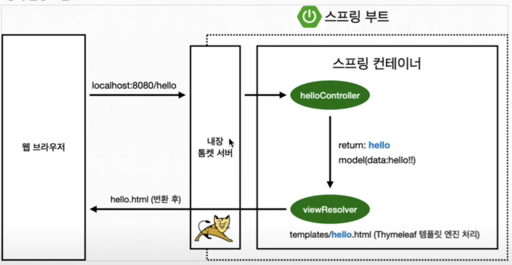
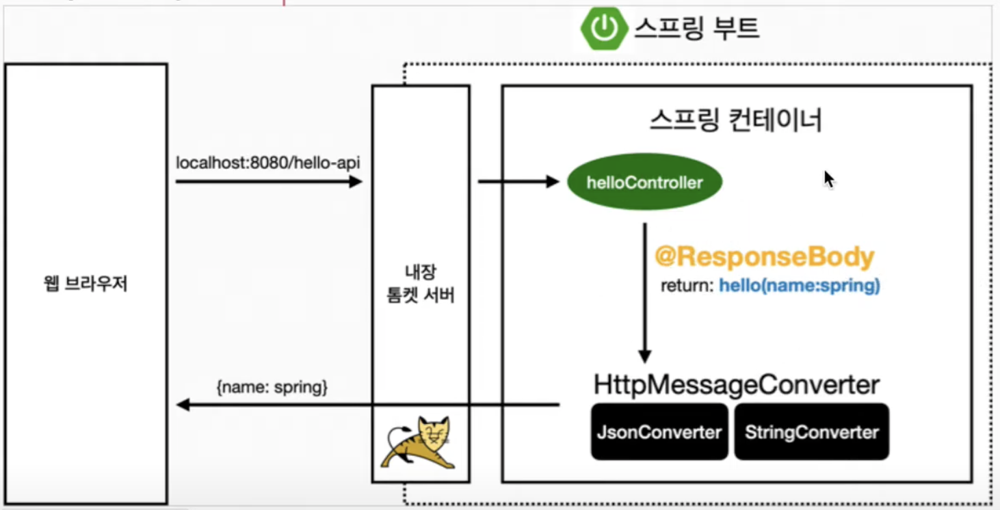
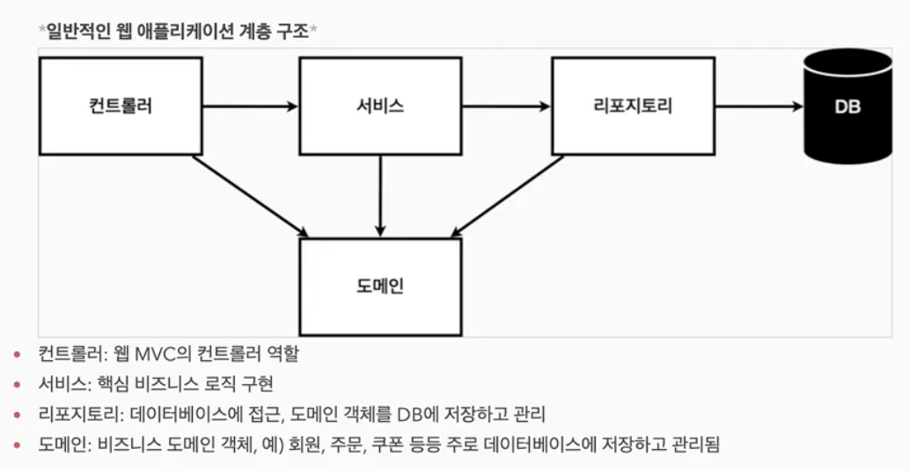

# Introduction

## 스프링 프레임워크
- 핵심 기술: 스프링 DI 컨테이너, AOP, 이벤트, 기타
- 웹 기술: 스프링 MVC, 스프링 WebFlux
- 데이터 접근 기술: 트랜잭션, JDBC, ORM 지원, XML 지원
- 기술 통합: 캐시, 이메일, 원격 접근, 스케줄링
- 테스트: 스프링 기반 테스트 지원 (junit, mockito, assertj,...)
- 언어: 자바, 코틀린, 그루비
    * 가장 큰 특징: 객체 지향 언어
        + 스프링은 객체 지향 언어가 가진 강력한 특징을 살려내는 프레임워크로, 좋은 객체 지향 앱을 개발할 수 있도록 돕는다.
        + `역할`과 `구현`으로 구분하면 단순 & 유연 & 변경에 편리해짐
            - 클라이언트는 대상의 역할(인터페이스)만 알면 된다 = 인터페이스의 안정적 설계가 중요
            - 클라이언트는 구현 대상의 내부 구조를 몰라도 되며, 변경에 영향받지 않는다.
        + **다형성** 스프링은 다형성의 한계를 극복하는 것을 도움 ex. DI, IoC


## 스프링 부트
- 스프링의 편리한 사용을 지원 (최근에는 기본으로 사용)
- 단독 실행 가능한 스프링 앱을 쉽게 생성
    * https://start.spring.io 에서 UI로 세팅한 프로젝트를 다운로드 가능
    * 추세: [Maven -> Gradle](../Spring/Maven%20vs%20Gradle.md)
        + tip. IDE가 대리하지 않고 직접 run하게 설정하면 빠르다.
    * artifact: 빌드 결과물
- Tomcat 등 웹서버를 내장해서 별도의 웹서버를 설치하지 않아도 됨
- 손쉬운 빌드 구성을 위한 starter 디펜던시 제공
    * 내가 모두 설정하지 않아도 필요한 요소들을 제공해주는 것 
- 스프링과 외부 라이브러리 자동 구성
    * cf. Slf4j (인터페이스) - logback (구현체)
- 메트릭, 상태 확인, 외부 구성 같은 기능 제공
- 관례에 의한 간결한 설정


## 응답 구성
- `정적 컨텐츠` 파일을 그냥 내려준다
- `MVC` Model, View, Controller 로 각각의 관심사를 분리하는 것. Model을 View에 매핑해서 Controller로 제공
- `템플릿 엔진` View라는 템플릿이 있는 상태에서 거기에 데이터를 넣어서 내려준다.
    * (= view template) 지정된 템플릿 양식과 데이터가 합쳐져 HTML 문서를 출력하는 소프트웨어
    * ex) thymeleaf `<p th:text="${test}"></p>`
    * 작동 원리: 컨트롤러가 변환한 문자열을 주면 뷰 리졸버가 화면을 찾아서 처리한다
       
- `@ResponseBody`
    * API로 내린다 = 응답 Body에 데이터를 직접 주겠다 (=/= html 페이지 구성)
    * 객체로 응답하게 하면 기본으로 json 응답을 내리게 된다
    * 작동 원리: 뷰 리졸버 대신 (객체를 json으로 바꿔주는; ex. jackson(디폴트), gson(구글 제공)) 컨퍼터를 사용한다
      


## 예시 서비스 만들기
- 웹 애플리케이션 계층 구조
  
- 어떤 DB를 선택할지 아직 정해지지 않았다면, 일단 interface(repository)를 의존하도록 한다
- 테스트 여러개를 작성하고 빌드할 때 한번에 모든 테스트를 실행시킬 수 있다
- 테스트의 기본 골자는 대개 `given`(주어진 데이터) `when`(처리할 로직) `then`(검증) 이다.
- 서비스는 도메인 의존적으로 작성 (네이밍 등) `ex. join()` / 리포지토리는 좀 더 개발자스럽게 `ex. getById()`
- 서비스 안에서 new로 레포지토리 객체를 생성하면 해당 인스턴스가 매번 생성될 우려가 있다. 이를 막기 위해 new로 생성하는 부분을 지우고, 서비스 생성자의 인자로 레포지토리를 주어 외부에서 생성할 수 있도록 하라. (= DI)

### 스프링 빈 등록
- `@Component` 어노테이션으로 자동으로 의존관계 설정 (ex. `@Controller`, `@Service`, ...)
    * main 함수가 있는 패키지 하위를 쭉 스캔하면서 빈으로 등록하는 식
    * 스프링이 **스프링 컨테이너**에 빈을 등록할 때, 기본으로 싱글톤으로 등록한다.
- 자바 코드로 직접 스프링 빈 등록
    ```java
    @Configuration  // 스프링이 뜰 때 이걸 읽고
    public class SpringConfig {
      @Bean // 이걸 빈으로 등록하란 거구나 하고 로직 호출 & 등록 처리 (참고: 빈 이름이 메서드 이름)
      public MemberService memberService() {
        return new MemberService();
      }
    }
    ```
- 정형화된 컴포넌트(ex. 컨트롤러, 서비스, 리포지토리 등)의 경우 컴포넌트 스캔 방식을, 정형화되지 않거나 상황에 따라 구현 클래스를 변경해야 하는 경우 Configuration을 통해 스프링 빈으로 등록한다.

### 스프링 빈 사용 (=의존성 주입)
- 스프링이 관리하게 되면 스프링 컨테이너에 모두 등록을 해야 하고, 그걸 (공동) 사용하는 식이어야 함.
- Inversion of Control: 객체의 생성을 제어한다는 관점
- `@Autowired` (cf. 참고: 스프링의 관리 대상 객체에서만 동작함, 빈으로 등록하지 않은 객체에선 동작 안함)
    * 생성자의 인자로 필요한 객체를 주고, 생성자에 어노테이션을 붙임
      ```java
      @Autowired
      public MemberService(MemberRepository memberRepository) {...}
      ``` 
    * 필드로 주입: 스프링 뜰 때 외에는 바꿔줄 방법이 없다 (다른 설정을 준 컴포넌트로 생성하고 싶다면...?)
      ```java
      @Autowired private MemberRepository memberRepository;
      ``` 
    * setter로 주입: public이어야 해서 외부에 노출될 우려가 있다 (set하면 안 되는데 어느 팀원이 set한다면...?)
      ```java
      @Autowired
      public setMemberRepository(MemberRepository memberRepository) {...}
      ``` 

### DB와의 연결
- (구) JDBC 직접 연결
    * JDBC 드라이버로 DB와 커넥션을 맺고 직접 SQL 문을 던지는 방식
    * 설정이 복잡하고 코딩이 어려움


## 참고
- [스프링 입문 - 코드로 배우는 스프링 부트, 웹 MVC, DB 접근 기술](https://www.inflearn.com/course/%EC%8A%A4%ED%94%84%EB%A7%81-%EC%9E%85%EB%AC%B8-%EC%8A%A4%ED%94%84%EB%A7%81%EB%B6%80%ED%8A%B8)