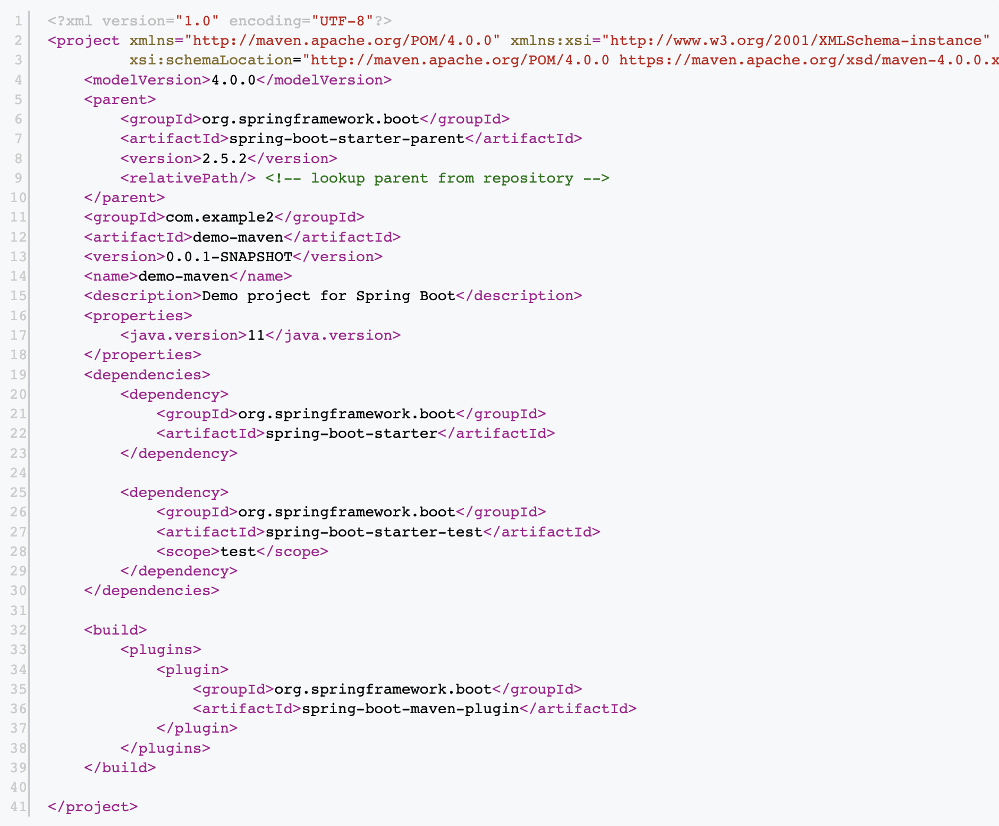
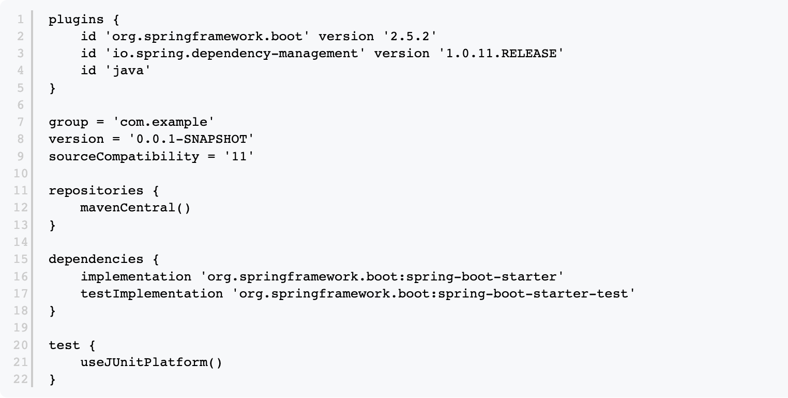

# Maven vs Gradle

1. 스크립트 길이와 가독성 면에서 gradle이 우세하다.
    - maven
      
    - gradle
      
2. 빌드와 테스트 실행 결과 gradle이 더 빠르다. (gradle은 캐시를 사용하기 때문에 테스트 반복 시 차이가 더 커진다.)
3. 의존성이 늘어날 수록 성능과 스크립트 품질의 차이가 심해진다.
4. gradle로 동적 빌드를 적용할 수 있다.