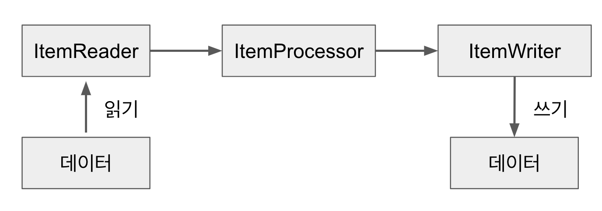

# 스프링 배치

## 구조
> 읽고, 작업하고, 저장하는 것이 대부분
- Job
  - Step
    - Tasklet 또는 ItemReader/ItemProcessor(opt.)/ItemWriter
  - Step
  - Step

## Tasklet
- 일반적인 컴포넌트
- 작성 후 execute() 에 인자로 넘겨주면 됨
- Step은 기본적으로 Tasklet 단위로 처리됨 (ItemReader & ItemWriter & ItemProcessor의 묶음 역시 Tasklet. `ChunkOrientedTasklet`)

## Chunk 지향

- chunk: 각 트랜잭션 커밋 사이에 처리되는 row 수
- 한 번에 하나씩 데이터를 읽어 Chunk라는 덩어리를 만든 뒤, Chunk 단위로 트랜잭션을 다루는 것
- 실패할 경우엔 해당 Chunk 만큼만 롤백이 되고, 이전에 커밋된 트랜잭션 범위까지는 반영이 된다
- input이 chunk 사이즈만큼 쌓일 때까지 read를 호출하고, 쌓인 데이터로 transform한 뒤, 일괄 write하는 식

## ItemReader

- 데이터를 읽음 (DB, json, xml, file, custom,...)
- 대표적 구현체 JdbcPagingItemReader는 ItemStream를 같이 구현하는데, 이는 주기적으로 상태를 저장하고 오류가 발생하면 해당 상태에서 복원하는 역할을 함
- 구현체 종류
    1. Cursor 기반 구현체: DB와 커넥션을 맺고 커서를 옮기면서 데이터를 가져옴. 스트리밍.(ex. `JdbcCursorItemReader`, `HibernateCursorItemReader`, `StoredProcedureItemReader`)
    2. Paging 기반 구현체: 한번에 지정한 사이즈 만큼 데이터를 가져옴. 정렬 필수. (ex. `JdbcPagingItemReader`, `HibernatePagingItemReader`, `JpaPagingItemReader`)

## ItemWriter
- item 하나가 아니라 Chunk 단위로 묶인 item List를 write
- read 또는 process가 chunk 만큼 개별 수행되면, writer에 chunk 만큼 전달됨
- [참고: ItemWriter에 List 전달하는 방법](https://jojoldu.tistory.com/140)

## ItemProcessor
- Writer에서도 구현 가능하므로, 필수는 아님. 가공/처리 단계.
- 사용 방법
    1. 변환: Reader에서 읽은 데이터를 원하는 타입으로 변환해서 Writer에 넘김
    2. 필터: Reader에서 넘겨준 데이터를 Writer로 넘겨줄 것인지를 결정. null을 반환하면 Writer에 전달되지 않음. 

## References
- [Spring Batch Ref](https://docs.spring.io/spring-batch/docs/4.2.x/reference/html/index-single.html)
- [스프링 배치 한글 번역 문서](https://godekdls.github.io/Spring%20Batch/contents/)
- [기억보단 기록을 - Spring Batch](https://jojoldu.tistory.com/category/Spring%20Batch)